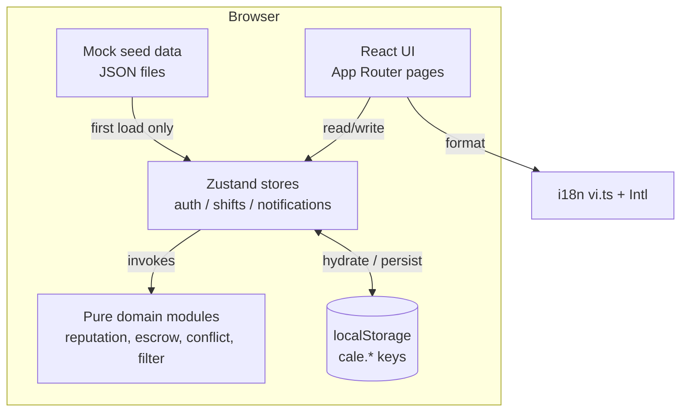
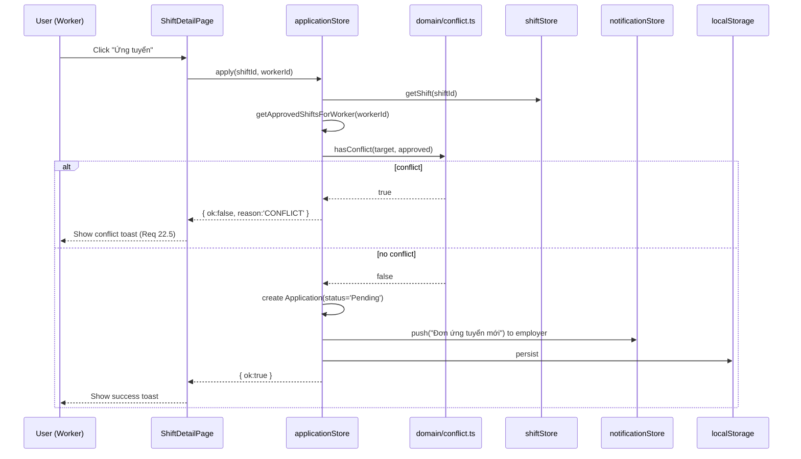

# Design Document — CaLẻ / ShiftNow

## Overview

CaLẻ / ShiftNow is a responsive web MVP that connects employers with short-term workers in Vietnam. This design covers the front-end-only MVP built with Next.js (App Router), React, TypeScript, and Tailwind CSS. All persistence, authentication, and payment flows are simulated locally.

### Goals

- Deliver a working clickable MVP that demonstrates the full lifecycle of a shift: create → deposit → publish → apply → approve → check-in → check-out → confirm → release.
- Validate UX with Vietnamese users without depending on real infrastructure (no backend, no SMS, no payment gateway).
- Keep core domain logic (reputation, escrow transitions, time-conflict, filtering) as pure TypeScript modules so the same code can later be moved server-side without rewriting.

### Non-Goals (MVP Scope)

- Real authentication, password hashing, sessions, CSRF, or HTTPS enforcement at the app layer. Requirement 30 is therefore treated as **deferred**: the design documents how each control will be implemented later, but the MVP only simulates them with localStorage and basic input sanitization on render.
- Real payment processing or money movement. All escrow state changes are simulated via a local state machine.
- Real SMS / OTP. "Phone verification" is a UI flow that flips a status flag.
- Mobile native apps, push notifications, or in-app chat.

### Design Decisions and Rationale

| Decision | Rationale |
|---|---|
| Next.js App Router (not Pages Router) | Modern default; lets us co-locate layouts, loading states, and route-scoped UI per role. |
| Mock data + localStorage | Matches the "student MVP, no backend" constraint while still letting state survive page reloads. |
| Zustand for global state | Lighter than Redux, simpler than Context-only for cross-page mutations (auth, notifications, current cart of filters). React Context is used only for theme/locale, which rarely change. |
| Pure domain modules (`/src/domain/*`) | Reputation scoring, escrow transitions, and time-conflict are pure functions. This makes them property-testable and trivially portable to a future Node backend. |
| `vi-VN` locale formatting via `Intl` | Native browser APIs handle ₫ currency and `DD/MM/YYYY` dates correctly without a translation library for the MVP. A flat `vi.ts` dictionary holds all UI strings. |
| Tailwind mobile-first | Matches Requirement 17 directly; no extra CSS framework needed. |

## Architecture

### High-Level Architecture



There is no server beyond what Next.js needs to render. All "API calls" are synchronous calls into Zustand stores, which in turn call pure domain functions and persist to `localStorage`.

### Next.js Project Layout

```
src/
├── app/
│   ├── layout.tsx                # Root layout, sets <html lang="vi">, fonts, providers
│   ├── page.tsx                  # Landing page (Req 16)
│   ├── (auth)/
│   │   ├── login/page.tsx
│   │   └── register/page.tsx
│   ├── shifts/
│   │   ├── page.tsx              # Shift listing + filters + search (Req 4, 19)
│   │   └── [id]/page.tsx         # Shift detail + Apply (Req 5)
│   ├── worker/
│   │   ├── dashboard/page.tsx    # Worker dashboard (Req 21)
│   │   └── profile/page.tsx      # Worker profile/portfolio (Req 24)
│   ├── employer/
│   │   ├── dashboard/page.tsx    # Employer dashboard + analytics (Req 20)
│   │   ├── shifts/new/page.tsx   # Create shift + simulated deposit (Req 3)
│   │   ├── shifts/[id]/page.tsx  # Manage shift, approve/reject, confirm (Req 6, 9)
│   │   └── profile/page.tsx      # Company profile (Req 23)
│   └── admin/
│       └── dashboard/page.tsx    # Admin user/shift/dispute management (Req 14, 15, 26)
│
├── components/
│   ├── ui/                       # Button, Input, Select, Badge, Card, Modal, Toast
│   ├── shift/                    # ShiftCard, ShiftFilters, ShiftStatusBadge
│   ├── user/                     # UserAvatar, ReputationBadge, VerificationBadge
│   ├── layout/                   # NavBar, MobileNav, Footer, RoleGuard
│   └── forms/                    # ShiftForm, RegisterForm, LoginForm, RatingForm
│
├── stores/                       # Zustand stores (see State Management)
│   ├── authStore.ts
│   ├── shiftStore.ts
│   ├── applicationStore.ts
│   ├── notificationStore.ts
│   └── adminStore.ts
│
├── domain/                       # Pure, testable logic
│   ├── reputation.ts             # score calculation + threshold rules (Req 8)
│   ├── escrow.ts                 # state machine transitions (Req 10)
│   ├── conflict.ts               # time-overlap detection (Req 22)
│   ├── filter.ts                 # shift filtering + search (Req 4, 19)
│   ├── deposit.ts                # deposit total calculation (Req 3)
│   └── rating.ts                 # average rating aggregation (Req 13)
│
├── data/
│   ├── seed/
│   │   ├── users.json
│   │   ├── shifts.json
│   │   ├── applications.json
│   │   ├── ratings.json
│   │   └── notifications.json
│   └── persistence.ts            # localStorage read/write helpers + schema versioning
│
├── i18n/
│   └── vi.ts                     # Flat key → string dictionary
│
├── lib/
│   ├── format.ts                 # formatVND, formatDateVN, formatTimeVN
│   ├── validate.ts               # email, VN phone, password, required
│   └── ids.ts                    # uuid-ish id generator for new entities
│
└── types/
    └── index.ts                  # All shared TypeScript types
```

### Client / Server Component Strategy

- **Server Components (default)**: static page shells — landing page sections, layout chrome, "How It Works" content. They render Vietnamese strings from `vi.ts` at build time and ship zero JS for those parts.
- **Client Components (`"use client"`)**: any page that reads/writes Zustand or localStorage. This includes every dashboard, every form, the shift listing (because it filters reactively), and the shift detail page (because it shows role-specific actions).
- **Hydration boundary**: a top-level `<AppHydrator>` client component runs once on mount, reads `localStorage`, and seeds Zustand. If localStorage is empty, it loads `data/seed/*.json` instead. This avoids SSR/CSR mismatches on Vietnamese-formatted dates and on auth state.

### Routing and Access Control

Role-based access is enforced client-side by a `<RoleGuard role="worker | employer | admin">` wrapper used inside each role-scoped page. If the current `authStore.user` does not match the required role, the guard redirects:

- unauthenticated → `/login`
- wrong role → role's own dashboard

Because there is no real backend, this is presentational only — sufficient for MVP demonstration but explicitly called out as not a security boundary.

## Components and Interfaces

### Reusable UI Primitives (`components/ui`)

All primitives accept Tailwind className overrides and forward refs. They enforce the 44×44 minimum touch target from Requirement 17.4.

| Component | Purpose | Key Props |
|---|---|---|
| `Button` | Primary / secondary / ghost / danger variants | `variant`, `size`, `loading`, `disabled` |
| `Input` | Text/email/tel/number with label + error | `label`, `error`, `type`, `required` |
| `Select` | Native `<select>` with Vietnamese options | `options`, `value`, `onChange` |
| `Textarea` | Multi-line input for descriptions / feedback | `label`, `error`, `maxLength` |
| `Badge` | Color-coded pill | `tone: 'success' \| 'warning' \| 'danger' \| 'info' \| 'neutral'` |
| `Card` | Surface container with hover state | `as`, `clickable` |
| `Modal` | Dialog with focus trap | `open`, `onClose`, `title` |
| `Toast` | Transient notifications | hooked into `notificationStore` |
| `EmptyState` | "Không tìm thấy ca làm phù hợp" etc. | `title`, `description`, `action` |
| `StarRating` | 1–5 input or read-only display | `value`, `readOnly`, `onChange` |

### Domain-Specific Components

**Shift components (`components/shift`)**
- `ShiftCard` — used on listing and dashboards. Shows title, location, date (DD/MM/YYYY), time, hourly wage in ₫, positions remaining, employer name, and a `ShiftStatusBadge`.
- `ShiftStatusBadge` — maps shift lifecycle status to a colored `Badge`.
- `ShiftFilters` — controlled component with location, date range, wage range, job type filters; fully responsive (stacks on mobile).
- `ShiftSearchBar` — debounced (300 ms) text input that updates URL query and filter state.
- `EscrowStatusBadge` — separate badge for the escrow lifecycle (Req 10).

**User components (`components/user`)**
- `UserAvatar` — initials fallback when no photo.
- `ReputationBadge` — shows score with color (green ≥ 80, amber 50–79, red < 50).
- `VerificationBadge` — chips for "Đã xác minh SĐT", "Đã xác minh CMND", "Đã xác minh thẻ SV".
- `WorkerProfileCard` — used on application review screens (Req 6.2).

**Forms (`components/forms`)**
- `ShiftForm` — used for create and edit. Auto-computes deposit total via `domain/deposit.ts` and shows a "Mô phỏng đặt cọc" button.
- `ApplicationActions` — Apply / Cancel buttons that call `applicationStore` and gate on verification + reputation + conflict.
- `RatingForm` — 1–5 stars + optional textarea, locked after submission.

### Layout Components

- `NavBar` (desktop) and `MobileNav` (`<768px` hamburger drawer) share the same items, generated from the current role.
- `NotificationBell` shows the unread count from `notificationStore` (Req 18.5).
- `Footer` — minimal, links to landing page sections.

### Component Interaction Pattern



## Data Models

All types live in `src/types/index.ts`. IDs are opaque strings produced by `lib/ids.ts`. Timestamps are ISO 8601 strings; the UI formats them via `lib/format.ts`.

### Enums and Unions

```ts
export type Role = 'worker' | 'employer' | 'admin';

export type VerificationFlag = 'phone' | 'id' | 'student';

export type ShiftStatus =
  | 'Draft'              // employer created, deposit pending
  | 'Published'          // visible on listing
  | 'FullyBooked'        // all positions filled, still visible
  | 'InProgress'         // at least one approved worker checked in
  | 'AwaitingConfirmation' // worker(s) checked out, employer not confirmed
  | 'Completed'          // all assigned workers confirmed
  | 'Cancelled'
  | 'Expired';           // start time passed without check-in

export type EscrowStatus =
  | 'PendingDeposit'
  | 'Deposited'
  | 'InProgress'
  | 'Completed'
  | 'Released'
  | 'Disputed'
  | 'Refunded';

export type ApplicationStatus =
  | 'Pending'
  | 'Approved'
  | 'Rejected'
  | 'CancelledByWorker'
  | 'NoShow'
  | 'CheckedIn'
  | 'CheckedOut'
  | 'Confirmed';

export type DisputeStatus = 'Open' | 'ResolvedReleased' | 'ResolvedRefunded';

export type NotificationKind =
  | 'ApplicationReceived'
  | 'ApplicationApproved'
  | 'ApplicationRejected'
  | 'NoShow'
  | 'ShiftCompletedConfirmed'
  | 'ShiftEdited'
  | 'ShiftCancelled'
  | 'LateCancel'
  | 'DisputeResolved';
```

### Core Entities

```ts
export interface BaseUser {
  id: string;
  role: Role;
  email: string;
  phone: string;
  passwordHash: string;     // MVP: plain "mock-hash:" prefix; documented in Security
  suspended: boolean;
  createdAt: string;
}

export interface Worker extends BaseUser {
  role: 'worker';
  fullName: string;
  avatarUrl?: string;
  bio?: string;
  skills: string[];
  preferredJobTypes: string[];
  preferredLocations: string[];
  verifications: VerificationFlag[]; // subset of 'phone' | 'id' | 'student'
  reputationScore: number;           // initialized to 100 (Req 8.1)
  completedShiftCount: number;
  ratingsReceived: Rating[];         // for average + history
  cancellationHistory: CancellationRecord[];
  noShowCount: number;
}

export interface Employer extends BaseUser {
  role: 'employer';
  companyName: string;
  businessType: string;
  description?: string;
  logoUrl?: string;
  verifiedBusiness: boolean;
  boostCredits: number;              // Req 11.2
}

export interface Admin extends BaseUser {
  role: 'admin';
  fullName: string;
}

export type User = Worker | Employer | Admin;
```

```ts
export interface Shift {
  id: string;
  employerId: string;
  title: string;
  description: string;
  requirements: string;
  jobType: string;                   // e.g. 'phục vụ', 'phát tờ rơi', 'kho vận'
  location: string;                  // free text + district
  district?: string;                 // for filtering
  date: string;                      // YYYY-MM-DD
  startTime: string;                 // HH:mm
  endTime: string;                   // HH:mm
  hourlyWage: number;                // VND
  positionsTotal: number;
  positionsFilled: number;
  status: ShiftStatus;
  escrowStatus: EscrowStatus;
  depositAmount: number;             // computed at creation, frozen
  createdAt: string;
  updatedAt: string;
  boostedAt?: string;                // when employer used Boost_Credit
}
```

```ts
export interface Application {
  id: string;
  shiftId: string;
  workerId: string;
  status: ApplicationStatus;
  appliedAt: string;
  approvedAt?: string;
  checkInAt?: string;
  checkOutAt?: string;
  confirmedAt?: string;
  cancelledAt?: string;
  cancelReason?: 'OnTime' | 'LateCancel';
  payoutAmount?: number;             // hourlyWage * hours, snapshot at approval
}

export interface Rating {
  id: string;
  shiftId: string;
  applicationId: string;
  fromUserId: string;                // employer
  toUserId: string;                  // worker
  stars: 1 | 2 | 3 | 4 | 5;
  feedback?: string;
  createdAt: string;
  // ratings are immutable once created (Req 13.5)
}

export interface CancellationRecord {
  id: string;
  shiftId: string;
  cancelledAt: string;
  type: 'OnTime' | 'LateCancel';
  reasonNote?: string;
}

export interface Notification {
  id: string;
  userId: string;
  kind: NotificationKind;
  title: string;                     // pre-localized Vietnamese
  body: string;
  link?: string;                     // route to navigate on click
  read: boolean;
  createdAt: string;
}

export interface Dispute {
  id: string;
  shiftId: string;
  applicationId: string;
  raisedBy: 'employer' | 'worker';
  reason: string;
  status: DisputeStatus;
  resolutionNote?: string;
  createdAt: string;
  resolvedAt?: string;
}

export interface BoostCreditLedgerEntry {
  id: string;
  employerId: string;
  delta: 1 | -1;
  reason: 'NoShowGrant' | 'ShiftRepost';
  shiftId?: string;
  createdAt: string;
}
```

### Persistence Schema (localStorage)

A single key per store, all namespaced under `cale.`:

| Key | Contents |
|---|---|
| `cale.schemaVersion` | integer; bumped on shape changes to trigger reseeding |
| `cale.auth` | `{ currentUserId, lastActivityAt }` |
| `cale.users` | `User[]` |
| `cale.shifts` | `Shift[]` |
| `cale.applications` | `Application[]` |
| `cale.ratings` | `Rating[]` |
| `cale.notifications` | `Notification[]` |
| `cale.disputes` | `Dispute[]` |
| `cale.boostLedger` | `BoostCreditLedgerEntry[]` |

`data/persistence.ts` centralizes JSON parse/stringify with try/catch and schema-version checks. On version mismatch it discards the old data and reseeds from `data/seed/*.json`.

### State Management (Zustand)

Each store exposes a typed selector API and a small set of mutators that delegate to pure domain modules. Mutators always end with `persist()`.

```ts
// authStore
interface AuthState {
  currentUser: User | null;
  login(email: string, password: string): { ok: true } | { ok: false; reason: string };
  register(input: RegisterInput): { ok: true; user: User } | { ok: false; reason: string };
  logout(): void;
  touch(): void;                                // updates lastActivityAt
}

// shiftStore
interface ShiftState {
  shifts: Shift[];
  create(input: NewShiftInput): Shift;          // status='Draft', escrow='PendingDeposit'
  simulateDeposit(shiftId: string): void;       // PendingDeposit -> Deposited; status -> Published
  edit(shiftId: string, patch: ShiftEditable): void;  // Req 25.1
  cancel(shiftId: string): void;                // Req 25.3
  list(filter: FilterCriteria): Shift[];        // delegates to domain/filter.ts
  setStatus(shiftId: string, status: ShiftStatus): void;
  useBoostCredit(shiftId: string): void;
}

// applicationStore
interface ApplicationState {
  applications: Application[];
  apply(shiftId: string, workerId: string): ApplyResult;  // checks verification + conflict + reputation
  approve(applicationId: string): void;
  reject(applicationId: string): void;
  cancelByWorker(applicationId: string): void; // OnTime vs LateCancel via domain/reputation.ts
  checkIn(applicationId: string): void;
  checkOut(applicationId: string): void;
  confirmCompletion(applicationId: string, rating: NewRating): void;
  reportIssue(applicationId: string, reason: string): void;
  markNoShow(applicationId: string): void;
}

// notificationStore
interface NotificationState {
  notifications: Notification[];
  push(n: Omit<Notification, 'id' | 'createdAt' | 'read'>): void;
  markRead(id: string): void;
  unreadCount(userId: string): number;
}

// adminStore
interface AdminState {
  suspend(userId: string): void;
  reactivate(userId: string): void;
  adjustReputation(workerId: string, delta: number, note: string): void;
  overrideEscrow(shiftId: string, status: EscrowStatus, note: string): void;
  resolveDispute(disputeId: string, outcome: 'ResolvedReleased' | 'ResolvedRefunded', note: string): void;
}
```

### Pure Domain Modules

These are framework-free TypeScript and the focus of property-based testing.

```ts
// domain/deposit.ts
export function hoursBetween(start: string, end: string): number;        // HH:mm -> hours (decimal)
export function calculateDeposit(wage: number, hours: number, positions: number): number;

// domain/escrow.ts
export type EscrowEvent =
  | 'Deposit' | 'WorkerCheckIn' | 'WorkerCheckOut'
  | 'EmployerConfirm' | 'EmployerReportIssue'
  | 'NoShow' | 'CancelShift'
  | 'AdminRelease' | 'AdminRefund';
export function transitionEscrow(current: EscrowStatus, event: EscrowEvent): EscrowStatus;
export function isTerminalEscrow(s: EscrowStatus): boolean;              // 'Released' | 'Refunded'

// domain/reputation.ts
export type ReputationEvent =
  | { kind: 'Completed' }
  | { kind: 'NoShow' }
  | { kind: 'LateCancel' }
  | { kind: 'AdminAdjust'; delta: number };
export const INITIAL_SCORE = 100;
export const MIN_SCORE = 0;
export const MAX_SCORE = 100;
export const APPLY_THRESHOLD = 50;
export function applyReputationEvent(score: number, e: ReputationEvent): number; // clamped to [0,100] except admin
export function canApplyToShifts(score: number): boolean;                // score >= APPLY_THRESHOLD

// domain/conflict.ts
export interface TimeRange { date: string; startTime: string; endTime: string; }
export const BUFFER_MINUTES = 60;                                        // Req 22.3
export function hasConflict(target: TimeRange, approved: TimeRange[]): boolean;
export function findConflicts(target: TimeRange, approved: TimeRange[]): TimeRange[];

// domain/filter.ts
export interface FilterCriteria {
  text?: string;
  location?: string;
  dateFrom?: string;
  dateTo?: string;
  wageMin?: number;
  wageMax?: number;
  jobType?: string;
}
export function applyFilters(shifts: Shift[], c: FilterCriteria): Shift[];

// domain/rating.ts
export function averageRating(ratings: Rating[]): number | null;         // null when empty
```

### Page-to-Requirement Mapping

| Route | Requirements |
|---|---|
| `/` | 16 |
| `/login`, `/register` | 1 |
| `/shifts` | 4, 19, 17 |
| `/shifts/[id]` | 5, 22 |
| `/worker/dashboard` | 18, 21 |
| `/worker/profile` | 2, 24 |
| `/employer/dashboard` | 18, 20 |
| `/employer/shifts/new` | 3, 10, 28, 29 |
| `/employer/shifts/[id]` | 6, 7, 9, 11, 13, 25 |
| `/employer/profile` | 23 |
| `/admin/dashboard` | 14, 15, 26 |
| All pages | 17, 27, 28 |


## Correctness Properties

*A property is a characteristic or behavior that should hold true across all valid executions of a system — essentially, a formal statement about what the system should do. Properties serve as the bridge between human-readable specifications and machine-verifiable correctness guarantees.*

The MVP has many UI-only acceptance criteria that are best covered by example tests. The properties below focus on the pure domain modules (`src/domain/*`) and the formatting/validation utilities, where input variation reveals real bugs and 100+ iterations are cheap to run. Each property has been consolidated from multiple acceptance criteria to remove redundancy.

### Property 1: Verification gates application

*For any* worker and any published shift, the worker can apply if and only if the worker's `verifications` list contains `'phone'`. The application is otherwise rejected with reason `VERIFICATION_REQUIRED` and no Application record is created.

**Validates: Requirements 2.1, 5.1, 5.2**

### Property 2: Deposit total is the product

*For any* positive `wage`, positive duration `hours`, and positive integer `positions`, `calculateDeposit(wage, hours, positions)` equals `wage × hours × positions`, is non-negative, and is monotonically non-decreasing in each argument.

**Validates: Requirements 3.2**

### Property 3: Escrow state machine

*For any* `(EscrowStatus, EscrowEvent)` pair, `transitionEscrow` returns either:
1. the next status defined by the lifecycle (`PendingDeposit -Deposit→ Deposited`, `Deposited -WorkerCheckIn→ InProgress`, `InProgress -WorkerCheckOut→ Completed`, `Completed -EmployerConfirm→ Released`, `Completed -EmployerReportIssue→ Disputed`, `Disputed -AdminRelease→ Released`, `Disputed -AdminRefund→ Refunded`, `Deposited -CancelShift→ Refunded`, `* -NoShow→ Refunded`), or
2. an unchanged status when the event is not legal in the current state.

In addition, terminal statuses (`Released`, `Refunded`) never transition to a non-terminal status under any event. When a `NoShow` event is applied to an `Application`, the employer's boost-credit balance increases by exactly 1.

**Validates: Requirements 3.4, 9.3, 9.5, 10.2, 10.3, 10.4, 10.5, 10.6, 11.1, 11.2, 15.5, 25.4**

### Property 4: Listing predicate and publication invariant

*For any* list of shifts and any `FilterCriteria`, `applyFilters(shifts, criteria)` returns exactly the subset of shifts that:
1. have `status ∈ {Published, FullyBooked}` and `escrowStatus = Deposited`, and
2. have a start datetime greater than or equal to the current time, and
3. satisfy every supplied criterion (text matches title/location/description case-insensitively; date within `[dateFrom, dateTo]`; wage within `[wageMin, wageMax]`; jobType matches when set).

The result preserves order stability for shifts that all match. No shift with `escrowStatus ≠ Deposited` ever appears in the listing.

**Validates: Requirements 3.3, 4.1, 4.3, 19.2, 19.4, 29.1, 29.2, 29.3, 29.4**

### Property 5: Reputation score evolution

*For any* starting score `s ∈ [0, 100]` and any sequence of `ReputationEvent`s, applying the events one at a time produces a final score that:
1. equals `clamp(s + Σ deltas, 0, 100)` where deltas are `+5` for `Completed`, `-20` for `NoShow`, `-10` for `LateCancel`, and the explicit `delta` for `AdminAdjust`, and
2. is always within `[0, 100]` after each step.

**Validates: Requirements 8.2, 8.3, 8.4, 14.5**

### Property 6: Reputation threshold gates new applications

*For any* score `s`, `canApplyToShifts(s)` returns `true` if and only if `s ≥ 50`. Any apply attempt by a worker with `s < 50` is rejected with reason `REPUTATION_TOO_LOW` and no Application record is created.

**Validates: Requirements 8.5**

### Property 7: Cancellation classification

*For any* approved application with shift start `T` and any cancellation moment `now`, the classifier returns:
- `NoPenalty` when the application status is `Pending`,
- `OnTime` when the status is `Approved` and `T - now ≥ 24h`,
- `LateCancel` when the status is `Approved` and `0 < T - now < 24h`.

A `LateCancel` always reduces the worker's reputation by 10 (clamped to ≥ 0); the other classifications never change reputation.

**Validates: Requirements 12.1, 12.2, 12.3**

### Property 8: Position counter invariant

*For any* shift and any sequence of approve / reject / cancel-by-worker / no-show operations, the following invariants hold after every operation:
1. `0 ≤ positionsFilled ≤ positionsTotal`,
2. `positionsFilled` equals the count of applications in status `Approved | CheckedIn | CheckedOut | Confirmed`,
3. `shift.status = FullyBooked` if and only if `positionsFilled = positionsTotal`,
4. cancellation of a previously approved application strictly decreases `positionsFilled` by 1.

**Validates: Requirements 6.3, 6.4, 12.4**

### Property 9: Time conflict detection with one-hour buffer

*For any* `target: TimeRange` and any list `approved: TimeRange[]` of currently-approved shifts, `hasConflict(target, approved)` returns `true` if and only if there exists some `r ∈ approved` such that the intervals `[target.start − 60min, target.end + 60min]` and `[r.start, r.end]` overlap. Pending or rejected applications are never considered approved and therefore never cause a conflict.

**Validates: Requirements 5.4, 22.1, 22.2, 22.3, 22.4**

### Property 10: Check-in, check-out and no-show time gates

*For any* `now` and an approved application with shift start `T_s` and end `T_e`:
1. `canCheckIn(now, application)` is `true` iff `application.status = 'Approved'` and `T_s − 30min ≤ now ≤ T_s + 15min`,
2. `canCheckOut(now, application)` is `true` iff `application.status = 'CheckedIn'` and `now ≥ T_e`,
3. `shouldMarkNoShow(now, application)` is `true` iff `application.status = 'Approved'` and `now > T_s + 15min`.

These three predicates are mutually exclusive when treated as actions on a single application.

**Validates: Requirements 7.1, 7.3, 7.5**

### Property 11: Edit and cancel 24-hour gates for employers

*For any* `now` and shift with start `T`, `canEditShift(now, shift)` and `canCancelShift(now, shift)` both return `true` if and only if `T − now ≥ 24h` and the shift is not already cancelled or completed.

**Validates: Requirements 25.1, 25.3**

### Property 12: Average rating is the arithmetic mean

*For any* non-empty list of `Rating` values, `averageRating(ratings)` equals `(Σ stars) / ratings.length`, lies within `[1, 5]`, is invariant under permutation of the input list, and equals each individual star value when all ratings agree. For an empty list it returns `null`.

**Validates: Requirements 13.3**

### Property 13: Ratings are immutable after creation

*For any* `Rating` record created by `confirmCompletion`, no exposed mutator (admin, employer, or worker) changes its `stars`, `feedback`, `fromUserId`, `toUserId`, or `createdAt`. After any sequence of subsequent operations, the rating remains byte-equal to its creation snapshot.

**Validates: Requirements 13.5**

### Property 14: Unread notification count

*For any* list of notifications and any `userId`, `unreadCount(userId)` equals the number of notifications in the list with `userId === target` and `read === false`. Calling `markRead(id)` decreases this count by exactly 1 if the notification was previously unread for that user, otherwise leaves it unchanged.

**Validates: Requirements 18.5**

### Property 15: VND currency formatting round-trip

*For any* non-negative integer amount `a`, `formatVND(a)` produces a string containing only digits, the Vietnamese thousand separator, and the `₫` suffix, and stripping every non-digit character from `formatVND(a)` parses back to exactly `a`.

**Validates: Requirements 27.2**

### Property 16: Date formatting round-trip

*For any* valid ISO `YYYY-MM-DD` date string `d`, `parseDateVN(formatDateVN(d))` equals `d`. The formatted output always matches the regular expression `^\d{2}/\d{2}/\d{4}$`.

**Validates: Requirements 27.3**

### Property 17: Vietnamese phone validator

*For any* string `s`, `isValidVNPhone(s)` returns `true` if and only if `s`, after stripping spaces and dashes, matches one of the canonical Vietnamese mobile formats: starts with `+84` or `84` or `0`, followed by a valid 9-digit subscriber number whose leading digit identifies a recognized carrier prefix (3, 5, 7, 8, 9). The validator never throws on arbitrary input.

**Validates: Requirements 28.3**

### Property 18: Session expiration predicate

*For any* `now` and `lastActivityAt`, `isSessionExpired(now, lastActivityAt)` is `true` if and only if `now − lastActivityAt > 24h`. Calling `authStore.touch()` always sets `lastActivityAt = now`, immediately making the session non-expired.

**Validates: Requirements 30.2**

## Error Handling

### Error Surfaces

There are three places where the MVP must signal failure to a user, all in Vietnamese:

1. **Form validation errors** — inline beneath the offending field. Driven by `lib/validate.ts`, which returns `{ ok: false, error: 'vi.error.<key>' }` for each rule. The form components look up the message in `i18n/vi.ts`.
2. **Action errors** — toast notifications from the global `Toast` host. Used for non-form errors like "Conflict with an approved shift", "Reputation too low to apply", "Verify your phone first".
3. **Empty / not-found states** — `EmptyState` component on listings, profiles, and detail pages.

### Error Categories and Strategy

| Category | Source | Strategy |
|---|---|---|
| Validation (`Vui lòng nhập...`, `Số điện thoại không hợp lệ`) | `lib/validate.ts` | Inline, prevent submission (Req 28) |
| Domain rule (`Bạn đã có ca làm trùng giờ`, `Điểm uy tín thấp`) | Pure domain modules return discriminated unions | Toast + keep user on page |
| Persistence (corrupt or missing localStorage) | `data/persistence.ts` | Catch JSON errors, log to console, reseed and toast `Đã khôi phục dữ liệu mẫu` |
| Programming bug (unexpected exception) | React error boundary | Show `Đã có lỗi xảy ra` page with reload button |
| Not-found (route param doesn't match a record) | Pages call `notFound()` | Renders `app/not-found.tsx` (Vietnamese 404) |

### Discriminated Union Result Pattern

All domain mutators that can fail return:

```ts
type Result<T, E extends string> =
  | { ok: true; value: T }
  | { ok: false; reason: E; details?: unknown };
```

For example, `applicationStore.apply` returns `Result<Application, 'VERIFICATION_REQUIRED' | 'REPUTATION_TOO_LOW' | 'CONFLICT' | 'FULLY_BOOKED' | 'ALREADY_APPLIED'>`. Components map `reason` codes to localized Vietnamese messages.

### Suspended Account Flow

When `auth.login` finds the user has `suspended: true`, it returns `{ ok: false, reason: 'SUSPENDED' }` and the login page shows the suspension message in Vietnamese (Req 14.4). Existing sessions check `currentUser.suspended` on every navigation; if true, the user is logged out and redirected to login.

## Testing Strategy

### Approach

The MVP combines three layers of testing:

1. **Property-based unit tests** for pure domain modules and formatting/validation utilities (Properties 1–18 above).
2. **Example-based unit tests** for components, stores, and acceptance criteria classified as `EXAMPLE` or `EDGE_CASE` in the prework analysis.
3. **Smoke / manual checks** for visual, performance, and infrastructure items (Req 17.5, 27.x process checks, 30.x deferred security items).

There is no E2E test layer in the MVP. Once a real backend exists, Playwright will be added.

### Tools

| Layer | Tool | Reason |
|---|---|---|
| Unit + property | Vitest + `fast-check` | First-class TypeScript support; `fast-check` is the de-facto JS PBT library and integrates cleanly with Vitest via `it.prop` |
| Component | Vitest + React Testing Library | Aligns with Vitest; React-idiomatic queries |
| Mock data | The same `data/seed/*.json` used at runtime | Avoid divergence between test fixtures and seed data |
| Lint / smoke | ESLint + a custom rule disallowing `dangerouslySetInnerHTML` | Cheap defense for Req 30.3 |

### Property-Based Testing Configuration

- Each property in the Correctness Properties section maps to **exactly one** property-based test in `__tests__/properties/`.
- Each property test runs **at least 100 iterations** (`fast-check`'s default `numRuns: 100`); slower properties (none expected for these pure modules) may use 50.
- Each test is tagged with a comment in the form:
  ```ts
  // Feature: cale-shiftnow, Property 5: Reputation score evolution
  ```
- Generators are co-located in `__tests__/generators/` and reused across properties (e.g., `arbReputationEvent`, `arbShift`, `arbTimeRange`, `arbRating`).
- We do not implement PBT mechanics from scratch; we rely on `fast-check`'s `fc.integer`, `fc.string`, `fc.record`, `fc.array`, and shrinking.

### Example-Based Test Coverage

Example tests live alongside the code (`*.test.ts` next to the module, `*.test.tsx` next to the component) and cover:

- **Form components**: required-field rendering, validation messages in Vietnamese, success/error toasts (Req 16, 23, 24, 28).
- **Page rendering**: dashboards display the right sections per role (Req 20, 21, 26).
- **Notification triggers**: each event from Req 18.1–18.4 produces a notification with the correct kind and recipient.
- **Auth flows**: login redirects per role (Req 1.3), invalid login error (Req 1.4), suspended user blocked (Req 14.4).
- **UI interactions**: hamburger menu on `<768px` (Req 17.2), Apply button hidden on fully-booked shifts (Req 6.4), search empty-state message (Req 19.5).
- **Edge cases**: empty rating list, zero-position shifts (rejected at form validation), worker with score exactly `50` (allowed), exactly `49` (denied).

### Why PBT for the Domain Layer Only

Following the prework decision guide, we apply PBT where input variation finds bugs cheaply:

- Pure functions over numbers, strings, dates, and small structured records — yes (Properties 1–18).
- Aggregations on dashboards — no, formulas mirror their definitions, so example tests with seed data are clearer.
- React component rendering — no, snapshot/example tests are the right fit.
- localStorage / Zustand wiring — no, this is glue code; example tests verify the wiring once.
- Future real backend, payments, or SMS — these will need integration tests, not PBT.

## Vietnamese Localization

### Language Strategy

For the MVP we deliberately avoid `next-intl` or `react-i18next` — overhead is unjustified for a single-locale app. Instead:

- A single dictionary file `src/i18n/vi.ts` exports a flat `vi: Record<string, string>` with dotted keys (`auth.login.title`, `shift.status.published`, `error.phone.invalid`, ...).
- A small `t(key)` helper looks up keys; an unknown key falls back to the key itself in development and logs a warning.
- All user-facing strings flow through `t()`. ESLint enforces this with a custom rule (`no-bare-vietnamese-string`) that allows Vietnamese letters only inside `vi.ts`.

The root layout sets `<html lang="vi">` and Tailwind's font stack uses a Vietnamese-compatible font (`Inter` works; we fall back to system fonts for diacritics).

### Formatting

`lib/format.ts` wraps `Intl` rather than rolling our own:

```ts
export const formatVND = (n: number) =>
  new Intl.NumberFormat('vi-VN', { style: 'currency', currency: 'VND', maximumFractionDigits: 0 }).format(n);

export const formatDateVN = (iso: string) =>
  new Intl.DateTimeFormat('vi-VN', { day: '2-digit', month: '2-digit', year: 'numeric' }).format(new Date(iso));

export const formatTimeVN = (hhmm: string) => hhmm; // already 24-hour HH:mm, no transformation
```

### Domain Vocabulary

The dictionary uses canonical Vietnamese terminology:

| English concept | Vietnamese key value |
|---|---|
| Shift | `ca làm` |
| Employer | `nhà tuyển dụng` |
| Worker | `người làm` |
| Application | `đơn ứng tuyển` |
| Apply | `Ứng tuyển` |
| Reputation score | `Điểm uy tín` |
| Phone verified | `Đã xác minh SĐT` |
| Deposit | `Đặt cọc` |
| Released | `Đã thanh toán` |
| Refunded | `Đã hoàn tiền` |

### Validation Messages

Every error key in `vi.ts` has a Vietnamese sentence. Validators in `lib/validate.ts` return error keys, never raw strings, so messages are always localized.

## Responsive Design Strategy

### Tailwind Configuration

We rely on Tailwind's default mobile-first breakpoints:

| Breakpoint | Width | Use |
|---|---|---|
| (default) | < 640 px | Mobile single column, hamburger nav |
| `sm:` | ≥ 640 px | Larger phones / small tablets |
| `md:` | ≥ 768 px | Switch to horizontal NavBar (Req 17.2 boundary) |
| `lg:` | ≥ 1024 px | Two-column dashboards |
| `xl:` | ≥ 1280 px | Wider content area, max-width capped at `max-w-7xl` |

### Layout Patterns

- **Single-column mobile, multi-column desktop** for every dashboard. Implemented with `grid grid-cols-1 lg:grid-cols-3 gap-4`.
- **Stacked forms on mobile** (Req 17.3): `flex flex-col gap-3 md:flex-row md:gap-4` for side-by-side fields.
- **Hamburger nav** below `md` (Req 17.2): `<NavBar>` renders desktop links inside `hidden md:flex`; `<MobileNav>` renders hamburger and drawer inside `md:hidden`.
- **Sticky bottom action bar** on shift detail and apply pages on mobile, so the primary CTA stays reachable with a thumb.
- **Touch targets** (Req 17.4): the `Button` and `Input` primitives use `min-h-[44px]` and `min-w-[44px]` for icon buttons. A Tailwind plugin or simple custom utility could expose `min-touch` if reuse grows.

### Performance

- Route-level code splitting comes for free with App Router.
- Server Components for the landing page and other static content keep the JS bundle small (Req 17.5).
- Images use `next/image` with `sizes` set and lazy loading by default.
- `next/font` for self-hosted fonts to avoid external blocking requests.

### Accessibility

- All form inputs paired with `<label>`.
- `aria-live="polite"` region for toast notifications.
- Focus trap in the `Modal` component.
- Color contrast verified against WCAG AA for the badge palette (success/warning/danger pairs).

## Open Questions and Future Work

These items are explicitly deferred but are flagged here so the next iteration can pick them up cleanly:

1. **Real authentication and password hashing** (Req 30.1, 30.4) — will require a backend; the discriminated `Result` API and `authStore` shape are designed to translate directly to API calls.
2. **Real escrow integration** — the `domain/escrow.ts` state machine is intentionally bank-agnostic so it can be reused on the server side.
3. **SMS phone verification** (Req 2.1) — only the verification flag mechanism is mocked; the trigger surface (`worker/profile`) is in place.
4. **Push notifications** — current notification store is in-app only; the `NotificationKind` enum is forward-compatible.
5. **Dispute messaging** — Req 9.5 / 15 keep disputes simple (one reason, admin resolves). A future iteration will need a comment thread.
