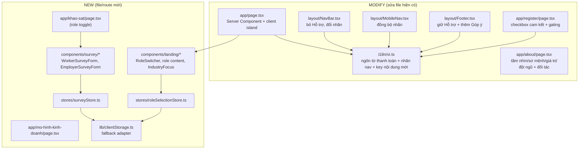
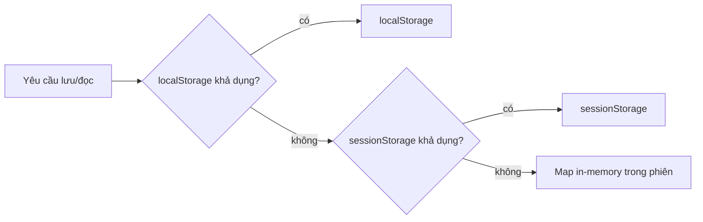

# Tài liệu Thiết kế — Checkpoint Readiness Phase 1

## Overview

Phase 1 là một lớp **nội dung tĩnh (STATIC)** và **dữ liệu mô phỏng trên trình duyệt (MOCK/localStorage)** phủ lên trên sản phẩm CaLẻ / Now hiện có, nhằm chuẩn bị cho buổi báo cáo/checkpoint. Thiết kế tuân thủ tuyệt đối nguyên tắc: **không chạm vào logic nghiệp vụ lõi**, **không thêm backend**, **không thanh toán/định danh thật**, và **giữ nguyên Baseline_Xanh** (eslint, tsc, vitest 544, next build).

Phần lớn công việc là:
- **Đổi nhãn hiển thị** qua `src/i18n/vi.ts` (ngôn từ thanh toán mềm, nhãn điều hướng).
- **Tái cấu trúc landing** thành trải nghiệm theo vai trò (người lao động / nhà tuyển dụng), tái sử dụng primitive sẵn có.
- **Bổ sung nội dung tĩnh** (Giới thiệu nâng cấp, Đối tác, Business Model Canvas, định hướng ngành).
- **Thêm dữ liệu MOCK**: lựa chọn vai trò (session), khảo sát người lao động & nhà tuyển dụng (localStorage), và cam kết điều khoản khi đăng ký (frontend gating).

Điểm mấu chốt về kiến trúc dữ liệu: **dữ liệu mới (khảo sát, vai trò) được lưu TÁCH BIỆT khỏi `Snapshot` trung tâm** của `persistence.ts`. Đây là quyết định có chủ đích để không phải bump `SCHEMA_VERSION` (tránh reseed làm mất dữ liệu demo) và không kéo khóa mới vào cơ chế export/import (vốn được test round-trip kiểm tra). Chi tiết ở mục Data Models.

### Traceability — ánh xạ thiết kế ↔ 12 yêu cầu

| Req | Chủ đề | Khu vực thiết kế chính | Loại |
|-----|--------|------------------------|------|
| R1 | Phân tách vai trò trên Trang chủ | `page.tsx` + `components/landing/*` + `roleSelectionStore` (sessionStorage) | STATIC + MOCK |
| R2 | Hai luồng "Cách hoạt động" theo vai trò | Khối nội dung vai trò trong `components/landing/*` + i18n | STATIC |
| R3 | Sắp xếp lại Điều hướng & Footer (chỉ nhãn) | `NavBar.tsx`, `MobileNav.tsx`, `Footer.tsx` + i18n `nav.label.*` | STATIC |
| R4 | Ngôn từ thanh toán mềm (chỉ nhãn) | `src/i18n/vi.ts` (giá trị chuỗi), không đổi định danh | STATIC |
| R5 | Nâng cấp Giới thiệu / Thương hiệu | `app/about/page.tsx` + `InfoPage`/`InfoSection` | STATIC |
| R6 | Mục Đối tác (tiềm năng/định hướng) | `app/about/page.tsx` (section mới) hoặc `components/landing/PartnersSection` | STATIC |
| R7 | Cam kết điều khoản khi đăng ký | `app/register/page.tsx` (checkbox + gating frontend) | STATIC + MOCK |
| R8 | Khảo sát Người lao động | `/khao-sat` + `WorkerSurveyForm` + `surveyStore` (localStorage) | MOCK |
| R9 | Khảo sát Nhà tuyển dụng | `/khao-sat` + `EmployerSurveyForm` + `surveyStore` (gating đồng ý bên thứ ba) | MOCK |
| R10 | Business Model Canvas & điểm khác biệt | `/mo-hinh-kinh-doanh` (route mới, `InfoPage`) | STATIC |
| R11 | Định hướng ngành ban đầu | Khối `IndustryFocus` trên `page.tsx` | STATIC |
| R12 | Guardrails & phi chức năng | `clientStorage` fallback adapter + danh sách file cấm + chiến lược test | STATIC + MOCK |

## Architecture

### Sơ đồ tổng quan các thay đổi



### Nhóm A — MODIFY (sửa file hiện có)

**`src/app/page.tsx` (Trang chủ).** Hiện là Server Component với hai "audience card" và một khối "How it works" hiển thị **đồng thời** cả hai vai trò. Phase 1 chuyển phần này sang trải nghiệm theo vai trò:
- Giữ nguyên Hero (Server) và phần trang trí.
- Thêm một **client island** `LandingRoleExperience` (component mới) bọc: `RoleSwitcher` + khối nội dung của **một** vai trò đang chọn (lợi ích + 3 bước "Cách hoạt động" + CTA), thoả R1.2/R1.3/R1.6/R1.8.
- Trạng thái vai trò đến từ `roleSelectionStore` (xem Nhóm B). Khi chưa chọn → trạng thái trung lập (R1.6); khi đã chọn → chỉ render nội dung vai trò đó (R1.8) và cho phép đổi vai trò không tải lại trang (R1.7, R1.9).
- Thêm khối `IndustryFocus` (R11) — danh sách ngành trọng tâm, hiển thị tĩnh.
- CTA khảo sát: thêm liên kết tới `/khao-sat?role=worker|employer` trong mỗi khối vai trò.

**`src/components/layout/NavBar.tsx`.** Chỉ thay đổi **nhãn hiển thị** (R3, R12.2 không áp dụng vì đây không phải file lõi):
- **Bỏ mục "Hỗ trợ"** khỏi tất cả biến thể nav (`PublicNav`, `WorkerNav`, `EmployerNav`, `AdminNav`) — R3.1.
- Đổi nhãn route `/safety` và `/user-guide` sang nhãn rõ ràng/hấp dẫn hơn, đọc từ i18n key mới (`nav.label.safety`, `nav.label.userGuide`) — R3.3/R3.4, giữ nguyên `href` (R3.5).
- Các chuỗi nhãn nav hiện đang hardcode trong các hằng `SAFETY_GROUP`/`*_GROUP` sẽ trỏ về i18n key để bảo đảm đồng nhất với MobileNav & Footer (R3.6).

**`src/components/layout/MobileNav.tsx`.** Đồng bộ đúng các nhãn trên cho cùng route trong các `*_SECTIONS` (R3.6). Bỏ dòng "Hỗ trợ" khỏi phần nav chính nếu cần để thống nhất với NavBar; vẫn giữ liên kết "Liên hệ hỗ trợ" ở footer của drawer (đó là footer của drawer, không phải NavBar). Không đổi `href`.

**`src/components/layout/Footer.tsx`.** Giữ liên kết **"Hỗ trợ"** (đã có `/support` trong `LEGAL_COLUMN`) — R3.2. Bổ sung liên kết **"Góp ý / Khảo sát"** trỏ tới `/khao-sat` và đảm bảo có liên kết "Giới thiệu" (`/about`, đã có). Đổi nhãn `/safety`, `/user-guide` đồng bộ qua cùng i18n key.

**`src/i18n/vi.ts`.** Trung tâm của R4 và một phần R3:
- **Đổi giá trị chuỗi** cho mọi nhãn liên quan "cọc/đặt cọc/cọc ca làm" sang nhóm Đảm_Bảo_Thanh_Toán (bảng ánh xạ ở mục i18n). **Giữ nguyên KEY** (`escrow.*`, `btn.deposit`, `shifts.deposit.*`…) — chỉ đổi value (R4.2).
- Thêm key nhãn nav mới (`nav.label.safety`, `nav.label.userGuide`).
- Thêm các nhóm key nội dung mới: `landing.role.*`, `survey.*`, `bmc.*`, `about.*`, `register.commitment.*` (xem mục i18n).
- Bảo đảm tiền tệ dùng "đ"/"đồng", không "VNĐ"/"₫" (R4.4) — quét và sửa nếu còn sót.

**`src/app/about/page.tsx`.** Mở rộng nội dung (R5, R6): các `InfoSection` cho Tầm nhìn, Sứ mệnh, Giá trị cốt lõi, Đội ngũ sáng lập, và một section **Đối tác (tiềm năng/định hướng)**. Ngôn từ mềm ("hướng tới", "được xây dựng để", "mong muốn"), không tuyên bố mạnh chưa kiểm chứng (R5.2/R5.3). Mọi đối tác phải gắn nhãn "tiềm năng / định hướng" (R6.2). Tái sử dụng `InfoPage`/`InfoSection`/`InfoList`.

**`src/app/register/page.tsx`.** Thêm **checkbox cam kết bắt buộc** với liên kết tới `/terms`, `/privacy`, `/safety` (R7.1/R7.2). Mở rộng `FormValues` thêm `agreedToTerms: boolean` và `FormErrors` thêm `agreedToTerms?`. Trong `validate()`: nếu chưa tích → thêm lỗi và chặn submit (R7.3). Khi đã tích và mọi trường hợp lệ → tiếp tục luồng `register(...)` hiện có **không thay đổi** (R7.4/R7.5). **Không chạm `authStore`** — chỉ sửa component trang.

### Nhóm B — NEW (file/route mới)

**Route khảo sát — `src/app/khao-sat/page.tsx`.** Một route duy nhất với **toggle vai trò** (worker / employer), nhận `?role=` để chọn form ban đầu, mặc định theo `roleSelectionStore` nếu có. Lý do chọn một route thay vì hai: giảm số route mới (giữ build gọn), tái sử dụng khái niệm vai trò của landing, và đơn giản hoá điều hướng từ CTA. Render `WorkerSurveyForm` hoặc `EmployerSurveyForm`. Đây là client component (form tương tác + ghi localStorage).

**Route mô hình kinh doanh — `src/app/mo-hinh-kinh-doanh/page.tsx`.** Trang tĩnh dùng `InfoPage` + `InfoSection`, render đủ 9 khối BMC và phần "điểm khác biệt" (R10). Server Component (không tương tác). Tên route tiếng Việt không dấu để nhất quán với `/khao-sat`.

**Store lựa chọn vai trò — `src/stores/roleSelectionStore.ts`.** Zustand store nhỏ mirror pattern hiện có (`scheduleStore`/`reviewReportStore`): state `selectedRole: 'worker' | 'employer' | null`, action `select(role)`, `clear()`, `hydrate(role)`. Persist qua `clientStorage` ở **scope session** (R1.4 — "Phiên_Trình_Duyệt").

**Store khảo sát — `src/stores/surveyStore.ts`.** Zustand store mirror pattern: giữ hai mảng `workerResponses`, `employerResponses`; action `submitWorker(input)`, `submitEmployer(input)` trả về `Result<Response, SurveyError>` (kiểu `Result` sẵn có trong `@/types`), `hydrate(...)`. Validation thuần (bắt buộc + gating đồng ý bên thứ ba) tách thành helper thuần để test PBT. Persist qua `clientStorage` ở **scope local** (R8.2/R9.2).

**Adapter lưu trữ — `src/lib/clientStorage.ts`.** Lớp truy cập lưu trữ phía trình duyệt **có dự phòng** (R12.8): thử `localStorage` → `sessionStorage` → bộ nhớ tạm trong phiên (Map in-memory). Mỗi backend có cùng giao diện `getItem/setItem`. Không bao giờ gửi dữ liệu ra ngoài (R8.5/R9.7/R12.7). Tách riêng với `persistence.ts` để không đụng cơ chế `Snapshot`/`SCHEMA_VERSION`/export-import. Hàm `pickBackend(scope)` chọn backend tốt nhất hiện có; phát hiện khả dụng bằng thao tác thử-ghi-xoá trong `try/catch`.

**Component landing mới — `src/components/landing/`.**
- `LandingRoleExperience.tsx` (client): điều phối vai trò, render switcher + nội dung.
- `RoleSwitcher.tsx` (client): hai lựa chọn "Tôi là người lao động" / "Tôi là nhà tuyển dụng" (R1.1) + cách đổi vai trò (R1.7).
- `RoleContent.tsx` (hoặc `WorkerLandingContent`/`EmployerLandingContent`): lợi ích + 3 bước "Cách hoạt động" + CTA theo vai trò (R2). Dùng `Card`/`InfoStep`-style hiện có (R2.7).
- `IndustryFocus.tsx`: khối ngành trọng tâm (R11).
- `PartnersSection.tsx` (tuỳ chọn — có thể đặt trong about thay vì landing): danh sách nhóm đối tác có nhãn "tiềm năng/định hướng" (R6).

**Component khảo sát mới — `src/components/survey/`.**
- `WorkerSurveyForm.tsx`, `EmployerSurveyForm.tsx`: form dùng `Input`/`Select`/`Textarea`/`Button` + checkbox; hiển thị lỗi từng trường; trạng thái xác nhận sau khi gửi thành công.
- `SurveySuccess.tsx`: panel xác nhận "đã ghi nhận" (R8.4/R9.5).

### Tích hợp hydration

`roleSelectionStore` và `surveyStore` **không** đi qua `AppHydrator`/`Snapshot` trung tâm. Thay vào đó mỗi store tự hydrate trong một `useEffect` phía client của chính component dùng nó (giống cách `MobileNav` đặt `mounted` gate, và `AppHydrator` chạy `useEffect`). Điều này:
- Tránh sửa `AppHydrator.tsx`/`persistence.ts` (giảm rủi ro baseline).
- Bảo đảm an toàn SSR: lần render đầu (server) là trung lập; sau mount mới áp vai trò đã lưu (R1.5) — tránh hydration mismatch.

## Components and Interfaces

Mục này mô tả trách nhiệm và giao diện (interface sketch tối thiểu) của các component/store chính. Mọi component tái sử dụng primitive hiện có (R12.9).

### Component landing (R1, R2, R11)

- **`LandingRoleExperience`** (client island, mới): điều phối vai trò. Đọc `selectedRole` từ `roleSelectionStore`; render `RoleSwitcher` + đúng một khối nội dung vai trò; trạng thái trung lập khi `null` (R1.6). Đổi vai trò không tải lại trang (R1.7/R1.9).
- **`RoleSwitcher`** (client): hai nút "Tôi là người lao động" / "Tôi là nhà tuyển dụng" (R1.1); gọi `roleSelectionStore.select(role)`.
- **`RoleContent`** (hàm/render thuần hoá được): nhận `role`, trả về khối lợi ích + 3 bước "Cách hoạt động" + CTA của vai trò đó. Hậu thuẫn bởi hàm thuần `contentForRole(role)` (test P2). Worker xưng "bạn"; employer gọi "người làm", không xưng "bạn" (R2.3–R2.6). Dùng `Card` + style `InfoStep` (R2.7).
- **`IndustryFocus`** (server/tĩnh): map danh sách ngành trọng tâm độc lập từng mục (R11, render một phần R11.3).

```ts
// Hàm thuần phục vụ Property 2
export function contentForRole(
  role: SelectedRole | null,
): { benefits: string[]; steps: string[]; ctas: CtaLink[] } | null;
// null → trạng thái trung lập; ngược lại chỉ chứa nội dung của `role`.
```

### Component khảo sát (R8, R9)

- **`WorkerSurveyForm` / `EmployerSurveyForm`** (client): dùng `Input`/`Select`/`Textarea`/`Button` + checkbox; hiển thị lỗi từng trường; gọi `surveyStore.submitWorker/submitEmployer`.
- **`SurveySuccess`** (client): panel xác nhận "đã ghi nhận" chỉ render khi `submit*` trả `{ ok: true }` (R8.4/R9.5; mặt phủ định R9.6).
- Validation tách thành hàm thuần `validateWorker(input)` / `validateEmployer(input)` (test P5/P6).

### Component đăng ký (R7)

- **`RegisterForm`** (sửa): thêm checkbox cam kết + 3 liên kết `/terms`,`/privacy`,`/safety`; mở rộng `validate()` thành (hoặc gọi) hàm thuần `validateRegister(values)` để test gating (P3). Không sửa `authStore`.

### Component nội dung tĩnh (R5, R6, R10)

- **`AboutPage`** (sửa): các `InfoSection` độc lập (Tầm nhìn/Sứ mệnh/Giá trị/Đội ngũ) + `PartnersSection`.
- **`PartnersSection`**: render danh sách đối tác từ dữ liệu `{ name, status: 'potential' | 'established' }`; hàm thuần `labelForPartner(p)` luôn gắn nhãn "tiềm năng/định hướng" cho `potential` và không gắn cho `established` (test P7).
- **`BusinessModelPage`** (`/mo-hinh-kinh-doanh`, server): `InfoPage` + 9 `InfoSection` cho 9 khối BMC + phần điểm khác biệt; mỗi khối độc lập (render một phần R10.5).

### Store & adapter (interface sketch)

```ts
// src/stores/roleSelectionStore.ts
interface RoleSelectionStore {
  selectedRole: SelectedRole | null;
  select(role: SelectedRole): void;   // persist scope 'session'
  clear(): void;
  hydrate(role: SelectedRole | null): void;
}

// src/stores/surveyStore.ts
type SurveyError = 'MISSING_REQUIRED' | 'CONSENT_REQUIRED';
interface SurveyStore {
  workerResponses: WorkerSurveyResponse[];
  employerResponses: EmployerSurveyResponse[];
  submitWorker(input: WorkerSurveyInput): Result<WorkerSurveyResponse, SurveyError>;
  submitEmployer(input: EmployerSurveyInput): Result<EmployerSurveyResponse, SurveyError>;
  hydrate(w: WorkerSurveyResponse[], e: EmployerSurveyResponse[]): void;
}

// src/lib/clientStorage.ts
type StorageScope = 'session' | 'local';
interface ClientStorage {
  get<T>(key: string, fallback: T, scope?: StorageScope): T;
  set<T>(key: string, value: T, scope?: StorageScope): void;
}
```

> `Result<T, E>` dùng lại kiểu sẵn có trong `@/types`. ID sinh bằng `newPrefixedId(...)` (`@/lib/ids`) như các store hiện có.

## Data Models

Tất cả model mới là **bổ sung (additive)** và **không** nằm trong `Snapshot` của `persistence.ts`. Vì vậy **KHÔNG bump `SCHEMA_VERSION`** và **KHÔNG sửa** `seedSnapshot`/`loadAll`/`persistAll`/`exportSnapshot`.

### Khóa lưu trữ mới (tách biệt với `STORAGE_KEYS`)

Định nghĩa trong `clientStorage.ts` (hoặc một module hằng nhỏ), **không** thêm vào `STORAGE_KEYS` của `persistence.ts`:

```ts
// src/lib/clientStorage.ts (sketch)
export const CALE_PHASE1_KEYS = {
  /** scope: session — lựa chọn vai trò trên landing (R1.4/R1.5) */
  selectedRole: 'cale.session.role',
  /** scope: local — mảng phản hồi khảo sát người lao động (R8.2) */
  workerSurvey: 'cale.survey.worker',
  /** scope: local — mảng phản hồi khảo sát nhà tuyển dụng (R9.2) */
  employerSurvey: 'cale.survey.employer',
} as const;
```

> Lý do tách khóa: `persistence.ts` suy ra `SNAPSHOT_KEYS = Object.values(STORAGE_KEYS)` và dùng nó cho `exportSnapshot`/`importSnapshot`; test round-trip (`phase10cStab1Batch2.test.ts`) phụ thuộc tập khóa này. Thêm khóa vào `STORAGE_KEYS` sẽ buộc phải cập nhật `seedSnapshot`/`loadAll`/`persistAll`/`exportSnapshot` đồng bộ **và** dễ làm gãy test round-trip. Giữ khóa Phase 1 ở namespace riêng là cách additive an toàn nhất, không cần bump version, không reseed dữ liệu demo.

### Kiểu lựa chọn vai trò

```ts
export type SelectedRole = 'worker' | 'employer';
// Giá trị bền vững: SelectedRole | null (null = chưa chọn → trạng thái trung lập R1.6)
```

### `WorkerSurveyResponse` (R8)

```ts
export type SurveyPriority = 'luong' | 'gan_nha' | 'gio_linh_hoat' | 'uy_tin';
export type Readiness = 'rat_san_sang' | 'san_sang' | 'can_nhac' | 'chua';

export interface WorkerSurveyResponse {
  id: string;                  // newPrefixedId('survey-wkr')
  createdAt: string;           // ISO 8601
  jobSearchChannels: string[]; // nơi thường tìm việc (>=1, bắt buộc)
  searchDifficulties: string[];// khó khăn khi tìm việc ngắn hạn (>=1)
  desiredIndustries: string[]; // ngành muốn làm (>=1)
  priorities: SurveyPriority[];// ưu tiên (>=1)
  webAppReadiness: Readiness;  // mức độ sẵn sàng dùng web/app (bắt buộc)
  note?: string;               // tuỳ chọn
}
```

### `EmployerSurveyResponse` (R9)

```ts
export type HiringFrequency = 'hang_ngay' | 'hang_tuan' | 'hang_thang' | 'thoi_vu';
export type PreferredModel = 'tra_theo_ca' | 'goi_thang' | 'vi_tra_truoc' | 'hoa_hong';

/** Giới thiệu doanh nghiệp/người phù hợp — có thể chứa PII bên thứ ba (R9.4). */
export interface SurveyReferral {
  businessName?: string;
  contactName?: string;   // PII bên thứ ba
  contactPhone?: string;  // PII bên thứ ba
  consentToShare: boolean;// PHẢI true nếu có contactName/contactPhone
}

export interface EmployerSurveyResponse {
  id: string;                   // newPrefixedId('survey-emp')
  createdAt: string;            // ISO 8601
  hiringIndustries: string[];   // ngành cần tuyển (>=1)
  hiringFrequency: HiringFrequency;
  currentChannels: string[];    // kênh đang tuyển hiện tại (>=1)
  difficulties: string[];       // thiếu người / bùng ca / lọc ứng viên / chất lượng (>=1)
  freeTrialReadiness: Readiness;// sẵn sàng dùng thử miễn phí
  payReadiness: Readiness;      // sẵn sàng trả phí
  preferredModel: PreferredModel;
  referral?: SurveyReferral;    // tuỳ chọn; nếu có PII → bắt buộc consentToShare
  note?: string;
}
```

> Các kiểu này sẽ đặt trong `src/stores/surveyStore.ts` hoặc bổ sung vào `src/types` (additive, không sửa kiểu hiện có).

### Cơ chế back-compat & fallback (R12.8)

`clientStorage` chọn backend theo thứ tự, không gửi dữ liệu ra ngoài:



- **Phát hiện khả dụng**: thử `setItem`/`removeItem` một khóa thăm dò trong `try/catch` (chế độ riêng tư/bị vô hiệu hoá sẽ ném lỗi → rớt xuống backend kế tiếp).
- **Đọc lỗi/parse lỗi** → trả về fallback (mảng rỗng / null), giống triết lý `read()` của `persistence.ts`.
- **Back-compat**: vì dùng namespace khóa mới, dữ liệu cũ không bị ảnh hưởng; người dùng cũ chỉ đơn giản chưa có khóa Phase 1 (đọc ra rỗng).
- Vai trò dùng scope **session** (mặc định `sessionStorage`, fallback in-memory); khảo sát dùng scope **local** (mặc định `localStorage`, fallback `sessionStorage` → in-memory).

## Correctness Properties

*Một property (thuộc tính) là một đặc tính hoặc hành vi phải luôn đúng trên mọi lần thực thi hợp lệ của hệ thống — về bản chất là một phát biểu hình thức về điều phần mềm phải làm. Properties là cầu nối giữa đặc tả cho con người đọc và đảm bảo đúng đắn mà máy có thể kiểm chứng.*

Phạm vi PBT của Phase 1 **chỉ áp cho lớp logic thuần** có thể tách khỏi UI: validation khảo sát, gating cam kết/đồng ý, round-trip lưu trữ mock (role + khảo sát qua `clientStorage`), ánh xạ nội dung theo vai trò, và gắn nhãn đối tác. Các phần nội dung tĩnh (BMC, About, nhãn điều hướng, ngôn từ thanh toán, định hướng ngành) **không** dùng PBT — xem Testing Strategy.

### Property 1: Round-trip lựa chọn vai trò

*For any* vai trò hợp lệ `r ∈ {worker, employer}`, sau khi `roleSelectionStore.select(r)` thì đọc lại `selectedRole` phải bằng `r`; và sau khi `hydrate(r)` từ giá trị đã lưu, state phải bằng `r` (khôi phục làm mặc định trong phiên). Đổi sang vai trò khác cập nhật giá trị ngay lập tức mà không cần xác nhận.

**Validates: Requirements 1.4, 1.5, 1.9**

### Property 2: Nội dung hiển thị khớp đúng vai trò đang chọn

*For any* vai trò đang chọn `r`, tập nội dung do `contentForRole(r)` trả về chỉ chứa các khối thuộc `r` (lợi ích, 3 bước, CTA của `r`) và **giao rỗng** với tập khối của vai trò còn lại; khi chưa có vai trò (`null`), kết quả là trạng thái trung lập không chứa toàn bộ nội dung của cả hai vai trò cùng lúc.

**Validates: Requirements 1.2, 1.3, 1.6, 1.8**

### Property 3: Chặn đăng ký khi chưa cam kết điều khoản

*For any* tổ hợp giá trị biểu mẫu đăng ký, kết quả `validateRegister(values)` **không có lỗi** (cho phép tiếp tục) khi và chỉ khi `agreedToTerms === true` **và** mọi trường bắt buộc khác hợp lệ; nếu `agreedToTerms === false` thì kết quả luôn chứa lỗi cam kết và việc đăng ký bị chặn — bất kể các trường khác.

**Validates: Requirements 7.3, 7.4**

### Property 4: Round-trip lưu khảo sát bảo toàn dữ liệu

*For any* phản hồi khảo sát hợp lệ (người lao động hoặc nhà tuyển dụng), sau khi `submit*(r)` thành công thì đọc lại danh sách phản hồi tương ứng phải chứa một bản ghi có dữ liệu trùng khớp với `r` (các trường được bảo toàn nguyên vẹn qua serialize/deserialize của lớp lưu trữ mock).

**Validates: Requirements 8.2, 9.2**

### Property 5: Khảo sát không hợp lệ bị từ chối và không được lưu

*For any* phản hồi khảo sát thiếu ít nhất một trường bắt buộc, hàm validate trả về danh sách lỗi chỉ đúng (các) trường còn thiếu, `submit*` trả về `{ ok: false }`, **không** ghi thêm bản ghi nào vào lưu trữ, và **không** phát sinh trạng thái xác nhận thành công.

**Validates: Requirements 8.3, 9.3, 9.6**

### Property 6: PII bên thứ ba bắt buộc đồng ý thực sự

*For any* phản hồi khảo sát nhà tuyển dụng, nếu phần giới thiệu có chứa tên hoặc số điện thoại của bên thứ ba (`contactName` hoặc `contactPhone` khác rỗng) thì phản hồi hợp lệ **khi và chỉ khi** `consentToShare === true`; trường hợp có PII nhưng `consentToShare` thiếu/false thì luôn bị chặn (kiểm tra giá trị thực của cờ, không chỉ sự hiện diện của ô đánh dấu).

**Validates: Requirements 9.4**

### Property 7: Mọi đối tác tiềm năng đều được gắn nhãn định hướng

*For any* mục trong danh sách đối tác tiềm năng, hàm chuẩn hoá/hiển thị phải đính kèm nhãn "tiềm năng / định hướng"; và *for any* mục được đánh dấu là đối tác đã xác lập (nếu có), nhãn "tiềm năng / định hướng" **không** được gắn.

**Validates: Requirements 6.2, 6.3, 6.4**

### Property 8: Round-trip lưu trữ phía trình duyệt bền với mọi backend dự phòng

*For any* khóa và giá trị tuần tự hoá được, với **mọi** backend khả dụng trong chuỗi dự phòng (localStorage → sessionStorage → in-memory), `clientStorage.set(k, v)` rồi `clientStorage.get(k)` phải trả về giá trị bằng `v`; kể cả khi localStorage bị mô phỏng ném lỗi (vô hiệu hoá), round-trip vẫn thành công qua backend kế tiếp và không phát sinh lời gọi mạng.

**Validates: Requirements 12.8**

## Error Handling

**Render một phần cho nội dung tĩnh (R5.5, R10.5, R11.3).** About, BMC và khối định hướng ngành được dựng từ các danh sách/section **độc lập**, map từng phần tử riêng biệt. Không có state/logic dùng chung khiến một mục lỗi kéo đổ cả trang. Với danh sách dữ liệu (ngành, khối BMC, đối tác), mỗi phần tử tự chịu trách nhiệm render; phần tử thiếu/khuyết trường tuỳ chọn vẫn render phần còn lại. Tránh `throw` trong nhánh render nội dung tĩnh.

**Validation khảo sát (R8.3, R9.3, R9.4).** Lỗi được trả dưới dạng map `field → messageKey` (i18n), hiển thị ngay tại trường tương ứng. Submit bị chặn trước khi ghi lưu trữ. Thông báo "câu hỏi còn thiếu" chỉ rõ trường. Consent bên thứ ba kiểm tra giá trị `=== true`.

**Gating cam kết đăng ký (R7.3).** Lỗi `agreedToTerms` hiển thị cạnh checkbox; nút submit không kích hoạt luồng `register(...)` cho tới khi hợp lệ. Không thay đổi thông điệp lỗi của các trường hiện có.

**Lưu trữ không khả dụng (R12.8).** `clientStorage` bắt mọi ngoại lệ truy cập storage (chế độ riêng tư, quota, bảo mật) bằng `try/catch`, tự rớt xuống backend kế tiếp. Đọc lỗi/parse lỗi trả fallback rỗng (giống `read()` trong `persistence.ts`). Người dùng không thấy crash; dữ liệu khảo sát vẫn tồn tại trong phiên qua in-memory nếu cần.

**An toàn SSR/hydration.** Mọi truy cập storage chỉ chạy trong `useEffect` phía client. Lần render server đầu tiên là trung lập (chưa áp vai trò đã lưu) để tránh hydration mismatch; vai trò đã lưu được áp sau khi mount.

## Testing Strategy

### Nguyên tắc bảo toàn baseline (BẮT BUỘC)

- **Không sửa** bất kỳ test hiện có nào. Bộ vitest 544 test và e2e Playwright hiện có phải **vẫn xanh, nguyên trạng** (R12.5).
- **Không sửa** test của các module Logic_Lõi (escrow/deposit/reputation/lifecycle/timeGates và logic của applicationStore/shiftStore/walletStore/adminStore).
- Vì Phase 1 chỉ đổi **value** chuỗi i18n (không đổi key), các test không assert vào nội dung văn bản nhãn cọc/đặt cọc sẽ không bị ảnh hưởng. Trước khi merge, **rà các test/e2e có assert chuỗi "đặt cọc"** (đã xác định: `e2e/20`, `e2e/21` assert thông điệp "Số dư ví không đủ để đặt cọc"; các test domain dùng từ "Hỗ trợ"/"đặt cọc" trong dữ liệu seed, không phải nhãn UI). Nếu một nhãn bị đổi value trùng với chuỗi mà e2e đang assert, **giữ nguyên chuỗi đó** hoặc cập nhật song song có chủ đích — nhưng ưu tiên không đổi các chuỗi thông điệp lỗi ví/đặt cọc nội bộ vốn ngoài phạm vi "nhãn marketing" của R4.

### Bộ công cụ

- **Unit + Property**: `vitest` (đã có) + `fast-check` (đã có trong devDependencies, `^4.8.0`). **Không** tự viết PBT từ đầu.
- **Component/UI**: `@testing-library/react` (đã có) cho các test ví dụ render.
- Property test cấu hình **tối thiểu 100 vòng** (`fc.assert(fc.property(...), { numRuns: 100 })`).
- Mỗi property test gắn comment tham chiếu: `// Feature: checkpoint-readiness-phase-1, Property {n}: {mô tả}`.

### Test mới đề xuất (chỉ cho logic thuần mới)

**Property-based tests (8 property, mỗi property một test PBT):**

| Property | Mục tiêu | Generator chính |
|----------|----------|-----------------|
| P1 | Round-trip vai trò qua `roleSelectionStore` | `fc.constantFrom('worker','employer')` |
| P2 | `contentForRole(r)` đúng & disjoint | role + `null` |
| P3 | `validateRegister` gating cam kết | record form ngẫu nhiên (email/phone/password/role + `agreedToTerms` boolean) |
| P4 | Round-trip lưu khảo sát (worker/employer) | generator phản hồi hợp lệ cho cả hai loại |
| P5 | Phản hồi thiếu trường bắt buộc bị chặn & không ghi | generator phản hồi có ≥1 trường rỗng |
| P6 | Consent PII bên thứ ba | generator có/không `contactName/Phone` × `consentToShare` boolean |
| P7 | Mọi đối tác tiềm năng được gắn nhãn | generator danh sách đối tác {name, status} |
| P8 | Round-trip `clientStorage` qua mọi backend (mô phỏng localStorage lỗi) | key/value tuỳ ý + cờ ép-fallback |

**Unit tests ví dụ (ít, tập trung):**
- Render `NavBar` guest: không có "Hỗ trợ" (R3.1); `Footer` có "Hỗ trợ" (R3.2).
- i18n: nhãn `/safety`, `/user-guide` trả nhãn mới (R3.3/R3.4); nhãn ba nơi đọc cùng key (R3.6).
- i18n lint (1 test duyệt dictionary): không value nào chứa cụm bị cấm "tiền cọc / đặt cọc / cọc ca" trong nhóm nhãn marketing, và không chứa "VNĐ"/"₫" (R4.1/R4.4) — dùng whitelist cho các key thông điệp nội bộ nếu cần để không làm gãy baseline.
- Render `/khao-sat` worker/employer: đủ trường câu hỏi (R8.1/R9.1); submit hợp lệ → panel xác nhận (R8.4/R9.5).
- Render `/about`: đủ 4 phần + section đối tác có nhãn định hướng (R5.1/R6.1).
- Render `/mo-hinh-kinh-doanh`: đủ 9 khối BMC + điểm khác biệt (R10.1/R10.2/R10.3).
- Structural: danh sách route hiện có vẫn tồn tại sau khi thêm route mới (R12.3); `surveyStore`/`clientStorage` không import `fetch`/network (R8.5/R9.7/R12.7).

### Vì sao phần còn lại KHÔNG dùng PBT

- **Nội dung tĩnh** (BMC, About, định hướng ngành, nhãn nav, ngôn từ thanh toán): không có "for all input" có ý nghĩa — dùng test ví dụ render và i18n lint.
- **Render một phần khi lỗi (R5.5/R10.5/R11.3)**: là kết cấu render (mỗi mục độc lập), kiểm bằng review + structural, không phải property tính toán.
- **Bảo toàn baseline / không-đụng-file (R12.1/R12.2/R12.5/R12.6)**: là ràng buộc môi trường/đường ống — kiểm bằng chạy lại toàn bộ pipeline (eslint, tsc, vitest, build) và diff guard, không phải PBT.

## Ràng buộc & file KHÔNG được đụng

### Quy tắc phạm vi (nhắc lại để thực thi)

- **MOCK/STATIC only**: không backend, không thanh toán thật, không đổi cơ chế auth thật (R12.6).
- **Ngôn từ thanh toán** chỉ đổi ở **value** trong `src/i18n/vi.ts`; **giữ nguyên mọi key** và mọi định danh nội bộ `deposit`/`escrow` (R4.2).
- **Không đổi/xoá** đường dẫn route hiện có; chỉ **thêm** route mới và build phải xanh (R3.5, R12.3, R12.4).
- Dữ liệu mới (vai trò, khảo sát) lưu qua `clientStorage` (localStorage → sessionStorage → in-memory), **không gửi ra ngoài** (R12.7/R12.8).
- **Không** thiết kế lại toàn bộ UI; tái sử dụng `InfoPage`, `InfoSection`, `InfoStep`, `Card`, `Button`, `Modal`, `Input`, `Select`, `Textarea` (R12.9).
- Dữ liệu Phase 1 **tách biệt** với `Snapshot`/`STORAGE_KEYS`/`SCHEMA_VERSION` → **không bump `SCHEMA_VERSION`**, **không** sửa `seedSnapshot`/`loadAll`/`persistAll`/`exportSnapshot`/`importSnapshot`.

### Danh sách file TUYỆT ĐỐI KHÔNG được sửa (kể cả thay đổi chất lượng mã — R12.2)

Module Logic_Lõi (domain):
- `src/domain/escrow.ts`
- `src/domain/deposit.ts`
- `src/domain/reputation.ts`
- `src/domain/shiftLifecycleState.ts`
- `src/domain/lifecycleSync.ts`
- `src/domain/timeGates.ts`

Phần **logic** của các store (không sửa nội dung mã các tệp này):
- `src/stores/applicationStore.ts`
- `src/stores/shiftStore.ts`
- `src/stores/walletStore.ts`
- `src/stores/adminStore.ts`

Hạ tầng lưu trữ trung tâm (không sửa để tránh ảnh hưởng baseline & test round-trip):
- `src/data/persistence.ts` (không thêm khóa vào `STORAGE_KEYS`, không bump `SCHEMA_VERSION`)
- `src/data/seed/*` (không reseed)

Test hiện có (giữ nguyên, không sửa):
- Toàn bộ `src/__tests__/*` hiện có và `e2e/*` hiện có.

### File ĐƯỢC sửa (MODIFY) trong phạm vi cho phép

- `src/app/page.tsx` (thêm trải nghiệm vai trò + industry focus, không bỏ route)
- `src/components/layout/NavBar.tsx`, `MobileNav.tsx`, `Footer.tsx` (chỉ nhãn/cấu trúc hiển thị)
- `src/i18n/vi.ts` (đổi value + thêm key mới)
- `src/app/about/page.tsx` (mở rộng nội dung + đối tác)
- `src/app/register/page.tsx` (checkbox cam kết + gating frontend; không đụng `authStore`)

### File/route MỚI (NEW) được phép thêm

- `src/app/khao-sat/page.tsx` (route khảo sát, toggle vai trò)
- `src/app/mo-hinh-kinh-doanh/page.tsx` (route BMC tĩnh)
- `src/stores/roleSelectionStore.ts`, `src/stores/surveyStore.ts` (+ export trong `src/stores/index.ts`)
- `src/lib/clientStorage.ts` (adapter dự phòng)
- `src/components/landing/*` (RoleSwitcher, role content, IndustryFocus, Partners nếu đặt ở landing)
- `src/components/survey/*` (WorkerSurveyForm, EmployerSurveyForm, SurveySuccess)
- Test mới: `src/__tests__/checkpointReadinessPhase1*.test.ts(x)` (8 property + unit ví dụ)

> Lưu ý: thêm export vào `src/stores/index.ts` là thay đổi **bổ sung** (chỉ thêm dòng `export`), không sửa logic store lõi — nằm trong phạm vi cho phép.

## Phần i18n — kế hoạch khóa & ánh xạ ngôn từ

### Bảng ánh xạ ngôn từ thanh toán (R4) — đổi VALUE, GIỮ KEY

> Khuyến nghị chọn nhãn mềm theo ngữ cảnh. Định danh nội bộ (`deposit`/`escrow`) không đổi.

| Key (giữ nguyên) | Value cũ (ví dụ) | Value mới đề xuất (ngôn từ mềm) | Ngữ cảnh |
|------------------|------------------|--------------------------------|----------|
| `btn.deposit` | "Mô phỏng đặt cọc" | "Đảm bảo thanh toán (mô phỏng)" | nút employer |
| `escrow.PendingDeposit` | "Chờ đặt cọc" | "Chờ đảm bảo thanh toán" | trạng thái |
| `escrow.Deposited` | "Đã đặt cọc" | "Đã đảm bảo thanh toán" | trạng thái |
| `shift.lifecycle.PendingDeposit` | "Chờ đặt cọc" | "Chờ đảm bảo thanh toán" | badge ca |
| `shifts.deposit.title` | "Mô phỏng đặt cọc" | "Đảm bảo thanh toán trước" | tiêu đề |
| `shifts.deposit.amount` | "Số tiền đặt cọc" | "Số dư tuyển dụng cần đảm bảo" | label |
| `shifts.deposit.description` | "...đặt cọc toàn bộ tiền lương..." | "...thanh toán trước toàn bộ tiền công vào ví doanh nghiệp..." | mô tả |
| `shifts.detail.depositStatus` | "Trạng thái đặt cọc" | "Trạng thái đảm bảo thanh toán" | label |
| `employer.dashboard.stats.totalDeposited` | "Tổng đã đặt cọc" | "Tổng đã đảm bảo thanh toán" | thống kê |
| `employer.payments.*` | "...đặt cọc..." | "...đảm bảo thanh toán / thanh toán trước..." | trang payments |
| `landing.trust.escrow` | "Tiền giữ ký quỹ minh bạch" | "Thanh toán được đảm bảo minh bạch" | landing |
| `landing.trust.noDeposit` | "Người làm không đặt cọc" | "Người lao động không phải trả trước" | landing |
| `landing.worker.benefit3` / `.desc` | "Không cần đặt cọc" | "Không phải trả trước" | landing |
| `landing.howItWorks.employer.step2` | "Đặt cọc tiền lương vào hệ thống" | "Đảm bảo thanh toán trước (ví doanh nghiệp)" | bước R2.2 |
| `landing.safety.deposit.*` | "Đặt cọc minh bạch / Cách tính đặt cọc" | "Đảm bảo thanh toán minh bạch / Cách tính khoản đảm bảo" | landing safety |
| `landing.finalCta.subtitle` | "...không cần đặt cọc." | "...người lao động không phải trả trước." | landing |
| `auth.side.benefit1.desc` / `benefit2.desc` | "...đặt cọc trước..." / "...không đặt cọc..." | "...thanh toán trước..." / "...không phải trả trước..." | auth side |

> Nhóm thuật ngữ Đảm_Bảo_Thanh_Toán dùng linh hoạt theo ngữ cảnh: **Đảm bảo thanh toán** (cơ chế), **Thanh toán trước** (hành động), **Ví doanh nghiệp / Số dư tuyển dụng** (số dư), **Gói trả trước** (mô hình), **Phí dịch vụ tuyển dụng** (phí). Khi rà cần xử lý hết ~75 dòng có "cọc"/"VNĐ"/"₫" trong `vi.ts` (R4.5/R4.4).

### Nhãn điều hướng (R3) — khóa mới

| Key mới | Value đề xuất | Route | Ghi chú |
|---------|---------------|-------|---------|
| `nav.label.safety` | "An toàn & bảo vệ" | `/safety` | thay "An toàn" (R3.3) |
| `nav.label.userGuide` | "Hướng dẫn sử dụng" | `/user-guide` | thay "Hướng dẫn" (R3.4) |

> NavBar/MobileNav/Footer cùng đọc hai key này để bảo đảm đồng nhất (R3.6). `nav.support` ("Hỗ trợ") giữ lại cho Footer; gỡ khỏi NavBar (R3.1).

### Nhóm key nội dung mới (đề xuất)

- `landing.role.worker.*`, `landing.role.employer.*` — eyebrow, lợi ích, 3 bước, CTA theo vai trò (R1/R2). Nội dung worker xưng "bạn"; nội dung employer gọi "người làm", không xưng "bạn" (R2.3–R2.6).
- `landing.roleSwitcher.worker` = "Tôi là người lao động", `landing.roleSwitcher.employer` = "Tôi là nhà tuyển dụng" (R1.1).
- `landing.industry.*` — tiêu đề + 6 ngành: Nhà hàng/F&B, Quán café, Sự kiện, Tiệc cưới, Bán lẻ, Kho vận nhẹ (R11.1) + câu thể hiện sự tập trung (R11.2).
- `about.vision.*`, `about.mission.*`, `about.values.*`, `about.team.*` — ngôn từ mềm (R5).
- `about.partners.*` — nhóm đối tác + nhãn "tiềm năng / định hướng" (R6).
- `bmc.block.*` (9 khối) + `bmc.diff.*` (điểm khác biệt vs Facebook/Zalo/Manpower/Beetask) (R10).
- `survey.worker.*`, `survey.employer.*` — câu hỏi, lựa chọn, nhãn nút, thông báo lỗi, xác nhận (R8/R9).
- `register.commitment.label` = "Tôi đã đọc và đồng ý với điều khoản sử dụng / chính sách an toàn / quy định xử lý tranh chấp" + `register.commitment.error` (R7).

## Khuyến nghị ngôn từ (chốt)

- **"tiền cọc / đặt cọc" → theo ngữ cảnh:**
  - Cơ chế/giá trị giữ tiền: **"đảm bảo thanh toán"** / **"số dư tuyển dụng"**.
  - Hành động trả trước của nhà tuyển dụng: **"thanh toán trước"** (vào **"ví doanh nghiệp"**).
  - Khẳng định cho người lao động: **"không phải trả trước"** (thay "không đặt cọc").
- **Nhãn nav:** `/safety` → **"An toàn & bảo vệ"**; `/user-guide` → **"Hướng dẫn sử dụng"**.
- **CTA người lao động:** "Tôi là người lao động" → khối lợi ích + "Tìm ca làm ngay" + "Chia sẻ nhu cầu của bạn" (link `/khao-sat?role=worker`).
- **CTA nhà tuyển dụng:** "Tôi là nhà tuyển dụng" → khối lợi ích + "Đăng ca tuyển" + "Góp ý cho nhà tuyển dụng" (link `/khao-sat?role=employer`). Không xưng "bạn" trong nội dung employer.

## Cấu trúc Điều hướng / Footer (trước → sau)

### NavBar (khách truy cập)

**Trước:** Trang chủ · Tìm ca làm · Người lao động ▾ · Nhà tuyển dụng ▾ · **An toàn & hướng dẫn ▾** · **Hỗ trợ** · [Đăng nhập · Đăng ký · Đăng ca tuyển]

**Sau:** Trang chủ · Tìm ca làm · Người lao động ▾ · Nhà tuyển dụng ▾ · An toàn & hướng dẫn ▾ *(mục con `/safety` dùng nhãn "An toàn & bảo vệ", `/user-guide` dùng "Hướng dẫn sử dụng")* · [Đăng nhập · Đăng ký · Đăng ca tuyển]
→ **Bỏ "Hỗ trợ"** khỏi NavBar (và khỏi WorkerNav/EmployerNav/AdminNav). `href` không đổi.

### MobileNav (drawer)

**Trước:** nhóm "Hướng dẫn & hỗ trợ" gồm Cách hoạt động · An toàn & xác minh · Câu hỏi thường gặp · Xử lý tranh chấp · Hướng dẫn sử dụng · Liên hệ hỗ trợ.

**Sau:** giữ cấu trúc; nhãn `/safety` → "An toàn & bảo vệ", `/user-guide` → "Hướng dẫn sử dụng" (đồng bộ NavBar). "Liên hệ hỗ trợ" vẫn nằm ở footer của drawer (không phải NavBar). `href` không đổi.

### Footer

**Trước:** cột "Về CaLedo" (Giới thiệu · Cách hoạt động · An toàn & xác minh · FAQ); cột "Pháp lý & hỗ trợ" (Hướng dẫn sử dụng · Điều khoản · Bảo mật · Tranh chấp · **Liên hệ hỗ trợ**).

**Sau:** giữ **"Hỗ trợ"** (Liên hệ hỗ trợ — R3.2). Thêm liên kết **"Góp ý / Khảo sát"** (`/khao-sat`) vào cột phù hợp (ví dụ "Về CaLedo" hoặc "Pháp lý & hỗ trợ"). Bảo đảm "Giới thiệu" (`/about`) hiện diện (đã có). Nhãn `/safety`, `/user-guide` đồng bộ. `href` không đổi.

## Lưu ý phiên bản Next.js

Dự án dùng **Next.js 16.2.6 + React 19**. Theo `AGENTS.md`, đây là bản có thể khác với kiến thức huấn luyện; khi hiện thực hoá ở phase Tasks, **đọc tài liệu trong `node_modules/next/dist/docs/`** trước khi viết code (đặc biệt: ranh giới Server/Client Component cho route mới `/khao-sat` (client) và `/mo-hinh-kinh-doanh` (server), `useSearchParams` cần bọc `Suspense` như `register/page.tsx` đang làm, và `metadata` cho route tĩnh). Không suy đoán API.
