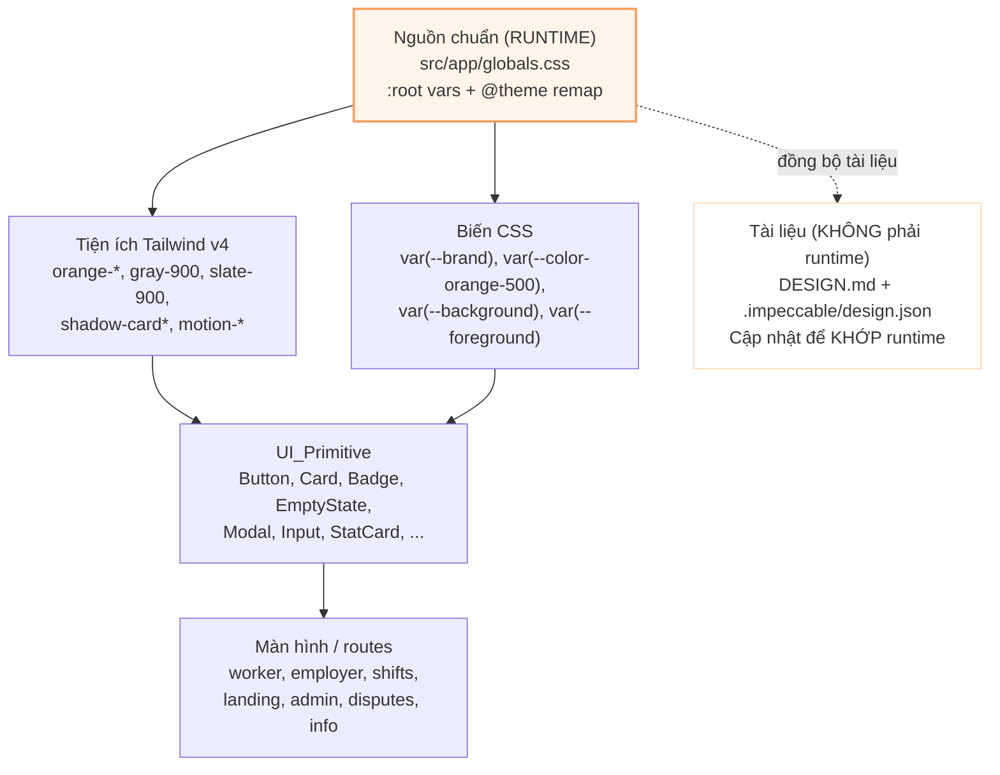

# Tài liệu Thiết kế: Frontend Visual Polish

## Tổng quan (Overview)

Tính năng **Frontend Visual Polish** là một đợt **đánh bóng thị giác** cho web CaLẻ / Now
(Next.js 16 App Router, React 19, Tailwind CSS 4 cấu hình trong CSS qua `@theme` tại
`src/app/globals.css`, state bằng Zustand). Mục tiêu là nâng chất lượng hình ảnh — màu,
typography, khoảng cách, độ nâng, chuyển động, trạng thái thị giác — mà **không** thay đổi
hành vi, luồng nghiệp vụ, dữ liệu, hay danh tính trợ năng (Yêu cầu 12).

Thiết kế này KHÔNG phải một bản thiết kế lại. Nó củng cố North Star sẵn có — *"Bảng điều
phối đáng tin"* — bằng cách siết lại tính nhất quán của lớp token và các UI_Primitive, rồi
lan tỏa sự nhất quán đó ra các màn hình. Không giới thiệu ngôn ngữ thiết kế mới, màu thương
hiệu mới, dark mode, hay thư viện component mới.

### Quyết định nền tảng (đã chốt, không mở lại)

**Runtime là nguồn sự thật duy nhất cho palette.** Lớp `@theme` + `:root` trong
`src/app/globals.css` là nguồn chuẩn (canonical). `DESIGN.md` và `.impeccable/design.json`
là **tài liệu** và sẽ được cập nhật để khớp runtime — không phải ngược lại (Yêu cầu 1.7,
Yêu cầu 2). Bảng giá trị chuẩn:

| Vai trò | Giá trị chuẩn | Ánh xạ trong `globals.css` |
|---|---|---|
| Dark / mực (ink) | `#37373B` | `--foreground`, `--color-gray-900`, `--color-slate-900` |
| Primary / cam thương hiệu | `#FF9A5F` | `--brand`, `--color-orange-500` |
| Neutral | `#FFD5AE` | `--brand-soft`, `--color-orange-200` |
| Background / kem | `#FFF4E9` | `--background`, `--brand-tint` |

**Quy tắc nút Primary CTA:** nền `#FF9A5F` + chữ **tối** `#37373B`. TUYỆT ĐỐI không chữ
trắng trên cam sáng; không quay lại `#f97316`; không dùng lại gradient cam cũ cho nút
primary. Cặp `#37373B` trên nền `#FF9A5F` là cấu hình **được chấp nhận** và phải đạt WCAG AA
4.5:1 (Yêu cầu 1.6, 10.1).

**Ghi chú detector (false-positive đã ghi nhận):** bất kỳ công cụ dò tương phản tự động nào
cảnh báo "chữ tối trên `#FF9A5F`" đều là **false-positive đã biết** so với quyết định này và
KHÔNG được kích hoạt việc hoàn nguyên về chữ trắng. Xem mục *Xử lý Lỗi*.

### Chiến lược cốt lõi: primitive-first + hòa giải token, rồi quét từng màn

Component đặc trưng nhất là **Shift Lifecycle Badge** (một hàm thuần ánh xạ trạng thái →
nhãn + tông). Vì các UI_Primitive được dùng lại ở mọi bề mặt, đánh bóng chúng sẽ lan sự
nhất quán ra toàn hệ thống. Do đó trọng tâm thiết kế là: (1) chốt lớp token runtime; (2)
đánh bóng các primitive để chúng tiêu thụ token thay vì hardcode hex; (3) hòa giải tài liệu
`DESIGN.md` / `design.json`; (4) quét từng màn theo thứ tự ưu tiên lưu lượng.

### Ngoài phạm vi (Non-goals)

Không sửa lỗi chức năng (hoãn sang đợt sau). Không đụng `src/stores`, `src/domain`,
`src/data`, logic trong `src/lib`, nội dung chuỗi i18n, types, event handler, hợp đồng
props/dữ liệu, đích điều hướng, hay backend/Supabase/AI (Yêu cầu 12). Ranh giới chi tiết
xem mục *Kiến trúc → Ranh giới lớp trình bày và lớp logic*.

## Kiến trúc (Architecture)

### Lớp token: một nguồn, ba tầng tiêu thụ

Kiến trúc token có một **nguồn chuẩn** (runtime) và các tầng tiêu thụ. Component KHÔNG hardcode
hex; chúng đọc token qua tiện ích Tailwind (`orange-*`, `gray-900`, `slate-900`, `bg-*`,
`text-*`, `ring-*`, `shadow-card*`) hoặc biến CSS (`var(--brand)`, `var(--color-orange-500)`…)
(Yêu cầu 1.4).



Điểm mấu chốt: mũi tên tới `DESIGN.md`/`design.json` là **đồng bộ tài liệu**, không phải
đường tiêu thụ runtime. Cập nhật hai tệp này là thay đổi tài liệu/thị giác, không phải thay
đổi hành vi (Yêu cầu 1.3, 1.7).

### Trạng thái drift nội bộ cần hòa giải

Dù `:root`/`@theme` đã dùng palette mới, một số lớp **trang trí** và lớp **InfoPage** trong
`globals.css` vẫn hardcode hex palette CŨ. Đây là các mục "off-token" cụ thể phải hội tụ về
palette runtime (`#FF9A5F` / `#FFD5AE` / `#FFF4E9` / `#37373B` và ramp cam đã remap) như một
phần công việc nhất quán token của Yêu cầu 1.5:

| Lớp CSS trong `globals.css` | Hex cũ hiện có | Hội tụ về |
|---|---|---|
| `.bg-route-soft` | `rgba(251,146,60,…)`, `rgba(249,115,22,…)` (#fb923c/#f97316) | `rgba(255,154,95,…)` (#FF9A5F) |
| `.info-page-hero` | `#fff7ed`, `rgba(251,146,60,…)` | `#FFF4E9`/nền trắng, `rgba(255,154,95,…)` |
| `.info-section-card > h2` | `#111827` (mực tiêu đề cũ) | `#37373B` (mực chuẩn) |
| `.info-step-card > h3` | `#111827` | `#37373B` |
| `.info-step-badge` | `linear-gradient(#fb923c → #f97316)` + chữ trắng | Nền on-palette; đây là **badge số trang trí**, KHÔNG phải primary CTA |
| `.info-section-card` (viền trái) | `rgba(251,146,60,0.25)` | `rgba(255,154,95,…)` |
| `.info-step-card` (bóng) | `rgba(251,146,60,…)` | `rgba(255,154,95,…)` |

Lưu ý về `.info-step-badge`: đây là chip số thứ tự mang tính trang trí (không phải nút hành
động), nên nó được phép giữ chữ trắng nếu nền đủ đậm để đạt tương phản — nhưng gradient phải
chuyển sang palette mới. Quy tắc "chữ tối trên cam sáng" chỉ áp dụng cho **primary CTA**.

### Thứ tự ưu tiên các bề mặt (Yêu cầu 11)

Áp dụng chuẩn thẩm mỹ theo thứ tự lưu lượng, tham chiếu route thật dưới `src/app`:

1. **Bảng điều khiển Worker** — `src/app/worker/dashboard/page.tsx`
2. **Bảng điều khiển Employer** — `src/app/employer/dashboard/page.tsx`
3. **Trang Landing** — `src/app/page.tsx`
4. **Trang Chi tiết ca** — `src/app/shifts/[id]/page.tsx` (công khai) và
   `src/app/employer/shifts/[id]/page.tsx` (phía employer)
5. **Các UI_Primitive dùng chung** — `src/components/ui/*`, `src/components/shift/*`
6. **Còn lại**: marketing/info (`about`, `how-it-works`, `safety`, `faq`, `user-guide`,
   `terms`, `privacy`, `support`) và admin/disputes (`src/app/admin/dashboard`,
   `src/app/disputes`, `src/app/employer/*`).

Vì primitive nằm ở giữa lưu lượng, hai bước đầu (token + primitive) đã nâng đồng thời phần
lớn các bề mặt; các bước sau chủ yếu là kiểm tra và tinh chỉnh cục bộ.

### Ranh giới lớp trình bày và lớp logic

Đây là ràng buộc kiến trúc quan trọng nhất của đợt này (Yêu cầu 12). Mọi thay đổi phải nằm
trong **lớp trình bày**.

**ĐƯỢC PHÉP (lớp trình bày):**
- `className` / lớp tiện ích Tailwind.
- CSS trong `src/app/globals.css` (token, `@theme`, `@utility`, keyframes, media query).
- `DESIGN.md` và `.impeccable/design.json` (tài liệu).
- Thay đổi JSX **thuần tạo kiểu**: thêm phần tử bao bọc (wrapper), container bố cục, lớp
  trang trí `aria-hidden`, sắp xếp lại thứ tự trực quan bằng lớp order — miễn là không đổi
  hành vi.
- Cách dùng token (đổi hex rời rạc sang tiện ích/biến token).

**BỊ CẤM (lớp logic — ngoài phạm vi):**
- `src/stores/**` (Zustand), `src/domain/**`, `src/data/**` (mock/seed).
- Logic nghiệp vụ trong `src/lib/**` (finance, reputation, attendance, notification, lifecycle sync).
- **Nội dung** chuỗi i18n (`src/i18n/vi.ts`) — cấm đổi nghĩa/câu chữ; chỉ được đổi cách
  trình bày trực quan (ví dụ CSS `text-transform`) mà không sửa chuỗi gốc (Yêu cầu 12.2).
- `src/types/**`, event handler, props/hợp đồng dữ liệu.
- Đích điều hướng/route, điều kiện hiển thị-ẩn phần tử, kết quả validate, dữ liệu gửi đi.
- Backend/Supabase, AI.

**Quy tắc thêm wrapper tạo kiểu mà không đổi hành vi hay danh tính trợ năng (Yêu cầu 12.5):**
1. Wrapper chỉ được là phần tử trình bày (`<div>`/`<span>` mang `className`), hoặc phần tử
   trang trí `aria-hidden="true"` không nhận tiêu điểm.
2. Không được chèn wrapper vào giữa quan hệ cha–con mà trợ năng dựa vào (ví dụ `<label>`↔
   control, `role="list"`↔`role="listitem"`, `<button>` bọc ngoài phần tử tương tác khác).
3. Không thêm/bớt/đổi `role`, `aria-*`, `tabindex`, hay tên trợ năng (accessible name) của
   phần tử hiện có. Wrapper không được "nuốt" sự kiện hay tiêu điểm.
4. Không đổi thẻ ngữ nghĩa (heading vẫn là heading; `<button>` vẫn là `<button>`).

Kết quả: tập trang truy cập được, tập route, và danh tính trợ năng của mọi phần tử được giữ
nguyên; chỉ diện mạo thay đổi.

## Thành phần và Giao diện (Components and Interfaces)

### Hợp đồng tiêu thụ token

Mọi primitive tuân theo một hợp đồng chung: **không hex rời rạc trong mã component**; màu đến
từ tiện ích Tailwind đã remap hoặc biến CSS. Ví dụ đã có trong repo:

- `Button` (`src/components/ui/Button.tsx`): primary = `bg-orange-500 text-gray-900`
  (solid #FF9A5F + mực #37373B, không gradient, không chữ trắng); focus ring dùng
  `focus-visible:ring-orange-400 ring-offset-2` đồng nhất mọi biến thể (Yêu cầu 10.3). Đây
  là mẫu chuẩn cho primary CTA.
- `Card` (`src/components/ui/Card.tsx`): `shadow-card` khi nghỉ; `motion-lift` +
  `hover:shadow-card-hover` chỉ khi `clickable` (Yêu cầu 4.1, 4.2, 4.3).
- `Badge` (`src/components/ui/Badge.tsx`): sáu tông ngữ nghĩa (success/warning/danger/info/
  neutral/purple) dưới dạng cặp nền + mực + ring.
- `EmptyState` (`src/components/ui/EmptyState.tsx`): icon trong chip ấm + tiêu đề + mô tả,
  viền nét đứt, nền trung tính — cấu trúc dùng chung cho mọi vùng rỗng (Yêu cầu 8.1, 8.4).

Công việc thiết kế là **kiểm tra và siết** hợp đồng này: nơi nào một primitive (hoặc bản sao
CTA nội tuyến) còn dùng hex ngoài token, thay bằng token chuẩn cùng vai trò ngữ nghĩa (Yêu
cầu 1.5). Đặc biệt lưu ý các **CTA nội tuyến** trên landing và header dashboard: chúng lặp
lại phần tạo kiểu của `Button` bằng lớp thô (`bg-orange-500 text-gray-900 …`) — phải giữ
đúng cùng hợp đồng token và tương phản như `Button`, không tự trôi.

### Danh mục UI_Primitive và hướng đánh bóng

`src/components/ui`: Badge, Button, Card, DateFieldVN, EmptyState, HelpPopover, Input, Modal,
PageHelpButton, PageShell, Reveal, SectionHeader, Select, StarRating, StatCard, TaskBadge,
Textarea, TimeFieldVN, Toast.

- **Trường nhập** (Input, Select, Textarea, DateFieldVN, TimeFieldVN): nền trắng, viền
  `gray-300`, bo 8px, cao ≥44px, focus ring cam; biến thể error dùng tông danger + `role="alert"`
  + `aria-invalid` (Yêu cầu 10.3, 10.6). Không đổi hợp đồng props/validate — chỉ diện mạo.
- **Modal** (`Modal.tsx` + `Modal.test.tsx`): panel dùng `shadow-modal`, backdrop `slate-900/60`
  KHÔNG blur, không áp bóng nâng lên backdrop (Yêu cầu 4.4). A11y (ESC, focus trap, khóa
  scroll) được giữ nguyên.
- **StatCard / StatTile**: bề mặt trắng, `shadow-card`, màu chỉ là accent nhỏ trên glyph +
  con số; `motion-lift` khi có `onClick`.
- **Toast** (`toast-anim`, `toast-progress`, `toast-shake`): giữ nguyên, đều đã tôn trọng
  reduced-motion.
- **Reveal**: scroll-reveal qua IntersectionObserver; end-state hiển thị ngay dưới reduced-motion.

### Component đặc trưng: Shift Lifecycle Badge

`ShiftLifecycleBadge` (`src/components/shift/ShiftLifecycleBadge.tsx`) là badge trạng thái ca
DUY NHẤT dùng ở mọi bề mặt. Nó tính trạng thái qua hàm thuần `getShiftLifecycleState` và ánh
xạ nhãn+tông qua bảng thuần `getShiftStatusBadge` (`src/domain/shiftLifecycleState.ts`). Vì
mọi trang render cùng component với cùng `(shift, applications, nowIso)`, cùng một ca luôn
hiện cùng nhãn + cùng màu (Yêu cầu 3.1, 3.2, 11.2).

**Ranh giới phạm vi:** `shiftLifecycleState.ts` nằm trong `src/domain` (lớp logic — BỊ CẤM
sửa). Đợt đánh bóng chỉ **tiêu thụ** nó, không sửa. Nếu một bề mặt lưu lượng cao đang dùng
chỉ báo trạng thái khác (ví dụ `ShiftStatusBadge` cũ dùng tông `purple` cho InProgress), việc
chuyển bề mặt đó sang `ShiftLifecycleBadge` là thay đổi component hiển thị — được phép ở mức
trình bày CHỈ KHI không đổi hành vi/điều kiện hiển thị; nếu có rủi ro đổi hành vi thì loại
khỏi phạm vi (Yêu cầu 12.4) và ghi nhận là hạng mục kiểm tra.

### Điều hướng responsive (NavBar)

`NavBar` (`src/components/layout/NavBar.tsx`) đã dùng adaptive header thuần CSS: `< xl`
(< 1280px) hiện hamburger + `<MobileNav>` drawer; `≥ xl` (≥1280px) hiện nav ngang, không thu
(Yêu cầu 9.3, 9.4). Header dùng `border-orange-100`, `bg-white/95`, `shadow-sm`. Đợt đánh
bóng giữ nguyên hành vi dropdown/điều hướng (đích route bất biến — Yêu cầu 12.1) và chỉ tinh
chỉnh diện mạo (token, tương phản, tiêu điểm, chạm ≥44px).

### Quét từng màn ưu tiên

- **Worker dashboard** (`worker/dashboard/page.tsx`): header "dispatch block" trắng với đúng
  MỘT primary CTA cam ("Tìm ca làm") + hành động phụ dạng secondary/ghost; lưới StatTile dùng
  `shadow-card`; `EmptyState` tone `warm`; `ShiftLifecycleBadge` cho trạng thái ca; nhiều
  `Modal`. Kiểm tra "một primary mỗi bề mặt" (Yêu cầu 2.4, 11.3) vì các `EmptyState` cũng
  chứa `Button variant="primary"` — cần xác định primary "trang" vs primary cục bộ trong vùng
  rỗng/modal.
- **Employer dashboard** (`employer/dashboard/page.tsx`): tương tự — đúng một primary hành
  động chính; badge tác vụ; `ShiftLifecycleBadge` cho danh sách ca.
- **Landing** (`page.tsx`): dùng palette đã chốt (CTA `bg-orange-500 text-gray-900`); dòng
  nhấn H1 dùng **màu đặc** `text-orange-600` (không phải gradient-text — đúng Yêu cầu 6.5,
  6.6); hero H1 co giãn `text-3xl → sm:text-4xl → lg:text-5xl` (=3rem) đơn điệu không giảm
  (Yêu cầu 6.2); `cta-band` là nền tối `#37373B` với chữ trắng (hợp lệ vì nền tối).
- **Shift detail** (`shifts/[id]/page.tsx`): một primary hành động ngữ cảnh (Ứng tuyển / hành
  động ca) qua `ShiftLifecycleBadge`; kiểm tra tương phản, chạm, khoảng cách.

### Mục tiêu dọn "off-token" trong globals.css

Xem bảng ở mục *Kiến trúc → Trạng thái drift nội bộ*. Đây là danh sách cụ thể, hữu hạn các
lớp cần hội tụ về palette runtime. Chúng là mục tiêu chính của kiểm tra tĩnh Thuộc tính 1.

## Mô hình Dữ liệu (Data Models)

"Mô hình dữ liệu" ở đây là các cấu trúc **token** và **bảng ánh xạ** mà thiết kế thao tác.

### Token màu chuẩn (runtime)

```
--background : #FFF4E9   (kem / nền)      → --color-background, bg-*
--foreground : #37373B   (mực / body)     → --color-foreground, gray-900, slate-900
--brand      : #FF9A5F   (primary/accent) → orange-500
--brand-soft : #FFD5AE   (neutral/chip)   → orange-200
--brand-tint : #FFF4E9   (background tint)
```

Ramp cam đã remap trong `@theme`: `orange-50 #ffead5`, `orange-100 #ffdbb8`,
`orange-200 #ffd5ae`, `orange-300 #fec091`, `orange-400 #feac74`, `orange-500 #ff9a5f`,
`orange-600 #ea580c`, `orange-700 #c2410c`, `orange-800 #9a3412`, `orange-900 #7c2d12`.
`gray-900`/`slate-900` → `#37373b`. (Đuôi 600–900 giữ gần mặc định để `text-orange-{600,700}`
còn đọc được trên nền sáng — Yêu cầu 10.)

### Cặp màu trạng thái ngữ nghĩa (Yêu cầu 1.2)

Mỗi trạng thái đúng một cặp nền + mực, đạt tương phản đọc được. Hiện `Badge` ánh xạ qua thang
Tailwind (ví dụ `bg-green-100 text-green-800`); tài liệu neo cặp canonical:

| Trạng thái | Nền | Mực |
|---|---|---|
| info | `#dbeafe` | `#1e40af` |
| warning | `#fef3c7` | `#92400e` |
| success | `#dcfce7` | `#166534` |
| danger | `#fee2e2` | `#991b1b` |
| neutral | `#f3f4f6` | `#374151` |

### Token độ nâng (Yêu cầu 4.5)

Bóng luôn là **hai lớp** khuếch tán (blur ≥ 8px), alpha mỗi lớp ≤ 0.12:

```
shadow-card       : 0 2px 8px rgba(0,0,0,0.04),  0 4px 16px rgba(0,0,0,0.04)
shadow-card-hover : 0 4px 12px rgba(0,0,0,0.08), 0 8px 24px rgba(0,0,0,0.08)
shadow-modal      : 0 8px 32px rgba(0,0,0,0.12), 0 16px 48px rgba(0,0,0,0.08)
```

### Token chuyển động (Yêu cầu 7)

`motion-lift` (transform+box-shadow 180ms), `motion-press` (transform 100ms),
`modal-panel-anim` (160ms), `entrance-up`/`entrance-up-soft`/`entrance-right`,
`reveal` (520ms), `float-soft` (biên độ 4px), `float-blob` (biên độ ~8–12px, ≤16px),
`pulse-node`, `motion-fade-up`, `cta-arrow-nudge`, `gradient-drift`. Tất cả bị vô hiệu dưới
`prefers-reduced-motion: reduce` (đã có media query; entrance/reveal về end-state ngay). Chỉ
animate `transform`/`opacity` cho entrance/reveal (Yêu cầu 7.6).

### Thang khoảng cách và typography (Yêu cầu 5, 6)

- Khoảng cách: `4 / 8 / 16 / 24 / 32 px`. Thẻ nội dung chuẩn: padding trong 20px.
- Typography (Inter): Display (800, `1.875rem → 3rem`, chỉ hero landing), Headline (700,
  `1.5rem → 1.875rem`), Title (600, `1.125rem`), Body (400, `0.875rem` UI / `1rem` prose),
  Label (600, `0.75rem`). Line-height tiêu đề ≥ 1.25. Trong app dùng thang cố định (rem),
  không `clamp()`.

### Bảng ánh xạ vòng đời ca (11 trạng thái — Yêu cầu 3.1)

Từ `getShiftStatusBadge` (nguồn sự thật, thuần, tổng trên union 11 trạng thái):

| Trạng thái | Nhãn (VN) | Tông |
|---|---|---|
| Draft | Nháp | neutral |
| PendingDeposit | Chờ đặt cọc | neutral |
| Published | Đã đăng | info |
| StartingSoon | Sắp bắt đầu | warning |
| InProgress | Đang diễn ra | **info** (không bao giờ purple/green) |
| AwaitingCheckout | Chờ check-out | warning |
| AwaitingEmployerConfirmation | Chờ xác nhận | warning |
| Completed | Hoàn thành | success |
| Expired | Hết hạn | neutral |
| Cancelled | Đã huỷ | danger |
| Disputed | Có tranh chấp | danger |

Tông luôn thuộc `{info, warning, success, danger, neutral}`. Trạng thái ngoài 11 mục → nhãn
VN dự phòng + tông neutral (Yêu cầu 3.5; xem *Xử lý Lỗi*).

### Kế hoạch hòa giải tài liệu (deliverable — Yêu cầu 1.3, 1.7, Yêu cầu 2)

`DESIGN.md` và `.impeccable/design.json` được cập nhật để KHỚP runtime. Đây là thay đổi tài
liệu, không phải runtime. Các giá trị đổi:

| Khóa tài liệu | Giá trị cũ (tài liệu) | Cập nhật thành (runtime) |
|---|---|---|
| `colors.brand` | `#f97316` | `#FF9A5F` |
| `colors.brand-deep` (nếu còn dùng cho primary) | `#ea580c` | giữ cho link/hover đậm; primary KHÔNG dùng cho nền CTA |
| `colors.brand-soft` | `#ffedd5` | `#FFD5AE` |
| `colors.cream` | `#fff7ed` | `#FFF4E9` |
| `colors.ink` | `#0f172a` | `#37373B` |
| `colors.ink-heading` | `#111827` | `#37373B` |
| `components.button-primary.backgroundColor` | `{colors.brand}` (=#f97316) | `#FF9A5F` |
| `components.button-primary.textColor` | `#ffffff` (chữ trắng) | `#37373B` (mực tối) |
| `button-primary` (mô tả) | "gradient dọc cam + chữ trắng" | "solid #FF9A5F + chữ tối #37373B, không gradient" |
| `colorMeta.brand.canonical` + `tonalRamp` | quanh `#f97316` | quanh `#FF9A5F` + ramp remap |
| `colorMeta.cream.canonical` | `#fff7ed` | `#FFF4E9` |
| `colorMeta.ink.canonical` | `#0f172a` | `#37373B` |
| Mô tả narrative/keyCharacteristics nhắc `#fff7ed`/`#f97316` | hex cũ | hex chuẩn mới |
| `Primary Button` / `Secondary Button` CSS mẫu (gradient, `#f97316`, chữ trắng) | hex cũ | `#FF9A5F` nền, `#37373B` chữ, bỏ gradient primary |

Sau hòa giải, ba nguồn (`DESIGN.md`, `design.json`, `globals.css`) khai báo cùng giá trị (so
khớp không phân biệt hoa/thường) cho mọi token màu ở Yêu cầu 1.1–1.2 (thỏa Yêu cầu 1.3).

## Thuộc tính Đúng đắn (Correctness Properties)

*Một thuộc tính (property) là một đặc điểm hoặc hành vi phải đúng trên mọi lần thực thi hợp
lệ của hệ thống — về bản chất là một phát biểu hình thức về những gì hệ thống PHẢI làm.
Thuộc tính là cầu nối giữa đặc tả cho người đọc và bảo đảm đúng đắn mà máy có thể kiểm chứng.*

Vì đây là đợt đánh bóng thị giác, phần lớn tiêu chí được kiểm chứng bằng **QA thị giác thủ
công**, **e2e Playwright**, hoặc **kiểm tra tĩnh (grep/parse)** thay vì property-based test
(PBT) trên nhiều đầu vào ngẫu nhiên. Chỉ hai lõi logic thuần thực sự hợp với PBT/unit:
ánh xạ **Shift Lifecycle Badge** (mã của ta) và **phép tính tương phản WCAG** trên tập token
hữu hạn. Mỗi thuộc tính dưới đây ghi rõ phương pháp kiểm chứng.

### Property 1: Nhất quán token (không còn hex lệch palette)

*Với mọi* tệp mã thành phần (`src/components/**`, `src/app/**`) và mọi khai báo lớp trong
`src/app/globals.css` **nằm ngoài** khối khai báo token chuẩn (`:root`, `@theme`), KHÔNG tồn
tại literal hex màu thương hiệu/mực nào thuộc palette cũ (`#f97316`, `#fb923c`, `#ea580c` khi
dùng làm nền primary, `#fff7ed`, `#0f172a`, `#111827`); và mỗi token màu ở Yêu cầu 1.1–1.2
có đúng một giá trị chuẩn khớp nhau (không phân biệt hoa/thường) giữa `globals.css`,
`DESIGN.md`, `.impeccable/design.json`. Ngoài ra token bóng chỉ gồm hai lớp (blur ≥ 8px,
alpha ≤ 0.12), typography in-app không dùng `clamp()`, và gradient-text không xuất hiện ngoài
H1 hero landing.

**Phương pháp:** kiểm tra tĩnh (grep/parse) — KHÔNG phải fast-check.
**Validates: Requirements 1.1, 1.2, 1.3, 1.4, 1.5, 1.7, 4.5, 6.1, 6.5, 6.6, 7.5, 7.6**

### Property 2: Shift Lifecycle Badge là nguồn sự thật duy nhất

*Với mọi* trạng thái vòng đời ca `s` thuộc union 11 trạng thái (Draft, PendingDeposit,
Published, StartingSoon, InProgress, AwaitingCheckout, AwaitingEmployerConfirmation,
Completed, Expired, Cancelled, Disputed), `getShiftStatusBadge(s)` trả về đúng một nhãn
(khóa i18n không rỗng) và đúng một tông thuộc `{info, warning, success, danger, neutral}`,
khớp bảng ánh xạ chuẩn; và với mọi `s`, các lần tra cứu độc lập luôn cho cùng `{nhãn, tông}`
(hàm đơn trị). Do mọi bề mặt render cùng `ShiftLifecycleBadge` với cùng
`(shift, applications, nowIso)`, cùng một trạng thái luôn hiện cùng nhãn + cùng màu ở mọi
nơi, và nhãn chữ luôn hiện diện độc lập với màu.

**Phương pháp:** fast-check (unit) trên hàm thuần + kiểm tra cấu trúc (bề mặt dùng badge). **Đây là thuộc tính unit-test được.**
**Validates: Requirements 3.1, 3.2, 3.3, 3.4, 11.2**

### Property 3: Tôn trọng prefers-reduced-motion

*Với mọi* phần tử trên một màn bị thay đổi bởi đợt đánh bóng, KHI thiết lập hệ thống là
`prefers-reduced-motion: reduce`, phần tử đó KHÔNG phát sinh animation hay transition làm
biến đổi vị trí, tỉ lệ, hoặc độ mờ kéo dài theo thời gian; và mọi nội dung entrance/reveal
hiển thị ngay ở trạng thái cuối nhìn thấy được (opacity 1, không transform), không bị giữ ẩn.

**Phương pháp:** e2e Playwright (giả lập reduced-motion) + kiểm tra tĩnh media query.
**Validates: Requirements 7.3, 7.4, 8.5**

### Property 4: Vùng chạm tối thiểu 44×44

*Với mọi* phần tử tương tác (nút, liên kết hành động, nút icon, mục điều hướng, control biểu
mẫu) trên các bề mặt ưu tiên tại các khung nhìn mobile, hộp tương tác hữu hiệu (tính cả đệm)
có bề rộng ≥ 44 CSS px và chiều cao ≥ 44 CSS px, ngay cả khi kích thước hiển thị nhỏ hơn.

**Phương pháp:** e2e Playwright (đo bounding box).
**Validates: Requirements 9.1**

### Property 5: Không cuộn ngang ở cấp trang tại 360/390/430px

*Với mọi* khung nhìn rộng trong khoảng 320–639px (đặc biệt 360, 390, 430px), toàn bộ bố cục
nằm gọn trong bề rộng khung nhìn: `document.scrollWidth` không vượt bề rộng khung nhìn, tức
không phát sinh thanh cuộn ngang ở cấp trang.

**Phương pháp:** e2e Playwright ở 360/390/430px.
**Validates: Requirements 9.2**

### Property 6: Tương phản đạt WCAG AA (gồm cặp primary CTA #37373B trên #FF9A5F)

*Với mọi* cặp {màu chữ, màu nền} thiết yếu lấy từ Design_Tokens dùng cho chữ thân/UI, tỷ lệ
tương phản tính theo WCAG 2.1 ≥ 4.5:1; và với mọi cặp dùng cho chữ lớn hoặc phần tử đồ hoạ
phi văn bản mang nghĩa, tỷ lệ ≥ 3:1. Cụ thể, cặp primary CTA `#37373B` trên nền `#FF9A5F`
PHẢI đạt ≥ 4.5:1 (đây là cấu hình được chấp nhận, không phải lỗi).

**Phương pháp:** fast-check/unit (tính tương phản trên tập cặp token hữu hạn) + axe/thủ công trên màn đã render. **Đây là thuộc tính unit-test được.**
**Validates: Requirements 1.6, 10.1, 10.2, 13.5**

### Property 7: Đúng một hành động chính trên mỗi bề mặt

*Với mọi* In_App_Surface lưu lượng cao (Bảng điều khiển Worker, Bảng điều khiển Employer,
trang Chi tiết ca), số lượng phần tử hiển thị bằng kiểu nút **primary** đúng bằng một; các
hành động còn lại dùng kiểu secondary, ghost, hoặc danger.

**Phương pháp:** e2e Playwright (đếm nút primary mỗi bề mặt).
**Validates: Requirements 2.4, 11.3**

> Tóm tắt phương pháp: **unit/PBT (fast-check):** P2, P6. **e2e Playwright:** P3, P4, P5, P7.
> **Kiểm tra tĩnh (grep/parse):** P1. Các tiêu chí còn lại (One-Orange định tính 2.1–2.3/2.5,
> nhịp khoảng cách 5.x, bóng/độ nâng cục bộ 4.1–4.4, cỡ chữ 6.2–6.4, empty/loading/error
> 8.1–8.4, breakpoint 9.3–9.5, trạng thái control 10.3–10.6, ràng buộc hành vi 12.x) được phủ
> bởi QA thị giác thủ công, kiểm tra component, và cổng chất lượng ở mục *Chiến lược Kiểm thử*.

## Xử lý Lỗi (Error Handling)

Vì đây là lớp trình bày, "lỗi" chủ yếu là các tình huống suy biến về dữ liệu/thiết lập, và
các sai lệch quy trình cần chặn.

- **Trạng thái vòng đời ngoài 11 mục (Yêu cầu 3.5):** `getShiftStatusBadge` là hàm tổng trên
  union 11 trạng thái, nên một giá trị "lạ" chỉ phát sinh khi dữ liệu bị ép kiểu ngoài
  `ShiftLifecycleState`. Xử lý: hiển thị nhãn chữ tiếng Việt dự phòng + tông `neutral`, không
  vỡ bố cục, không truyền đạt chỉ bằng màu. Đây là hành vi phòng thủ ở lớp hiển thị (không sửa
  `src/domain`).
- **Tải dữ liệu thất bại (Yêu cầu 8.3):** hiển thị thông báo lỗi dùng tông `danger` của hệ
  thống, kèm chữ nêu rõ thao tác nào thất bại; không dựa vào màu đơn thuần. Không thay đổi
  logic gọi/xử lý dữ liệu — chỉ chuẩn hoá diện mạo thông báo.
- **Token thiếu/không xác định:** nếu một biến CSS/token vắng, component phải suy biến về màu
  token gần nhất cùng vai trò (ví dụ nền kem/trắng, mực `#37373B`) thay vì hex tùy tiện; đây
  là lý do cấm hardcode hex (Yêu cầu 1.4, 1.5).
- **Giảm chuyển động:** dưới `prefers-reduced-motion: reduce`, mọi animation/transition bị vô
  hiệu và chỉ báo tải hiển thị tĩnh (Yêu cầu 7.3, 7.4, 8.5). Đây là nhánh xử lý đã có trong
  media query của `globals.css`; công việc là bảo đảm không lớp mới nào thoát khỏi nhánh này.
- **False-positive của detector tương phản (quy trình):** cặp `#37373B` trên `#FF9A5F` là
  cấu hình primary CTA **được chấp nhận** và đạt AA. Nếu công cụ tự động gắn cờ "chữ tối trên
  cam sáng", coi đó là **false-positive đã ghi nhận**; KHÔNG hoàn nguyên về chữ trắng, KHÔNG
  quay lại `#f97316`. Ghi nhận trong tài liệu để tránh hồi quy trong tương lai.
- **Thay đổi làm biến đổi hành vi (Yêu cầu 12.4):** nếu một chỉnh sửa thị giác vô tình đổi
  kết quả điều hướng, kích hoạt/xử lý sự kiện, gửi biểu mẫu, kết quả validate, dữ liệu gửi
  đi, hoặc điều kiện hiển thị-ẩn phần tử, thì thay đổi đó bị **loại khỏi phạm vi** và hoàn
  nguyên, kể cả khi diện mạo đẹp hơn.

## Chiến lược Kiểm thử (Testing Strategy)

Tiếp cận kép và chia theo mối quan tâm. PBT chỉ dùng cho lõi thuần (P2, P6); phần còn lại
dùng unit/component, e2e Playwright, kiểm tra tĩnh, và QA thị giác thủ công.

### Công cụ và quy ước (đã có trong repo)

- Đơn vị/PBT: **vitest** (`vitest.config.ts`, môi trường jsdom, alias `@`), chạy một lần bằng
  `npm run test:run` (không dùng chế độ watch).
- PBT: **fast-check** `^4.8.0` (đã là devDependency) — KHÔNG tự cài lại, KHÔNG tự viết PBT từ
  đầu. Mỗi property test chạy tối thiểu **100 vòng** (`numRuns: 100`) và gắn thẻ:
  `// Feature: frontend-visual-polish, Property {số}: {nội dung}`.
- e2e: **Playwright** (`playwright.config.ts`, thư mục `e2e/`), chạy bằng `npm run test:e2e`.
  Có tiền lệ QA ảnh chụp trong `qa-exploration/`.
- Vị trí test theo quy ước hiện có: `src/__tests__/` (unit/integration),
  `src/__tests__/properties/` (PBT), `src/__tests__/generators/` (generator fast-check),
  `e2e/` (Playwright).
- **Baseline** = trạng thái dự án ngay trước đợt đánh bóng, dùng để so lỗi build/test/console.

### 1. Thị giác (manual screenshot QA)

QA ảnh chụp thủ công cho bốn màn ưu tiên, đối chiếu Do's/Don'ts trong `DESIGN.md`; so sánh
before/after. Kiểm tra One-Orange (≤10% ở 360/1280 lúc nghỉ — Yêu cầu 2.2), nền không tô cam
(2.3), nhịp khoảng cách 4/8/16/24/32 và padding thẻ 20px (Yêu cầu 5), bóng mềm hai lớp (4.1–
4.4), cỡ/độ cao dòng chữ (6.2–6.4), empty/loading/error (8.1–8.4), diện mạo trạng thái control
(10.3–10.6). Lưu ảnh vào thư mục QA theo tiền lệ `qa-exploration/`.

### 2. Responsive

e2e Playwright ở **360 / 390 / 430px**: không cuộn ngang cấp trang (**Property 5**, Yêu cầu
9.2 — `globals.css` đã có clamp `overflow-x` ở gốc); nav thu về hamburger drawer dưới 1280px
và hiện nav ngang từ 1280px (Yêu cầu 9.3, 9.4); bố cục nhiều cột dồn một cột dưới 640px (9.5).
Đo vùng chạm ≥44×44 (**Property 4**, Yêu cầu 9.1).

### 3. WCAG AA

Kiểm tra tương phản: 4.5:1 cho chữ thân/UI thiết yếu, 3:1 cho chữ lớn và phần tử phi văn bản
mang nghĩa (Yêu cầu 10.1, 10.2, 13.5) — **Property 6** bằng unit/fast-check trên tập cặp token
hữu hạn, bổ sung axe/thủ công trên màn đã render. Xác nhận rõ cặp primary CTA `#37373B` trên
`#FF9A5F` đạt 4.5:1. Kiểm tra vòng tiêu điểm cam 2px kèm offset ≥1px, ≥3:1 (Yêu cầu 10.3).

### 4. prefers-reduced-motion

Bật reduced-motion (giả lập trong Playwright và/hoặc thiết lập OS thủ công): xác nhận media
query vô hiệu mọi animation/transition và entrance/reveal về end-state ngay, chỉ báo tải tĩnh
(**Property 3**, Yêu cầu 7.3, 7.4, 8.5). Kiểm tra tĩnh biên độ `float-*` ≤16px và entrance/
reveal chỉ animate transform/opacity (7.5, 7.6).

### 5. Cổng chất lượng (Yêu cầu 13)

- `next build` thành công (thoát mã 0), không lỗi TS/ESLint MỚI so với baseline (13.1) —
  `npm run build`, `npm run lint`.
- 100% unit + e2e hiện có PASS, 0 thất bại (13.2) — `npm run test:run`, `npm run test:e2e`.
- Không xóa/skip/vô hiệu test nào để đạt pass (13.3) — kiểm tra diff số lượng và phạm vi test.
- Không phát sinh lỗi/cảnh báo console trình duyệt mới trên màn đã đổi (13.4) — bắt console
  trong Playwright + kiểm tra thủ công.
- Bất biến hành vi: bộ e2e hiện có trong `e2e/` bảo vệ route và đích điều hướng (12.1), hành
  vi tương tác (12.4); diff `src/i18n/vi.ts` xác nhận không đổi nội dung chuỗi (12.2); axe +
  bộ test hiện có xác nhận danh tính trợ năng được giữ (12.5).

### Thuộc tính kiểm thử bằng PBT (fast-check)

Chỉ hai thuộc tính là unit/PBT-được, mỗi thuộc tính một property test đơn:

- **Property 2 — Shift Lifecycle Badge:** generator `fc.constantFrom(...11 trạng thái)`;
  assert `getShiftStatusBadge(s)` cho nhãn không rỗng + tông ∈ `{info,warning,success,danger,
  neutral}` khớp bảng chuẩn, và đơn trị. Thuần, không I/O, không React.
  Thẻ: `// Feature: frontend-visual-polish, Property 2: Shift Lifecycle Badge single source of truth`.
- **Property 6 — Tương phản:** generator trên tập cặp token thiết yếu (gồm `#37373B`/`#FF9A5F`
  và các cặp trạng thái); assert tỷ lệ WCAG ≥ 4.5:1 (chữ thường) / ≥ 3:1 (chữ lớn, phi văn bản).
  Thẻ: `// Feature: frontend-visual-polish, Property 6: Primary-CTA and token contrast meets WCAG AA`.

### Thuộc tính kiểm thử bằng e2e (Playwright)

- **Property 3** (reduced-motion), **Property 4** (vùng chạm ≥44×44), **Property 5** (không
  cuộn ngang 360/390/430), **Property 7** (đúng một primary mỗi bề mặt). Ưu tiên bổ sung vào
  bộ `e2e/` hiện có mà không xóa/sửa test cũ.

### Thuộc tính kiểm thử bằng kiểm tra tĩnh (grep/parse)

- **Property 1** (nhất quán token): grep hex palette cũ trong `src/components`, `src/app`, và
  các lớp trang trí/InfoPage trong `globals.css`; parse và so khớp token giữa `globals.css`,
  `DESIGN.md`, `design.json`; kiểm tra `clamp()` in-app, gradient-text ngoài hero, và định
  nghĩa bóng hai lớp.

### Cân bằng unit vs property

Unit/component test tập trung ví dụ cụ thể và edge case: Card áp `shadow-card`/`shadow-card-hover`
đúng lúc (4.1–4.3), Modal dùng `shadow-modal` không lên backdrop (4.4), EmptyState đúng cấu
trúc (8.1, 8.4), Button có trạng thái loading (10.5), Input có biến thể error tông danger
(10.6), và trạng thái vòng đời dự phòng (3.5). Property test lo phần phổ quát (P2, P6). Tránh
viết quá nhiều unit test cho những gì thuộc phạm vi QA thị giác/e2e.

## Rà soát và phê duyệt

`requirements.md` đã tồn tại và được phê duyệt (workflow requirements-first). Thiết kế này bám
sát repo thật (routes dưới `src/app`, primitive dưới `src/components/ui`, badge + domain vòng
đời, `globals.css`) và tham chiếu yêu cầu theo số. Nếu phát hiện thiếu sót trong yêu cầu (ví
dụ định nghĩa "hành động chính" ở màn có nhiều vùng/modal, hoặc ngưỡng đo One-Orange 10%),
tôi sẵn sàng quay lại bước làm rõ yêu cầu trước khi sang giai đoạn Tasks.
