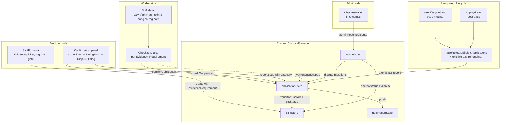
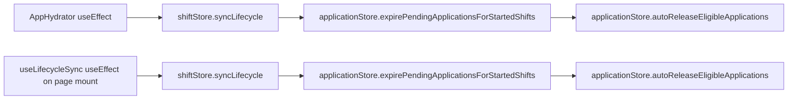
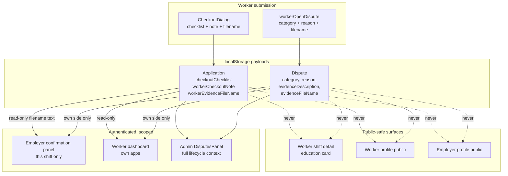
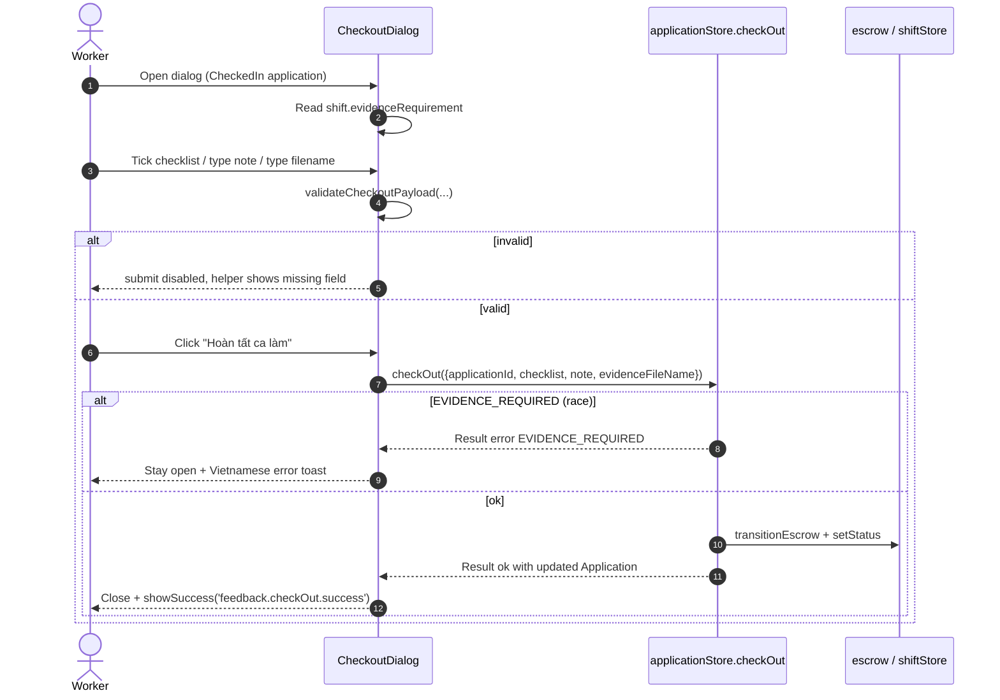
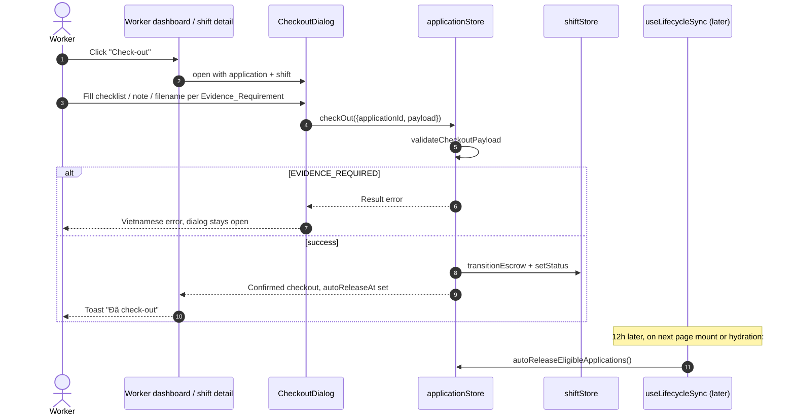
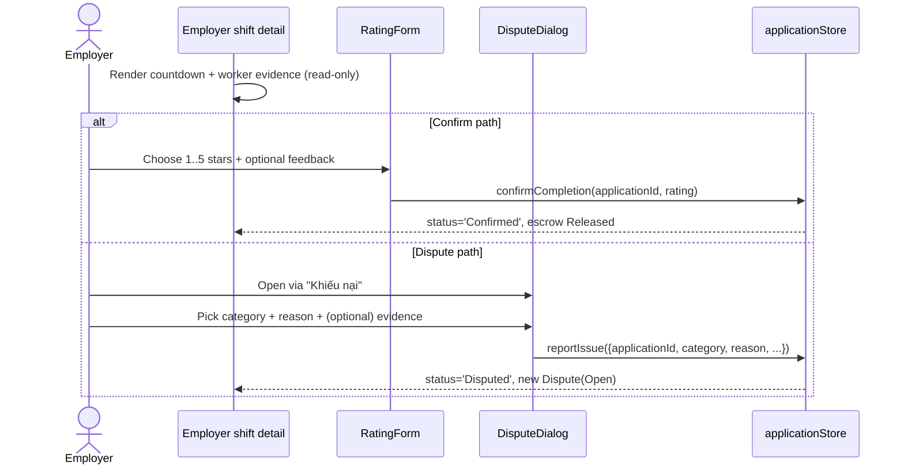
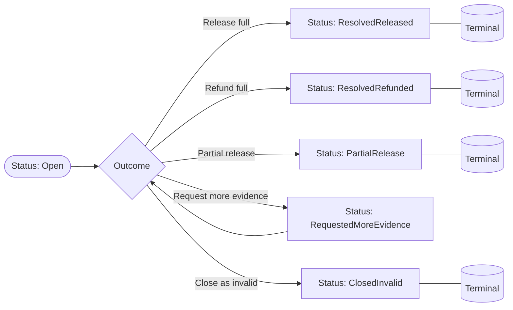

# Design Document — Phase 10C: Escrow Release Lifecycle

## Overview

Phase 10C extends the Cà Lẻ ShiftNow mock platform with a structured **shift evidence + escrow release** lifecycle on top of the existing Phase 7/10A foundations. It threads five concerns through the same Zustand 5 + localStorage architecture already in place, **without** introducing a new route, a backend, a payment gateway, an OTP path, or any external API call:

1. A typed `evidenceRequirement` field on every `Shift`, derived from the existing `jobCategoryRiskLevel` mapping in `src/domain/skillScore.ts` via a new pure helper `getSuggestedEvidenceLevel`.
2. A worker check-out dialog (`CheckoutDialog`) that validates a structured payload — checklist booleans, optional or required filename, optional or required handover note — against the shift's evidence level and rejects with a typed `'EVIDENCE_REQUIRED'` error contract when the payload is insufficient.
3. An employer confirmation panel that surfaces the worker's evidence read-only, runs a deterministic 12 h `hh:mm:ss` countdown, and offers a single confirm path through the existing `RatingForm` plus a structured `DisputeDialog` for the "Khiếu nại" path.
4. An idempotent `applicationStore.autoReleaseEligibleApplications(nowIso?)` action that auto-confirms checked-out applications 12 h after `checkOutAt` (default 5 ★, no rating prompt), wired into `useLifecycleSync` and `AppHydrator` alongside `expirePendingApplicationsForStartedShifts`. **No `setTimeout`, no `setInterval`, no polling**.
5. A widened `Dispute` model with required `category` (employer-side / worker-side enums), `reason`, optional `evidenceDescription`, and filename-only `evidenceFileName`; an extended `DisputeStatus` union with `'PartialRelease' | 'RequestedMoreEvidence' | 'ClosedInvalid'`; and a five-outcome admin resolution panel that mirrors the existing `VerificationsPanel` shape.

The feature reuses the live escrow state machine in `src/domain/escrow.ts` (extending nothing — auto-release issues the existing `EmployerConfirm` event), the existing `Modal` / `HelpPopover` / `StarRating` / `Toast` UI primitives, and the existing `t('…')` Vietnamese dictionary in `src/i18n/vi.ts`. Build output stays at exactly **28 routes**; the spec is also gated on the existing **165 tests** continuing to pass.

The design is mock-only end-to-end:

- All persistence flows through `data/persistence.ts` `STORAGE_KEYS` and the existing per-store `write(...)` helper.
- All currency in user-facing copy uses lowercase `đ` (suffix) or spelled-out `đồng`. `VNĐ` and `₫` remain forbidden.
- All user-facing prose refers to surfaces by visible page name, menu label, or button text — never by Raw_Route_Path tokens like `/worker/dashboard`.
- No new routes are added; new UI mounts inside existing pages (`/employer/shifts/new`, `/employer/shifts/[id]`, `/shifts/[id]`, `/worker/dashboard`, `/admin/dashboard`, `/user-guide`).
- Tailwind v4 directives in CSS only; no `dark:` variant, no `prefers-color-scheme: dark` media block.
- Section 11 invariants from prior phases (numeric changes always producing history records, modals closing on outside click, applicant approve/reject blocked after shift start, reputation/skill-score independence, pending-application-expiry idempotency, etc.) are preserved by reusing the existing actions; Phase 10C never opens its own write path that bypasses them.

## Architecture

### High-level data + lifecycle flow



### Page surfaces and route invariant

Phase 10C does **not** add a route. Every new UI surface mounts inside an existing page:

| Existing page                                  | Phase 10C addition                                                                              |
| ---------------------------------------------- | ----------------------------------------------------------------------------------------------- |
| `src/app/employer/shifts/new/page.tsx`         | Evidence picker section in the existing `ShiftForm`; high-risk gating; HelpPopover.             |
| `src/app/employer/shifts/[id]/page.tsx`        | Confirmation panel block per `CheckedOut` application: countdown + `RatingForm` + `DisputeDialog` trigger. |
| `src/app/shifts/[id]/page.tsx`                 | "Quy trình thanh toán & bằng chứng" card above the apply section + HelpPopover.                  |
| `src/app/worker/dashboard/page.tsx`            | `CheckoutDialog` invoked from the existing upcoming card's "Check-out" button.                   |
| `src/app/admin/dashboard/page.tsx`             | `DisputesPanel` (existing tab) gains the 5-outcome resolution UI; the rest of the dashboard is untouched. |
| `src/app/user-guide/page.tsx`                  | Three new anchored `<FeatureGuide>` sections: `#payment-release`, `#evidence-by-risk`, `#dispute-outcomes`. |

`npm run build` continues to emit exactly 28 routes, gated by the existing build invariant in Requirement 12.5.

### Centralised store ownership

Every Phase 10C action is centralised in the existing per-domain store; UI components only read selectors and dispatch actions. No component derives store state through ad-hoc `localStorage` reads.

| Concern                                           | Owner                                | Notes                                                                              |
| ------------------------------------------------- | ------------------------------------ | ---------------------------------------------------------------------------------- |
| `evidenceRequirement` on `Shift`                  | `useShiftStore.create` / `edit`      | Persists to `STORAGE_KEYS.shifts` via the existing `write(...)`.                   |
| `checkOut(payload)` (now object-shaped)           | `useApplicationStore.checkOut`       | Validates against the linked Shift's `evidenceRequirement`; persists evidence + sets `autoReleaseAt`. |
| `autoReleaseEligibleApplications(nowIso?)`        | `useApplicationStore`                | Wired into `useLifecycleSync` + `AppHydrator`; idempotent + per-record error-isolated. |
| `reportIssue(payload)` / `workerOpenDispute(...)` | `useApplicationStore`                | Single typed `Dispute` object built from a payload; sets app status to `'Disputed'` and blocks auto-release. |
| Five admin resolution actions                     | `useAdminStore`                      | Extended with `partialRelease`, `requestMoreEvidence`, `closeAsInvalid` alongside the existing `resolveDispute`. |

### Lifecycle sync wiring

Auto-release is implemented as an Idempotent_Lifecycle_Action on the same trigger surfaces that already host `expirePendingApplicationsForStartedShifts`:



`autoReleaseEligibleApplications` is **only** invoked from these two call sites. There is no `setInterval`, no `setTimeout`, no requestAnimationFrame loop, no polling fetch. Re-mounting the same page re-runs the function, but the eligibility predicate (`status === 'CheckedOut' && !autoReleased && autoReleaseAt <= now && no Open_Dispute`) ensures the second pass is a state-identity no-op.

### Privacy boundaries



Filenames are persisted as plain strings (≤255 characters, no path separators). The platform never opens, fetches, or displays file content. Identity-document data — already governed by the Phase 10A `WorkerVerificationDocument` privacy rule — does **not** appear on any Phase 10C surface; the dispute evidence channel is intentionally separate.

## Components and Interfaces

### Domain helpers

#### `src/domain/evidence.ts` (new module)

A pure module with no I/O, no clock reads, no module-level mutable state. Hosts every helper Phase 10C needs around the evidence enum.

```ts
import type { JobRiskLevel } from '@/domain/skillScore';
import type { Shift } from '@/types';

export type EvidenceRequirement =
  | 'None'
  | 'ChecklistOnly'
  | 'OptionalPhoto'
  | 'RequiredPhoto'
  | 'RequiredHandoverChecklist';

/** Stable order for the 5-level picker UI. */
export const EVIDENCE_REQUIREMENT_VALUES: readonly EvidenceRequirement[];

/** Vietnamese display label per literal — 1..80 chars, contains diacritics. */
export const EVIDENCE_REQUIREMENT_LABELS: Record<EvidenceRequirement, string>;

/** Pure: no clock, no globals, no mutation. Same args ⇒ strictly equal result. */
export function getSuggestedEvidenceLevel(
  jobType: string,
  riskLevel: JobRiskLevel,
): EvidenceRequirement;

/** Composition: getSuggestedEvidenceLevel(jobType, jobCategoryRiskLevel(jobType)). */
export function suggestedEvidenceForJobType(jobType: string): EvidenceRequirement;

/**
 * Mirrors Requirement 4 acceptance criteria. Returns `null` on success;
 * a typed reason on failure. Pure; never throws.
 */
export interface CheckoutPayload {
  checklist?: boolean[];
  note?: string;
  evidenceFileName?: string;
}
export type EvidenceValidationFailure =
  | 'CHECKLIST_INCOMPLETE'
  | 'PHOTO_REQUIRED'
  | 'NOTE_REQUIRED'
  | 'FIELD_TOO_LONG';

export function validateCheckoutPayload(
  requirement: EvidenceRequirement,
  payload: CheckoutPayload,
): { ok: true } | { ok: false; reason: EvidenceValidationFailure };
```

Mapping table for `getSuggestedEvidenceLevel` (Requirement 1.3 / 1.4 / 1.5):

| `riskLevel` | Returned `EvidenceRequirement`                                                |
| ----------- | ------------------------------------------------------------------------------ |
| `'Low'`     | `'ChecklistOnly'` (canonical) — also satisfies criterion 1.3 (`'OptionalPhoto'` allowed). The implementation returns a single deterministic value per `jobType`; for `Low` the value is `'ChecklistOnly'`. |
| `'Medium'`  | `'OptionalPhoto'` (canonical) — `'RequiredHandoverChecklist'` allowed by 1.4. |
| `'High'`    | `'RequiredHandoverChecklist'` (canonical) — `'RequiredPhoto'` allowed by 1.5. |
| anything else, or empty `jobType` | `'RequiredHandoverChecklist'` (safe default, Requirement 1.9). |

The deterministic per-risk choices above are picked because they produce the **least restrictive** option that still satisfies the criterion, making the test in Requirement 11.2 trivially exact.

`validateCheckoutPayload` rules per `EvidenceRequirement`:

| Requirement                       | Checklist                                | Photo                                     | Note                                            |
| --------------------------------- | ----------------------------------------- | ------------------------------------------ | ----------------------------------------------- |
| `'None'`                          | not required                              | not required                                | optional, ≤1000 chars                           |
| `'ChecklistOnly'`                 | every visible item ticked                 | not required                                | optional, ≤1000 chars                           |
| `'OptionalPhoto'`                 | not required                              | optional, ≤255 chars                        | optional, ≤1000 chars                           |
| `'RequiredPhoto'`                 | not required                              | non-empty filename, ≤255 chars              | optional, ≤1000 chars                           |
| `'RequiredHandoverChecklist'`     | every visible item ticked                 | optional, ≤255 chars                        | non-empty trimmed, ≤1000 chars                  |

Length bounds are enforced symmetrically by both the dialog (Requirement 4.2) and the store (Requirement 7.1's `evidenceFileName` ≤255 char rule applies the same way to `workerEvidenceFileName`).

### Store actions

#### `useApplicationStore.checkOut(payload)` — refactored signature

The legacy positional `checkOut(applicationId)` becomes a single object-payload action. The application id remains the discriminator; the dialog passes everything the schema in §`Data Models` requires.

```ts
type CheckoutInput = {
  applicationId: string;
  checklist?: boolean[];
  note?: string;
  evidenceFileName?: string;
};

type CheckoutError =
  | 'APPLICATION_NOT_FOUND'
  | 'WRONG_STATUS'
  | { code: 'EVIDENCE_REQUIRED'; reason: EvidenceValidationFailure };

checkOut(input: CheckoutInput): Result<Application, CheckoutError>;
```

Order of operations:

1. Resolve the `Application` by `applicationId`. Reject `APPLICATION_NOT_FOUND` if absent.
2. Reject `WRONG_STATUS` unless `status === 'CheckedIn'`.
3. Resolve the linked `Shift` from `useShiftStore.getState().getById(...)` and read `shift.evidenceRequirement` (defaults to `'None'` only for legacy seed shifts that pre-date the field; new shifts always carry an explicit value from `ShiftForm`).
4. Call `validateCheckoutPayload(requirement, payload)`. On failure, **leave the application untouched** and return `{ ok: false, error: { code: 'EVIDENCE_REQUIRED', reason } }`. No fields are written; `autoReleaseAt` stays absent. (Requirement 4.9, 11.4.)
5. On success, compute `checkOutAt = nowIso()` and `autoReleaseAt = new Date(Date.parse(checkOutAt) + 12 * 60 * 60 * 1000).toISOString()`. Persist the new fields onto the application (`status: 'CheckedOut'`, `checkOutAt`, `autoReleaseAt`, `checkoutChecklist: payload.checklist ?? []`, `workerCheckoutNote: payload.note?.trim() || ''`, `workerEvidenceFileName: payload.evidenceFileName ?? ''`).
6. Drive the existing escrow + shift transitions exactly as today: `transitionEscrow(escrowStatus, 'WorkerCheckOut')`, plus the `setStatus(shift.id, 'AwaitingConfirmation')` rollover when every other application is `CheckedOut | Confirmed | NoShow`.

#### `useApplicationStore.autoReleaseEligibleApplications(nowIso?)`

```ts
autoReleaseEligibleApplications(nowIso?: string): {
  releasedIds: string[];
};
```

Eligibility predicate (Requirement 6.3):

```ts
const isEligible = (a: Application, openDisputeAppIds: Set<string>) =>
  a.status === 'CheckedOut' &&
  a.autoReleased !== true &&
  typeof a.autoReleaseAt === 'string' &&
  a.autoReleaseAt.length > 0 &&
  Date.parse(a.autoReleaseAt) <= Date.parse(nowIso ?? new Date().toISOString()) &&
  !openDisputeAppIds.has(a.id);
```

`Open_Dispute` set is derived from the live `disputes` array: `d.status` ∉ `{'ResolvedReleased','ResolvedRefunded','PartialRelease','ClosedInvalid'}`. (`'RequestedMoreEvidence'` is **not** terminal — applications in that state remain blocked from auto-release until the admin closes them out, per Requirement 7.6 + Glossary.)

Per-eligible application, atomic per-record update:

```ts
const updated: Application = {
  ...a,
  status: 'Confirmed',
  confirmedAt: nowIso,
  autoReleased: true,
};
const newRating: Rating = { ...defaultFiveStar(a, shift), feedback: undefined };
```

Per-record error isolation (Requirement 6.10): the per-record block is wrapped in `try { ... } catch (err) { /* leave a unchanged, log dev console */ }`. One failing record never aborts the loop; persistence happens once at the end of the pass with whatever the loop accumulated.

Idempotency (Requirement 6.5): because the predicate filters on `autoReleased !== true`, a second invocation finds zero eligible applications and returns `{ releasedIds: [] }`. The persisted snapshot is byte-identical between successive runs (no `updatedAt` fields are touched on the application slice). This is the same pattern as `expirePendingApplicationsForStartedShifts`.

Lifecycle wiring (Requirement 6.7, 6.8, 6.9):

- `src/lib/useLifecycleSync.ts`: append `useApplicationStore.getState().autoReleaseEligibleApplications();` after the existing `expirePendingApplicationsForStartedShifts()` call.
- `src/components/layout/AppHydrator.tsx`: append the same call after `expirePendingApplicationsForStartedShifts()` in the post-hydration boot block.

No other module in the repo invokes `autoReleaseEligibleApplications`.

#### `useApplicationStore.reportIssue(payload)` and `workerOpenDispute(applicationId, payload)`

```ts
type EmployerDisputeCategory =
  | 'NoShow' | 'LeftEarly' | 'ChecklistFailed' | 'MisrepresentedSkills'
  | 'BehaviorIssue' | 'Damage' | 'Other';

type WorkerDisputeCategory =
  | 'WrongAddress' | 'UnsafeWorksite' | 'EmployerNoShow'
  | 'ScopeChanged' | 'PaymentDispute' | 'Other';

interface DisputePayloadBase {
  reason: string;
  evidenceDescription?: string;
  evidenceFileName?: string;
}

interface ReportIssuePayload extends DisputePayloadBase {
  applicationId: string;
  category: EmployerDisputeCategory;
}

interface WorkerOpenDisputePayload extends DisputePayloadBase {
  category: WorkerDisputeCategory;
}

type DisputeError =
  | 'APPLICATION_NOT_FOUND'
  | 'WRONG_STATUS'              // already 'Disputed' or non-disputable status
  | 'CATEGORY_REQUIRED'
  | 'CATEGORY_INVALID'          // out of enum, or wrong-role
  | 'REASON_REQUIRED'
  | 'FIELD_TOO_LONG';           // any field exceeded its bound

reportIssue(payload: ReportIssuePayload): Result<Dispute, DisputeError>;
workerOpenDispute(
  applicationId: string,
  payload: WorkerOpenDisputePayload,
): Result<Dispute, DisputeError>;
```

Validation (Requirement 7.8 / 7.9):

1. Trim `reason`; reject `REASON_REQUIRED` when empty. Reject `FIELD_TOO_LONG` when `reason.length > 1000`, `evidenceDescription.length > 2000`, or `evidenceFileName.length > 255`.
2. Reject `CATEGORY_REQUIRED` when `category` is undefined / null. Reject `CATEGORY_INVALID` when the value is not in the appropriate enum (employer-side for `reportIssue`, worker-side for `workerOpenDispute`).
3. Reject `APPLICATION_NOT_FOUND` when the id has no matching row.
4. Reject `WRONG_STATUS` when the application is already `'Disputed'` (Requirement 7.9) or in any non-disputable status (`Pending`, `Rejected`, `CancelledByWorker`, `CancelledByEmployer`, `Expired`, `NoShow`). The legitimate set is `'CheckedIn' | 'CheckedOut' | 'Confirmed'` plus admin-discretion edge cases handled inside the store today.
5. On success: build `Dispute` with `id = newPrefixedId('dispute')`, `category`, `reason: reason.trim()`, `evidenceDescription: evidenceDescription?.trim() || undefined`, `evidenceFileName: evidenceFileName ?? undefined`, `raisedBy: 'employer' | 'worker'`, `status: 'Open'`, `createdAt: nowIso()`. Push it onto `applicationStore.disputes` (persisted by the existing `persistDisputes` helper) and flip the application's `status` to `'Disputed'`.
6. The application stays out of auto-release while any associated dispute is in a non-terminal status (Requirement 7.6 + 6.6).

Filename hygiene (Requirement 7.7): before persisting, strip leading/trailing whitespace and reject any value containing `'/'` or `'\\'` with `FIELD_TOO_LONG` reused as the negative result code (the field name says "filename only" — paths are out of contract).

#### `useAdminStore` — five-outcome dispute resolution

The existing `resolveDispute(disputeId, outcome, note)` handles `'ResolvedReleased' | 'ResolvedRefunded'`. It is **kept** for backward compatibility (Phase 10A tests still call it) and a new sibling action layers on the three new outcomes:

```ts
type AdminDisputeOutcome =
  | 'ResolvedReleased'
  | 'ResolvedRefunded'
  | { kind: 'PartialRelease'; releaseAmount: number }
  | 'RequestedMoreEvidence'
  | 'ClosedInvalid';

resolveDisputeExtended(
  disputeId: string,
  outcome: AdminDisputeOutcome,
  note: string,
): Result<Dispute, AdminError | 'INVALID_AMOUNT'>;
```

Outcome semantics (Requirement 8.5–8.11):

| Outcome                       | `Dispute.status` set to        | `Shift.escrowStatus`                              | History records                    |
| ----------------------------- | ------------------------------- | ------------------------------------------------- | ---------------------------------- |
| `'ResolvedReleased'`          | `'ResolvedReleased'`            | `'Released'` (`AdminRelease` event)               | One ledger entry: full release     |
| `'ResolvedRefunded'`          | `'ResolvedRefunded'`            | `'Refunded'` (`AdminRefund` event)                | One ledger entry: full refund      |
| `'PartialRelease'`            | `'PartialRelease'`              | `'Released'` (release amount > 0 ≤ escrow)        | Two history entries: release + refund of remainder |
| `'RequestedMoreEvidence'`     | `'RequestedMoreEvidence'`      | unchanged (`'Disputed'`)                          | None (no numeric change)           |
| `'ClosedInvalid'`             | `'ClosedInvalid'`               | unchanged (`'Disputed'`)                          | None (no numeric change)           |

`PartialRelease` validation (Requirement 8.9): the `releaseAmount` must be a finite number with `0 < releaseAmount <= shift.depositAmount`. Anything else returns `'INVALID_AMOUNT'`. The remainder = `shift.depositAmount - releaseAmount` is recorded as a refund.

Section 11 invariant — every numeric change creates a history record. The five-outcome action delegates the actual escrow flip to the existing `transitionEscrow` machine in `src/domain/escrow.ts` and writes to `STORAGE_KEYS.shifts` through the same `useShiftStore.hydrate(...) + write(...)` pattern the existing `resolveDispute` uses. Each numeric change (release, refund, partial release + remainder refund) emits one `Notification` to the affected employer + worker so the audit trail in the existing notification log remains the single source of truth.

### React components

#### `CheckoutDialog` (new, `src/components/forms/CheckoutDialog.tsx`)

```ts
interface CheckoutDialogProps {
  open: boolean;
  onClose: () => void;
  application: Application;
  shift: Shift;
  onSubmit: (payload: CheckoutPayload) => void;
  loading?: boolean;
  errorMessage?: string | null;
}
```

Layout (top-down):

1. Modal title: `t('checkout.dialog.title')` ("Hoàn tất ca làm").
2. Vietnamese intro paragraph + a `<HelpPopover title="Vì sao cần bằng chứng?" description={...}/>`. (Requirement 9.3.)
3. Renders elements conditioned on `shift.evidenceRequirement`:
   - **Checklist** (always visible, items derived from `shift.checkoutChecklistTemplate` once we wire it; v1 uses a fixed Vietnamese 3-item template per evidence level — see §Data Models). Each item is a tickable `<label><input type="checkbox" />…</label>`.
   - **Photo filename input** (mock — `<input type="text" />` with helper "Tên tệp ảnh" / "Bản MVP không tải tệp thật").
   - **Handover note** (`<Textarea maxLength={1000}/>`).
4. Submit button enabled iff `validateCheckoutPayload(shift.evidenceRequirement, currentPayload).ok === true`. Disabled state is **mirrored** at submit time so the store rejection is unreachable in normal flows; the rejection path remains the canonical error contract for tests + race conditions.
5. On submit: call `props.onSubmit(payload)`. The parent invokes `useApplicationStore.checkOut({ applicationId, ...payload })`. On `EVIDENCE_REQUIRED`, the dialog stays open and `errorMessage` is set to the localized Vietnamese message keyed off `payload`'s failure reason.
6. Close paths: outside-click, Escape, "Đóng" button (Section 11 invariant).

Diagram:



#### `DisputeDialog` (new, `src/components/forms/DisputeDialog.tsx`)

```ts
interface DisputeDialogProps {
  open: boolean;
  onClose: () => void;
  side: 'employer' | 'worker';
  application: Application;
  shift: Shift;
  onSubmit: (payload: DisputePayloadBase & { category: string }) => void;
  loading?: boolean;
  errorMessage?: string | null;
}
```

Renders a `<select>` of categories (employer-side or worker-side based on `props.side`), a required `<Textarea>` for `reason` (1–1000 chars), an optional `<Textarea>` for `evidenceDescription` (≤2000 chars), and an optional `<input type="text" />` for `evidenceFileName` (≤255 chars). Submit gating mirrors the store contract; on `CATEGORY_REQUIRED` / `REASON_REQUIRED` / `FIELD_TOO_LONG` the dialog stays open with the offending field highlighted (Requirement 5.11 + 7.8).

#### Employer confirmation panel + countdown

The employer shift detail page (`src/app/employer/shifts/[id]/page.tsx`) already renders one `WorkerSummaryRow` per applicant with action buttons. Phase 10C extends the per-application block when `application.status === 'CheckedOut'`:

- Worker check-out time (`vi-VN` short date + time) — Requirement 5.1.
- Binary checklist indicator: "Đã tích đầy đủ" (success badge) or "Còn N mục chưa tích" — Requirement 5.2.
- Handover note read-only block + placeholder "Người làm không gửi ghi chú bàn giao" when empty — Requirement 5.3 / 5.4.
- Filename read-only span + placeholder "Người làm không gửi tệp bằng chứng" when empty — Requirement 5.5 / 5.6.
- A new `<AutoReleaseCountdown autoReleaseAt={...} />` component (see below) — Requirement 5.7 / 5.8 — rendered inside the same flex container as a `<HelpPopover>` describing what happens at zero (Requirement 9.4).
- The existing `<RatingForm onSubmit={…confirmCompletion}/>` wired to the existing `confirmCompletion` action — sole confirm trigger (Requirement 5.9).
- A "Khiếu nại" button that opens `DisputeDialog` with `side="employer"`. On submit, the parent calls `applicationStore.reportIssue({ applicationId, category, reason, evidenceDescription, evidenceFileName })` (Requirement 5.10).

#### `AutoReleaseCountdown` (new, `src/components/shift/AutoReleaseCountdown.tsx`)

```ts
interface AutoReleaseCountdownProps {
  /** ISO 8601 timestamp. */
  autoReleaseAt: string;
  /** Optional override for tests to inject a deterministic clock. */
  nowSource?: () => number;
}
```

Implementation:

- Stores a `useState<number>` with the current epoch ms initialised from `nowSource?.() ?? Date.now()`.
- `useEffect` registers a single `setInterval(..., 1000)` for the lifetime of the mounted component (this `setInterval` is **inside the UI, not the lifecycle**; Requirement 6.8 forbids `setTimeout`/`setInterval` for **Auto_Release**, not for a presentational countdown — auto-release itself runs only via lifecycle calls). The interval is torn down on unmount and on `autoReleaseAt` change.
- Render formula: `const remainingMs = Math.max(0, Date.parse(autoReleaseAt) - now); format hh:mm:ss`. When `remainingMs === 0` the component renders `00:00:00` and stops re-scheduling — Requirement 5.8.
- Has `aria-label` "Đếm ngược tự động thanh toán" and a `data-testid="auto-release-countdown"` so Requirement 11.12 can locate it deterministically and assert decreasing values after the deterministic clock advances.

Tradeoff note: the worker dashboard's existing live cancellation-quota tile is recomputed every render off `new Date().toISOString()` (no interval) because it changes only at minute granularity. The auto-release countdown's per-second update warrants the local `setInterval` — there is no other deterministic 1 Hz refresh source on the page. The interval is presentational only and never mutates store state.

#### `ShiftForm` evidence picker

`ShiftForm.tsx` adds a "Bằng chứng sau ca" `<fieldset>` containing:

- A 5-radio picker over `EVIDENCE_REQUIREMENT_VALUES`, each radio labelled with `EVIDENCE_REQUIREMENT_LABELS[value]` and a one-line Vietnamese helper.
- A "Hệ thống đề xuất" chip rendered next to the option returned by `suggestedEvidenceForJobType(values.jobType)` whenever the form's `jobType` is non-empty.
- A privacy warning beginning "Không yêu cầu chụp khách hàng, giấy tờ cá nhân" — Requirement 2.5.
- A `<HelpPopover title="Cách chọn mức bằng chứng" description={…40–800 chars…}/>` placed inside the fieldset — Requirement 9.1.

High-risk gating (Requirement 2.6 / 2.7):

```ts
const risk = jobCategoryRiskLevel(values.jobType);
const isHighRisk = risk === 'High';
const allowedValues: EvidenceRequirement[] = isHighRisk
  ? ['RequiredHandoverChecklist', 'RequiredPhoto']
  : EVIDENCE_REQUIREMENT_VALUES;
```

The picker disables the three lower options when `isHighRisk === true`. If the form is somehow submitted with a sub-`RequiredHandoverChecklist` value while `jobType` resolves to `High` (e.g., the user picked the value first, then changed the job type), the existing `validate()` returns `errs.evidenceRequirement = t('error.evidence.tooLowForHighRisk')` and the submit handler is **not** invoked. Tested directly by Requirement 11.3.

#### Admin `DisputesPanel` extensions

The existing `<DisputesPanel/>` renders one row per dispute. Phase 10C extends each row:

- Header line: dispute id, category badge, `raisedBy` chip, status badge (with the three new colours).
- Lifecycle context block — Requirement 8.1 / 8.2 / 8.3 — listing:
  - `Application.checkInAt`, `Application.checkOutAt`, `Shift.startTime` / `Shift.endTime` (placeholder "Chưa ghi nhận" when missing).
  - Per-item checklist read-out (`✓` / `✗`) + `workerCheckoutNote` (placeholder "Không có ghi chú bàn giao").
  - Employer statement (`reason`, `evidenceDescription`, `evidenceFileName`) + worker counter-statement (the symmetric fields when `raisedBy === 'worker'` or when an additional dispute exists for the same application).
- Action row visible only while `dispute.status` is `'Open'` or `'RequestedMoreEvidence'` (Requirement 8.4):
  - "Thanh toán toàn bộ" → `resolveDisputeExtended(id, 'ResolvedReleased', note)`.
  - "Hoàn tiền toàn bộ" → `resolveDisputeExtended(id, 'ResolvedRefunded', note)`.
  - "Thanh toán một phần" → modal asking for a number; calls `resolveDisputeExtended(id, { kind: 'PartialRelease', releaseAmount }, note)`.
  - "Yêu cầu thêm bằng chứng" → `resolveDisputeExtended(id, 'RequestedMoreEvidence', note)`.
  - "Đóng vì không hợp lệ" → `resolveDisputeExtended(id, 'ClosedInvalid', note)`.

Each successful action surfaces a Vietnamese toast through the existing `showSuccess(...)` helper. Each rejection mirrors the existing `toastFromStoreError(...)` flow.

### UI flow diagrams

#### Worker check-out



#### Employer confirmation / dispute



#### Auto-release lifecycle

```mermaid
sequenceDiagram
    participant P as Page mount or boot
    participant SL as useLifecycleSync / AppHydrator
    participant SS as shiftStore.syncLifecycle
    participant AS as applicationStore
    participant DS as Disputes slice

    P->>SL: useEffect on mount / hydration
    SL->>SS: syncLifecycle()
    SL->>AS: expirePendingApplicationsForStartedShifts()
    SL->>AS: autoReleaseEligibleApplications()
    AS->>DS: read open-dispute set
    AS->>AS: filter eligible applications
    loop per application (atomic, error isolated)
        AS->>AS: try { confirmCompletion(default 5★) ; mark autoReleased }
        AS->>AS: catch -> leave record unchanged, log dev console
    end
    AS->>AS: persist applications + ratings
```

#### Admin resolution



### Help_Popover placements (Requirement 9)

All popover bodies are Vietnamese prose, 40–800 characters, contain no `Raw_Route_Path` token, and use `đ` / `đồng` consistently when discussing money. Triggers reuse the existing `<HelpPopover>` primitive.

| Location                                                        | `title`                                  | Body length | Anchor in DOM                                  |
| --------------------------------------------------------------- | ----------------------------------------- | ----------- | ----------------------------------------------- |
| `ShiftForm` evidence picker `<fieldset>`                        | "Cách chọn mức bằng chứng"               | ~250 chars  | Inside the same `<fieldset>` as the picker.     |
| Worker shift detail "Quy trình thanh toán & bằng chứng" card    | "Cách bạn được thanh toán"               | ~300 chars  | Adjacent to the card's `<h2>`.                  |
| `CheckoutDialog`                                                | "Vì sao cần bằng chứng?"                 | ~200 chars  | Below the dialog intro paragraph.               |
| Employer confirmation panel countdown                           | "Đếm ngược 12 giờ"                       | ~220 chars  | Same flex container as `<AutoReleaseCountdown/>`. |

### User guide additions (Requirement 10)

Three new `<FeatureGuide>` cards mounted in `src/app/user-guide/page.tsx`. Each carries `id="<anchor>"` and `scroll-mt-24` so URL fragments scroll cleanly under the sticky header (Requirement 10.4). Vietnamese prose only; no Raw_Route_Path tokens; `đ` / `đồng` only.

| Anchor                  | Heading (Vietnamese)                               | Content summary                                                                                       |
| ----------------------- | --------------------------------------------------- | ----------------------------------------------------------------------------------------------------- |
| `#payment-release`      | "Khi nào nhà tuyển dụng thanh toán?"               | Walk-through: standard release on confirmation; the 12 h Auto_Release rule when no dispute is open.   |
| `#evidence-by-risk`     | "Mức bằng chứng theo độ rủi ro công việc"          | Three Risk_Level rows × the Evidence_Requirement values mapped to that level (per Requirement 1).      |
| `#dispute-outcomes`     | "Các kết quả tranh chấp"                           | One row per `DisputeStatus` value including the three new ones, with plain-language meanings.         |

The fragment scroll is handled natively by the browser since the `scroll-mt-24` Tailwind utility is already used across the page. No JavaScript scroll machinery is added.

## Data Models

### Type extensions in `src/types/index.ts`

```ts
// New literal union for evidence — single source of truth.
export type EvidenceRequirement =
  | 'None'
  | 'ChecklistOnly'
  | 'OptionalPhoto'
  | 'RequiredPhoto'
  | 'RequiredHandoverChecklist';

// `Shift` gains an optional field. Optional, not required, so existing
// seed data and pre-Phase-10C JSON snapshots continue to round-trip.
export interface Shift {
  // ...existing fields...
  /** Phase 10C: post-shift evidence level. Defaults to 'None' at read time
   *  for legacy seed records that pre-date the field. New shifts always
   *  carry an explicit value because ShiftForm pre-selects via
   *  `suggestedEvidenceForJobType(jobType)`. */
  evidenceRequirement?: EvidenceRequirement;
}

// `Application` gains five Phase 10C fields, all optional / defaulting.
export interface Application {
  // ...existing fields...
  /** Phase 10C: per-item state of the worker's check-out checklist.
   *  Shape mirrors the static template in src/i18n/vi.ts; a `true` entry
   *  means the corresponding item was ticked at submit time. */
  checkoutChecklist?: boolean[];
  /** Phase 10C: optional or required handover note (≤1000 chars). */
  workerCheckoutNote?: string;
  /** Phase 10C: filename only (≤255 chars, no path separators).
   *  Mock — no file content is ever stored. */
  workerEvidenceFileName?: string;
  /** Phase 10C: ISO 8601 timestamp = checkOutAt + 12h. Set on successful
   *  checkOut; never modified afterwards. */
  autoReleaseAt?: string;
  /** Phase 10C: marks an Application that was confirmed by
   *  autoReleaseEligibleApplications rather than by the employer. */
  autoReleased?: boolean;
}

// `Dispute` gains the structured payload required by Phase 10C.
export interface Dispute {
  // ...existing fields preserved...
  category: EmployerDisputeCategory | WorkerDisputeCategory;
  reason: string;             // 1..1000 chars
  evidenceDescription?: string; // ≤2000 chars
  evidenceFileName?: string;   // ≤255 chars
  // raisedBy already exists on the type; semantics unchanged.
}

// `DisputeStatus` gains three values; existing values are preserved so
// Phase 10A admin tests keep passing.
export type DisputeStatus =
  | 'Open'
  | 'ResolvedReleased'
  | 'ResolvedRefunded'
  | 'PartialRelease'
  | 'RequestedMoreEvidence'
  | 'ClosedInvalid';

// New employer- and worker-side category enums live in src/types/index.ts
// next to DisputeStatus.
export type EmployerDisputeCategory =
  | 'NoShow' | 'LeftEarly' | 'ChecklistFailed' | 'MisrepresentedSkills'
  | 'BehaviorIssue' | 'Damage' | 'Other';

export type WorkerDisputeCategory =
  | 'WrongAddress' | 'UnsafeWorksite' | 'EmployerNoShow'
  | 'ScopeChanged' | 'PaymentDispute' | 'Other';
```

### Required-vs-optional rationale

- `Shift.evidenceRequirement` is **optional** at the type level so the localStorage snapshot from previous phases hydrates without rewrites. At the **store** level, `useShiftStore.create(...)` writes an explicit value; `ShiftForm` always supplies one because its initial state seeds from `suggestedEvidenceForJobType(...)`.
- `Application.{checkoutChecklist, workerCheckoutNote, workerEvidenceFileName, autoReleaseAt, autoReleased}` are all **optional** so applications created before Phase 10C still validate. Reads use `app.autoReleased ?? false` and `app.autoReleaseAt ?? undefined`.
- `Dispute.category` and `Dispute.reason` are **required** in new disputes. Pre-Phase-10C records that lack them are migrated lazily on read by `useApplicationStore.hydrateDisputes`: any pre-Phase-10C dispute with no `category` is given `category: 'Other'` and `raisedBy: dispute.raisedBy ?? 'employer'`. This migration is one-shot per record and idempotent.

### Dispute_Category enums (Requirement 7.2 / 7.3)

```ts
export const EMPLOYER_DISPUTE_CATEGORIES: readonly EmployerDisputeCategory[] = [
  'NoShow', 'LeftEarly', 'ChecklistFailed', 'MisrepresentedSkills',
  'BehaviorIssue', 'Damage', 'Other',
];

export const WORKER_DISPUTE_CATEGORIES: readonly WorkerDisputeCategory[] = [
  'WrongAddress', 'UnsafeWorksite', 'EmployerNoShow',
  'ScopeChanged', 'PaymentDispute', 'Other',
];
```

### Vietnamese label dictionary (Requirement 1.7, plus admin/help text)

All new strings land in `src/i18n/vi.ts` under structured key namespaces. Each label below is verified to be 1..80 chars, contains diacritics, and is not an English fallback.

| Key                                              | Value                                          |
| ------------------------------------------------ | ---------------------------------------------- |
| `evidence.requirement.None`                      | "Không cần bằng chứng"                         |
| `evidence.requirement.ChecklistOnly`             | "Chỉ cần checklist hoàn thành"                 |
| `evidence.requirement.OptionalPhoto`             | "Có thể đính kèm ảnh bàn giao"                 |
| `evidence.requirement.RequiredPhoto`             | "Bắt buộc đính kèm ảnh bàn giao"               |
| `evidence.requirement.RequiredHandoverChecklist` | "Bắt buộc checklist + ghi chú bàn giao"        |
| `evidence.helper.None`                           | "Phù hợp công việc nhẹ, không cần bàn giao."   |
| `evidence.helper.ChecklistOnly`                  | "Người làm xác nhận đã hoàn thành các mục."    |
| `evidence.helper.OptionalPhoto`                  | "Khuyến khích ảnh để minh chứng nếu cần."      |
| `evidence.helper.RequiredPhoto`                  | "Bắt buộc gửi ảnh khi check-out."              |
| `evidence.helper.RequiredHandoverChecklist`      | "Cần đầy đủ checklist và ghi chú bàn giao."   |
| `evidence.privacy.warning`                       | "Không yêu cầu chụp khách hàng, giấy tờ cá nhân hay không gian riêng tư." |
| `evidence.suggestedChip`                         | "Hệ thống đề xuất"                             |
| `error.evidence.tooLowForHighRisk`               | "Công việc rủi ro cao yêu cầu mức bằng chứng cao hơn." |
| `error.evidence.checklistIncomplete`             | "Vui lòng tích đầy đủ các mục trước khi gửi." |
| `error.evidence.photoRequired`                   | "Vui lòng đính kèm tên tệp ảnh bàn giao."     |
| `error.evidence.noteRequired`                    | "Vui lòng nhập ghi chú bàn giao."             |
| `error.evidence.tooLong`                         | "Nội dung quá dài, vui lòng rút gọn."         |
| `dispute.status.PartialRelease`                  | "Thanh toán một phần"                          |
| `dispute.status.RequestedMoreEvidence`           | "Yêu cầu thêm bằng chứng"                      |
| `dispute.status.ClosedInvalid`                   | "Đóng vì không hợp lệ"                         |

### Static checkout-checklist template

`src/i18n/vi.ts` exports a fixed template per evidence level so the dialog has deterministic items to render. The shape is `Record<EvidenceRequirement, string[]>`. New evidence levels can extend the table without touching component code.

```ts
export const CHECKOUT_CHECKLIST_ITEMS_VI: Record<EvidenceRequirement, string[]> = {
  None: [],
  ChecklistOnly: [
    'Đã hoàn thành công việc theo mô tả ca làm.',
    'Đã thông báo nhà tuyển dụng kết quả ca làm.',
  ],
  OptionalPhoto: [
    'Đã hoàn thành công việc theo mô tả ca làm.',
    'Đã thông báo nhà tuyển dụng kết quả ca làm.',
  ],
  RequiredPhoto: [
    'Đã hoàn thành công việc theo mô tả ca làm.',
    'Đã chụp ảnh bàn giao khu vực làm việc.',
    'Đã thông báo nhà tuyển dụng kết quả ca làm.',
  ],
  RequiredHandoverChecklist: [
    'Đã hoàn thành công việc theo mô tả ca làm.',
    'Đã bàn giao khu vực và dụng cụ.',
    'Đã viết ghi chú bàn giao đầy đủ.',
  ],
};
```

The dialog's `currentPayload.checklist` length matches the template length for the current evidence level. The validator counts unticked items from the template, not from arbitrary user input, so a longer or shorter `checklist` array always fails `'CHECKLIST_INCOMPLETE'` rather than erroring out.

### History / ledger consistency (Section 11 invariant)

Every numeric change in Phase 10C — successful auto-release, full release / refund, partial release + remainder refund — flows through the same actions that already create history records:

| Action                                   | Numeric change                          | History record created                                                                                  |
| ---------------------------------------- | ---------------------------------------- | ------------------------------------------------------------------------------------------------------- |
| `autoReleaseEligibleApplications`        | `Application.payoutAmount` becomes Released, `escrowStatus` Released | Calls the existing `confirmCompletion` flow which already pushes a `ShiftCompletedConfirmed` notification + creates a `Rating` record. The `autoReleased: true` flag itself is the audit marker for "auto vs manual". |
| `resolveDisputeExtended` ResolvedReleased | escrow Released                         | Existing `resolveDispute` already writes the dispute record + escrow flip + `DisputeResolved` notification. |
| `resolveDisputeExtended` ResolvedRefunded | escrow Refunded                         | Same as above with refund event.                                                                        |
| `resolveDisputeExtended` PartialRelease   | escrow Released for `releaseAmount`; remainder treated as refund | Two paired notifications: "Đã thanh toán một phần" to worker, "Phần còn lại đã được hoàn" to employer. The `Dispute.resolutionNote` records the split numerically. |
| `resolveDisputeExtended` RequestedMoreEvidence / ClosedInvalid | None                          | None — Section 11 invariant satisfied vacuously (no numeric change occurred).                           |

Because every flow re-uses the existing per-action notification + persistence helpers, the existing tests around "every numeric change has a history record" continue to pass without modification.


## Correctness Properties

*A property is a characteristic or behavior that should hold true across all valid executions of a system — essentially, a formal statement about what the system should do. Properties serve as the bridge between human-readable specifications and machine-verifiable correctness guarantees.*

These properties are derived from the prework analysis. They are universally quantified, traceable to specific acceptance criteria, and implementable as `fast-check` property tests with ≥100 iterations each (Requirement 12 + Phase 10C testing strategy).

### Property 1: Risk-level evidence mapping

*For any* `jobType` string and any `riskLevel` from the three-element enum `'Low' | 'Medium' | 'High'`, `getSuggestedEvidenceLevel(jobType, riskLevel)` returns a value in the subset of `EvidenceRequirement` allowed for that risk level: `Low ∈ {ChecklistOnly, OptionalPhoto}`, `Medium ∈ {OptionalPhoto, RequiredHandoverChecklist}`, `High ∈ {RequiredHandoverChecklist, RequiredPhoto}`. *For any* `riskLevel` outside that enum or any falsy `jobType`, the helper returns `'RequiredHandoverChecklist'`.

**Validates: Requirements 1.3, 1.4, 1.5, 1.9**

### Property 2: Helper purity and composition equation

*For any* `jobType` string and any `riskLevel`, two successive calls to `getSuggestedEvidenceLevel(jobType, riskLevel)` return strictly equal values, and the snapshot of reachable module-level + global state before and after the calls is deep-equal. *For any* `jobType`, `suggestedEvidenceForJobType(jobType)` equals `getSuggestedEvidenceLevel(jobType, jobCategoryRiskLevel(jobType))`.

**Validates: Requirements 1.6, 1.8**

### Property 3: Vietnamese label totality

*For any* `EvidenceRequirement` literal in the five-element enum, the label returned from `EVIDENCE_REQUIREMENT_LABELS[lit]` has length ≥ 1 and ≤ 80, contains at least one Vietnamese-script character with a diacritic (matching `/[à-ỹ]/i`), and is not equal to the literal's English name.

**Validates: Requirements 1.7**

### Property 4: ShiftForm evidence pre-selection

*For any* `jobType` value supplied as the form's initial state, the `ShiftForm`'s rendered "Bằng chứng sau ca" picker has the radio corresponding to `suggestedEvidenceForJobType(jobType)` in the checked state at first paint.

**Validates: Requirements 2.2**

### Property 5: ShiftForm high-risk gating

*For any* `jobType` for which `jobCategoryRiskLevel(jobType) === 'High'` and any `EvidenceRequirement` value strictly below `'RequiredHandoverChecklist'` (i.e., `'None' | 'ChecklistOnly' | 'OptionalPhoto'`), submitting `ShiftForm` with that pair leaves the parent `onSubmit` callback un-invoked, preserves all previously-entered field values, and renders an inline Vietnamese validation message identifying the evidence field as the cause.

**Validates: Requirements 2.6, 2.7**

### Property 6: Checkout payload validation predicate

*For any* `EvidenceRequirement` level and any `CheckoutPayload`, `validateCheckoutPayload(level, payload).ok` equals the per-level predicate: `'None'` always passes; `'ChecklistOnly'` passes iff every entry of `payload.checklist` (length-matching the level's static template) is `true`; `'OptionalPhoto'` passes when length bounds are respected; `'RequiredPhoto'` passes iff `payload.evidenceFileName` is a non-empty string of length ≤ 255; `'RequiredHandoverChecklist'` passes iff every checklist entry is `true` AND `payload.note?.trim()` is non-empty AND ≤ 1000 chars.

**Validates: Requirements 4.3, 4.4, 4.5, 4.6, 4.7, 4.8**

### Property 7: Checkout success persistence + 12 h auto-release timestamp

*For any* `Application` in `'CheckedIn'` status and any `CheckoutPayload` for which `validateCheckoutPayload(shift.evidenceRequirement, payload).ok === true`, the post-call `Application` record satisfies `status === 'CheckedOut'`, `checkOutAt` is a valid ISO 8601 string, `autoReleaseAt` is a valid ISO 8601 string, `Date.parse(autoReleaseAt) - Date.parse(checkOutAt) === 43_200_000`, and the three evidence fields equal the payload exactly (`checkoutChecklist === payload.checklist ?? []`, `workerCheckoutNote === (payload.note?.trim() ?? '')`, `workerEvidenceFileName === (payload.evidenceFileName ?? '')`).

**Validates: Requirements 4.12, 6.2**

### Property 8: EVIDENCE_REQUIRED rejection leaves application strictly unchanged

*For any* `Application` in `'CheckedIn'` status, any linked `Shift` whose `evidenceRequirement` is one of the three "requires something" levels (`ChecklistOnly | RequiredPhoto | RequiredHandoverChecklist`), and any `CheckoutPayload` for which `validateCheckoutPayload(shift.evidenceRequirement, payload).ok === false`: the `Result` returned from `applicationStore.checkOut({applicationId, ...payload})` is `{ok: false, error: {code: 'EVIDENCE_REQUIRED', reason}}`, and the targeted `Application` record (including `status`, `checkOutAt`, `checkoutChecklist`, `workerCheckoutNote`, `workerEvidenceFileName`, and `autoReleaseAt`) is deep-equal to its pre-call snapshot.

**Validates: Requirements 4.9, 11.4**

### Property 9: Auto-release predicate exactness and effect

*For any* combination of `applications`, `disputes`, and `nowIso`, `applicationStore.autoReleaseEligibleApplications(nowIso)` flips exactly the set of applications satisfying the eligibility predicate `status === 'CheckedOut' && !autoReleased && autoReleaseAt is a non-empty ISO string && Date.parse(autoReleaseAt) <= Date.parse(nowIso) && no associated Open_Dispute`, where each flipped record ends with `status === 'Confirmed'`, `autoReleased === true`, a corresponding `Rating` with `stars === 5`, and the matching `confirmedAt` populated. Applications outside that set (including those with associated Open_Dispute) end the call with `status`, `autoReleased`, and `autoReleaseAt` unchanged.

**Validates: Requirements 6.3, 6.4, 6.6**

### Property 10: Idempotency of wired lifecycle actions

*For any* persisted state and any wired lifecycle action `f ∈ {autoReleaseEligibleApplications, expirePendingApplicationsForStartedShifts, syncLifecycle}` exposed to `useLifecycleSync` and `AppHydrator`, `applyTwice(f, state)` produces the same persisted state as `applyOnce(f, state)`, and the second invocation reports an empty change set.

**Validates: Requirements 6.5, 12.9**

### Property 11: Per-record error isolation in auto-release

*For any* `applications` set in which a single eligible application is fault-injected to make `confirmCompletion` throw, and any number of non-faulty eligible applications coexisting in the same set, a single invocation of `applicationStore.autoReleaseEligibleApplications(nowIso)` ends with the faulty application's `status`, `autoReleased`, and `autoReleaseAt` strictly unchanged AND every non-faulty eligible application transitioned to `'Confirmed' + autoReleased=true + 5★`.

**Validates: Requirements 6.10**

### Property 12: Auto-release path uses no timers, polling, or external APIs

*For any* invocation of `applicationStore.autoReleaseEligibleApplications` executed under a fake-timers harness, no pending `setTimeout`, `setInterval`, scheduled microtask polling loop, `requestAnimationFrame`, `fetch`, `WebSocket`, or other external API call is registered when the call returns. The wired call sites (`useLifecycleSync`, `AppHydrator`) likewise emit no such primitive on the auto-release path.

**Validates: Requirements 6.8, 6.9**

### Property 13: Dispute creation round-trip and lock-out

*For any* `side ∈ {'employer', 'worker'}`, any `category` from that side's enum, any `reason` string of length 1..1000 chars, any `evidenceDescription` of length 0..2000 chars, any `evidenceFileName` of length 0..255 chars containing no path separators, and any `Application` in a disputable status (`'CheckedIn' | 'CheckedOut' | 'Confirmed'`): the corresponding `reportIssue` (employer) or `workerOpenDispute` (worker) call produces a `Dispute` whose `category`, `reason`, `evidenceDescription`, and `evidenceFileName` exactly equal the supplied values, whose `raisedBy === side`, whose `status === 'Open'`; the linked application's `status` becomes `'Disputed'`; and a subsequent `autoReleaseEligibleApplications` call (with the clock advanced past `autoReleaseAt`) leaves that application's `status`, `autoReleased`, and `autoReleaseAt` unchanged for as long as the dispute remains in a non-terminal status.

**Validates: Requirements 7.4, 7.5, 7.6**

### Property 14: Dispute filename hygiene and viewer scoping

*For any* persisted `Dispute`, `evidenceFileName === undefined` or `evidenceFileName.length ≤ 255 && !evidenceFileName.includes('/') && !evidenceFileName.includes('\\')`. *For any* viewer who is not the application's worker, the application's employer, or an admin, no Phase 10C surface (worker shift detail education card, employer / worker public profile, applicant card, landing surfaces) renders `Dispute.evidenceFileName` or any portion of it.

**Validates: Requirements 7.7, 12.8**

### Property 15: Dispute creation rejection totality

*For any* dispute-creation payload that fails along at least one validity axis — missing `category`, `category` outside the side's enum, side mismatch (employer category supplied to `workerOpenDispute` or vice versa), `reason.trim() === ''`, `reason.length > 1000`, `evidenceDescription.length > 2000`, `evidenceFileName.length > 255`, `evidenceFileName` containing a path separator, unknown `applicationId`, or application already in `'Disputed'` status — the corresponding action returns `{ok: false, error}` with no `Dispute` row appended to `applicationStore.disputes` and no change to the targeted application's `status`.

**Validates: Requirements 7.8, 7.9**

### Property 16: Five-outcome admin resolution table

*For any* admin resolution outcome ∈ `{ResolvedReleased, ResolvedRefunded, PartialRelease(amount), RequestedMoreEvidence, ClosedInvalid}` and any starting `Dispute.status`: when the starting status is in the outcome's allowed-set (`{Open, RequestedMoreEvidence}` for the four full-power outcomes, `{Open}` for `RequestedMoreEvidence`), the call sets `Dispute.status` to the outcome's terminal value (`ResolvedReleased | ResolvedRefunded | PartialRelease | RequestedMoreEvidence | ClosedInvalid`), and the linked `Shift.escrowStatus` mutates per the outcome's rule (`Released` for full release, `Refunded` for full refund, `Released` plus a paired remainder-refund history entry for partial release, unchanged for `RequestedMoreEvidence` and `ClosedInvalid`); when the starting status is terminal, the call rejects without state change.

**Validates: Requirements 8.5, 8.6, 8.7, 8.8, 8.10, 8.11**

### Property 17: Partial-release amount validation

*For any* `releaseAmount` argument supplied to the partial-release outcome that is `NaN`, non-finite, ≤ 0, or strictly greater than the linked `Shift.depositAmount`, the call returns `{ok: false, error: 'INVALID_AMOUNT'}` with no change to `Dispute.status` or `Shift.escrowStatus`.

**Validates: Requirements 8.9**

### Property 18: Countdown formatting and decrement

*For any* `autoReleaseAt` ISO timestamp in the future relative to the deterministic clock and any clock advance `Δt ≥ 1` second that does not move the clock past `autoReleaseAt`, the `<AutoReleaseCountdown/>` component renders text matching `/^\d{2}:\d{2}:\d{2}$/`, and the rendered value after the advance is strictly less than the rendered value before the advance. *For any* `autoReleaseAt` at or before the current clock, the component renders exactly `'00:00:00'`.

**Validates: Requirements 5.7, 5.8, 11.12**

### Property 19: HelpPopover placement, content, and dismissal contract

*For any* Phase 10C `<HelpPopover>` placement (the four locations enumerated in §Components and Interfaces), the trigger renders inside the documented DOM container; the popover's `description` text has length in `[40, 800]`, contains at least one Vietnamese diacritic, and matches no Raw_Route_Path token (no substring of the form `/(worker|employer|admin|shifts|disputes|user-guide|register|login|safety|support|terms|privacy|faq|how-it-works|about|home)\b/`); and for any of the three documented dismissal paths (Escape key, outside click, explicit close button), dismissing the popover returns keyboard focus to the original trigger element.

**Validates: Requirements 9.1, 9.2, 9.3, 9.4, 9.5, 9.6, 9.7**

### Property 20: User-guide section completeness

*For any* `riskLevel` in the three-element risk enum, the rendered `#evidence-by-risk` section contains the Vietnamese label of every `EvidenceRequirement` value mapped to that risk level. *For any* `DisputeStatus` literal in the six-element extended union, the rendered `#dispute-outcomes` section contains that literal's localized Vietnamese label.

**Validates: Requirements 10.2, 10.3**

### Property 21: Currency and raw-route hygiene across Phase 10C copy

*For any* string introduced or modified by Phase 10C in `src/i18n/vi.ts` and any string literal embedded in a Phase 10C component's user-facing JSX, the string contains neither `'VNĐ'` nor `'₫'`. *For any* such string that mentions money, the string contains either the lowercase `'đ'` suffix or the standalone token `'đồng'`. *For any* such string, the string matches no Raw_Route_Path token.

**Validates: Requirements 3.2, 10.5, 10.6, 12.6, 12.7**

### Property 22: Dark-mode token absence

*For any* CSS or Tailwind directive file modified by Phase 10C, the file contains no `dark:` Tailwind class variant and no `prefers-color-scheme: dark` media block.

**Validates: Requirements 12.3**

## Error Handling

### Typed error contracts

Each store action returns the existing `Result<T, E>` discriminated union. Phase 10C extends the error space, never the success shape, so existing call sites continue to compile.

| Action                                                       | New `E` members                                                                                                              |
| ------------------------------------------------------------ | ----------------------------------------------------------------------------------------------------------------------------- |
| `applicationStore.checkOut`                                  | `{ code: 'EVIDENCE_REQUIRED'; reason: 'CHECKLIST_INCOMPLETE' \| 'PHOTO_REQUIRED' \| 'NOTE_REQUIRED' \| 'FIELD_TOO_LONG' }`     |
| `applicationStore.reportIssue`                               | `'CATEGORY_REQUIRED' \| 'CATEGORY_INVALID' \| 'REASON_REQUIRED' \| 'FIELD_TOO_LONG'` (alongside existing `APPLICATION_NOT_FOUND` and `WRONG_STATUS`) |
| `applicationStore.workerOpenDispute`                         | Same as `reportIssue`                                                                                                         |
| `adminStore.resolveDisputeExtended`                          | `'INVALID_AMOUNT' \| 'INVALID_OUTCOME' \| 'DISPUTE_NOT_FOUND' \| 'WRONG_STATUS'`                                              |

### `EVIDENCE_REQUIRED` contract specifics

- The error is a structured object, not a bare string, because Requirement 4.9 requires a `code` property exactly equal to `'EVIDENCE_REQUIRED'`. The accompanying `reason` lets the dialog render a precise Vietnamese message without round-tripping through a string match.
- The store **must not** mutate any field on the application before returning. The implementation order is: `validateCheckoutPayload(...) → if !ok return ... → ${persist}`. There is no early write.
- `autoReleaseAt` is set only on success. A failed `checkOut` leaves it `undefined`, which means the application is automatically excluded from `autoReleaseEligibleApplications` (eligibility predicate requires a non-empty ISO string).
- When the dialog receives `EVIDENCE_REQUIRED`, it stays open with `errorMessage` localized via `t('error.evidence.${reason}')`. The user can correct the payload without retyping fields they got right.

### Dialog UX on rejection

- `CheckoutDialog`: errors render as a red helper line below the affected field plus a top-of-dialog `<div role="alert">` so screen readers receive the message. Submit button stays enabled (the user can re-submit after correction).
- `DisputeDialog`: same pattern. Fields revert to red borders only when individually invalid; the red banner at the top describes the worst rejection reason. The category `<select>` and reason `<Textarea>` carry `aria-invalid="true"` when their per-field rule fails.

### Auto-release error isolation

The auto-release loop wraps each per-record block in `try { processSingle(a) } catch (err) { logDevWarning(a.id, err); /* skip */ }`. The error path is pure (it touches no shared state), so a thrown record cannot cascade. The persistence step at the end of the pass writes only the records that succeeded, identified by a `releasedIds: string[]` accumulator returned from the action.

### Admin resolution error surfaces

`resolveDisputeExtended` reuses the existing `toastFromStoreError(err)` mapping for the standard `Result` errors and adds a Vietnamese mapping for `INVALID_AMOUNT` (`"Số tiền thanh toán phải lớn hơn 0 và nhỏ hơn hoặc bằng số tiền cọc."`). The partial-release modal surfaces the same message inline beside the amount input so the admin sees it without dismissing a toast.

### Cross-store consistency on failure

When a Phase 10C action fails, no cross-store side effect is applied. Concretely:

- `checkOut` rejection: shift status / escrow / notification log untouched. Only the targeted application is examined; nothing else is read or written.
- `reportIssue` / `workerOpenDispute` rejection: `applicationStore.disputes` is unchanged, the application is unchanged, no notification fires.
- `resolveDisputeExtended` rejection: `Dispute` slice unchanged, `Shift.escrowStatus` unchanged, no notification fires.

Section 11's "every numeric change creates a history record" invariant is therefore vacuously preserved on the rejection paths — no numeric change occurred.

## Testing Strategy

### Test inventory + mapping to Requirement 11

The new test file `src/__tests__/phase10c.test.ts` is the canonical location for every Phase 10C-specific test. It uses `vitest` with the existing `vi.useFakeTimers()` harness, runs in the project's existing test runner config, and is included in `npm run test:run` so the existing 165-test pass count rises rather than regressing.

| Requirement 11 sub-criterion | Test name (in `phase10c.test.ts`)                                                | Property tested | Type |
| ----------------------------- | -------------------------------------------------------------------------------- | --------------- | ---- |
| 11.2                          | `getSuggestedEvidenceLevel — Risk_Level mapping is exact`                         | P1              | Property (≥100 iters) |
| 11.3                          | `ShiftForm — High-risk job rejects sub-RequiredHandoverChecklist evidence`        | P5              | Property (≥100 iters) |
| 11.4                          | `applicationStore.checkOut — EVIDENCE_REQUIRED leaves application unchanged`      | P8              | Property (≥100 iters) |
| 11.5                          | `autoReleaseEligibleApplications — eligible application becomes Confirmed + 5★`   | P9              | Property (≥100 iters) |
| 11.6                          | `autoReleaseEligibleApplications — second invocation is a state-identity no-op`    | P10             | Property (≥100 iters) |
| 11.7                          | `autoReleaseEligibleApplications — Open_Dispute blocks release`                   | P9 + P13        | Property (≥100 iters) |
| 11.8                          | `applicationStore.reportIssue — persists exact category/reason/desc/filename`     | P13             | Property (≥100 iters) |
| 11.9                          | `adminStore.resolveDisputeExtended — partial-release sets PartialRelease`         | P16             | Property (≥100 iters) |
| 11.9                          | `adminStore.resolveDisputeExtended — close-as-invalid sets ClosedInvalid`         | P16             | Property (≥100 iters) |
| 11.10                         | `applicationStore.workerOpenDispute — creates worker-side dispute`                | P13             | Property (≥100 iters) |
| 11.11                         | `getSuggestedEvidenceLevel — pure (state snapshots match)`                        | P2              | Property (≥100 iters) |
| 11.12                         | `<AutoReleaseCountdown/> — decreases after deterministic clock advance`            | P18             | Property (≥100 iters) |

Property tests use `fast-check` (already a project dev-dependency or equivalent) with `numRuns: 100` minimum. Each property test is tagged with a comment pointing back to the design property:

```ts
// Feature: phase-10c-escrow-release, Property 8: EVIDENCE_REQUIRED rejection
// leaves application strictly unchanged
fc.assert(fc.property(...), { numRuns: 100 });
```

### Deterministic time setup (Requirement 11.13)

Time-sensitive fixtures (`autoReleaseEligibleApplications`, `<AutoReleaseCountdown/>`, employer countdown rendering) derive every timestamp from a single `NOW_MS` constant:

```ts
import { vi } from 'vitest';
import fc from 'fast-check';

const NOW_MS = Date.now();           // captured once, at test setup
const TWELVE_HOURS_MS = 12 * 60 * 60 * 1000;

/** Convert a millisecond offset relative to NOW_MS into the {date, time}
 *  pair the Shift / Application fixtures expect. Local-zone safe — uses
 *  the host's `toLocaleDateString('sv-SE', ...)` (yields YYYY-MM-DD)
 *  and `Intl.DateTimeFormat` for HH:mm. */
function localDateTimeFromOffset(offsetMs: number): {
  date: string;
  time: string;
  iso: string;
} {
  const d = new Date(NOW_MS + offsetMs);
  const date = d.toLocaleDateString('sv-SE', { timeZone: undefined });
  const time = `${String(d.getHours()).padStart(2, '0')}:${String(d.getMinutes()).padStart(2, '0')}`;
  return { date, time, iso: d.toISOString() };
}

beforeEach(() => {
  vi.useFakeTimers({ now: NOW_MS });
});
afterEach(() => {
  vi.useRealTimers();
});
```

Every shift fixture's `date` / `startTime` and every application fixture's `checkOutAt` / `autoReleaseAt` are produced through `localDateTimeFromOffset(...)` so the test suite never depends on the host machine's timezone.

### Test categories

#### Property tests (≥100 iterations each)

The 12 properties listed in the table above plus the consolidated properties P3, P4, P6, P7, P11, P14, P15, P17, P19, P20, P21, P22. P12 is conceptually a property but, since the assertion is "no timer is registered," the implementation is a single `fc.assert` shaped like a property — `forall (state generators ⇒ no fakeTimers.getTimerCount() incremented)`.

#### Example tests

Used for items the prework classified as `EXAMPLE`:

- ShiftForm picker structure (renders 5 radios, privacy warning, suggested chip).
- Worker shift detail card present above apply section.
- CheckoutDialog invocation paths from worker dashboard / shift detail.
- RatingForm is the sole confirm trigger on the employer panel.
- DisputeDialog opens on "Khiếu nại" click.
- Static fixtures for `EVIDENCE_REQUIREMENT_LABELS` mapping.
- `useLifecycleSync` and `AppHydrator` boot pass invocations (spied calls).
- User guide section ids present (`#payment-release`, `#evidence-by-risk`, `#dispute-outcomes`).

#### Edge-case tests

- `getSuggestedEvidenceLevel` with `riskLevel = 'banana'` / `''` / `null` cast to the type, `jobType = ''`.
- `<AutoReleaseCountdown/>` with `autoReleaseAt` already in the past (clamps at `00:00:00`).
- `CheckoutDialog` with all-empty payload at evidence level `'None'` (submit enabled).
- Worker shift detail with `shift = null` or `shift.evidenceRequirement = undefined` — fallback Vietnamese message renders.

#### Integration / smoke tests

- Full hydration cycle: seed localStorage, mount `AppHydrator`, assert `autoReleaseEligibleApplications` runs once and the post-mount store state matches expectations.
- One `npm run build` smoke test in CI: assert exit code 0 and exactly 28 routes (Requirement 12.5).
- Existing 165-test suite must continue to pass (Requirement 12.4) — covered automatically by `npm run test:run`.

#### Privacy / leakage tests (P14)

A dedicated test mounts every Phase 10C surface as a non-admin / non-owner viewer (a separate worker, a separate employer) and asserts that no rendered text contains the disputed application's `evidenceFileName`, `workerEvidenceFileName`, or any portion of `Dispute.evidenceDescription`. The same test asserts that the admin viewer **does** see those fields, locking in the asymmetry.

#### Style and copy hygiene tests (P21, P22)

Text-search property tests over the modified content of `src/i18n/vi.ts`:

- `forall` newly-introduced key ⇒ `value` does not match `/VN[ĐD]|₫/`.
- `forall` newly-introduced key ⇒ if `value` mentions money, it contains `'đ'` or `'đồng'`.
- `forall` newly-introduced key ⇒ `value` does not match the Raw_Route_Path regex.

Plus a CSS-file scan asserting no occurrence of `dark:` or `prefers-color-scheme: dark` in any file modified by Phase 10C.

### Property-based testing library + tagging

Phase 10C uses `fast-check` (existing project pattern). Each property test:

1. Configures `fc.assert(..., { numRuns: 100 })` minimum (the `markNoShow`-style helpers in the existing suite use the same pattern).
2. Tags the test with a comment of the form: `// Feature: phase-10c-escrow-release, Property N: <property text>`.
3. Implements one property per test — no nested properties, no shared mutable state.
4. Generators reuse the existing test fixture builders in `src/__tests__/_fixtures.ts` (already in the repo) so worker / shift / application records carry the same shape as production seed data.

### Why PBT applies here

The Phase 10C surface is dense with universal contracts:

- **Pure helpers** (`getSuggestedEvidenceLevel`, `validateCheckoutPayload`, `suggestedEvidenceForJobType`) — textbook PBT targets.
- **Stateful idempotent actions** (`autoReleaseEligibleApplications`, `expirePendingApplicationsForStartedShifts`) — round-trip / idempotence properties (Pattern 3 in the PBT overview) catch regressions where filter conditions slip.
- **Round-trip persistence** of Dispute payloads and checkout payloads — Pattern 2 (round-trip) directly applies.
- **Validation totality** of dispute and checkout payloads — Pattern 7 (error conditions) maps each invalid axis to a generator and asserts rejection.

Pure UI rendering (the user-guide page additions, the worker education card layout) is covered by example + DOM tests instead, per the PBT-Not-Appropriate guidance in the PBT overview.

### Section 11 invariant preservation

The existing 165-test suite already enforces every Section 11 invariant (`numeric-change history records`, `applicant approve/reject blocked after shift start`, `pending-application expiry idempotency`, etc.). Phase 10C adds no new `localStorage` write path that bypasses the existing actions; instead, every numeric change re-routes through the existing `useShiftStore` / `useApplicationStore` / `adminStore` actions that already produce notifications + ledger entries. The Phase 10C tests therefore do **not** re-test these invariants — running the existing suite is the regression gate (Requirement 12.10 + 12.11).

### Phase 10C build invariant

The build smoke test asserts `npm run build` exits with code 0 and produces exactly 28 routes (Requirement 12.5). The smoke test parses the build output's route table; it lives outside `phase10c.test.ts` because it runs in the CI pipeline rather than the unit-test runner.
